## 一、第一个 Flutter 应用

```dart
// 包导入；导入了 Material UI 组件库。Material 是一种标准的移动端和 web 端的视觉设计语言， Flutter 默认提供了一套丰富的 Material 风格的 UI 组件。
import 'package:flutter/material.dart';

// 应用入口
void main() => runApp(new MyApp());
// 应用结构
class MyApp extends StatelessWidget {
  @override
  Widget build(BuildContext context) {
    return new MaterialApp(
      // 应用名称
      title: 'Flutter Demo',
      theme: new ThemeData(
        // 蓝色主题
        primarySwatch: Colors.blue,
      ),
      // 应用页路由
      home: new MyHomePage(title: 'Flutter Demo Home Page'),
    );
  }
}

// 首页
class MyHomePage extends StatefulWidget {
  MyHomePage({Key key, this.title}) : super(key: key);
  final String title;

  @override
  _MyHomePageState createState() => new _MyHomePageState();
}

class _MyHomePageState extends State<MyHomePage> {
  int _counter = 0;     // 用于记录按钮点击的总次数

  void _incrementCounter() {
    setState(() {       // setState 方法的作用是通知 Flutter 
      _counter++;
    });
  }

  @override
  Widget build(BuildContext context) {
    return new Scaffold(
      appBar: new AppBar(
        title: new Text(widget.title),
      ),
      body: new Center(
        child: new Column(
          mainAxisAlignment: MainAxisAlignment.center,
          children: <Widget>[
            new Text(
              'You have pushed the button this many times:',
            ),
            new Text(
              '$_counter',
              style: Theme.of(context).textTheme.headline4,
            ),
          ],
        ),
      ),
      floatingActionButton: new FloatingActionButton(
        onPressed: _incrementCounter,
        tooltip: 'Increment',
        child: new Icon(Icons.add),
      ), // This trailing comma makes auto-formatting nicer for build methods.
    );
  }
}
```

### 1.1 分析

#### 1.1.1 导入包

导入了 Material UI 组件库。Material 是一种标准的移动端和 web 端的视觉设计语言， Flutter 默认提供了一套丰富的 Material 风格的 UI 组件。

#### 1.1.2 应用入口

- 与 C/C++、Java 类似，Flutter  应用中 main 函数为应用程序的入口。main 函数中调用了 runApp 方法，它的功能是启动 Flutter 应用。runApp 它接受一个 Widget 参数，在本示例中它是一个 MyApp 对象，MyApp() 是 Flutter 应用的根组件。
- main 函数使用了 (=>) 符号，这是 Dart 中单行函数或方法的简写。

#### 1.1.3 应用结构

```dart
class MyApp extends StatelessWidget {
  @override
  Widget build(BuildContext context) {
    return new MaterialApp(
      //应用名称  
      title: 'Flutter Demo', 
      theme: new ThemeData(
        //蓝色主题  
        primarySwatch: Colors.blue,
      ),
      //应用首页路由  
      home: new MyHomePage(title: 'Flutter Demo Home Page'),
    );
  }
}
```

- MyApp 类代表 Flutter 应用，它继承了 StatelessWidget 类，这也就意味着应用本身也是一个 widget。
- 在Flutter中，大多数东西都是 widget（后同“组件”或“部件”），包括对齐(alignment)、填充(padding)和布局(layout)等，它们都是以 widget 的形式提供。
- Flutter 在构建页面时，会调用组件的 build 方法，widget 的主要工作是提供一个 build() 方法来描述如何构建 UI 界面（通常是通过组合、拼装其它基础 widget）。
- MaterialApp 是 Material 库中提供的 Flutter APP 框架，通过它可以设置应用的名称、主题、语言、首页及路由列表等。MaterialApp 也是一个 widget。
- home 为 Flutter 应用的首页，它也是一个 widget。

#### 1.1.4 首页

```dart
class MyHomePage extends StatefulWidget {
 MyHomePage({Key key, this.title}) : super(key: key);
 final String title;
 @override
 _MyHomePageState createState() => new _MyHomePageState();
}

class _MyHomePageState extends State<MyHomePage> {
...
}
```

- MyHomePage 是 Flutter 应用的首页，它继承自 StatefulWidget 类，表示它是一个有状态的组件（Stateful widget）。现在我们只需简单认为有状态的组件（Stateful widget） 和无状态的组件（Stateless widget）有两点不同：
    - Stateful widget 可以拥有状态，这些状态在 widget 生命周期中是可以变的，而 Stateless widget 是不可变的。
    - Stateful widget 至少由两个类组成：
        - 一个 StatefulWidget 类;
        - 一个 State 类； StatefulWidget 类本身是不变的，但是 State 类中持有的状态在 widget 生命周期中可能会发生变化。

\_MyHomePageState 类是 MyHomePage 类对应的状态类。看到这里，读者可能已经发现：和 MyApp 类不同， MyHomePage 类中并没有 build 方法，取而代之的是，build 方法被挪到了 \_MyHomePageState 方法中，至于为什么这么做，先留个疑问，在分析完完整代码后再来解答。

#### 1.1.5 State 类

接下来，看看 \_MyHomePageState 中都包含哪些东西：

##### 1 组件状态

```dart
int _counter = 0; //用于记录按钮点击的总次数
```

##### 2 状态操作方法

```dart
void _incrementCounter() {
  setState(() {     // setState 方法的作用是通知 Flutter 框架，有状态发生了改变
     _counter++;
  });
}
```

当按钮点击时，会调用此函数，该函数的作用是先自增 \_counter，然后调用 setState 方法。setState 方法的作用是通知 Flutter 框架，有状态发生了改变，Flutter 框架收到通知后，会执行 build 方法来根据新的状态重新构建界面， Flutter 对此方法做了优化，使重新执行变的很快，所以你可以重新构建任何需要更新的东西，而无需分别去修改各个 widget。

##### 3 构建 UI 界面

构建 UI 界面的逻辑在 build 方法中，当 MyHomePage 第一次创建时，\_MyHomePageState 类会被创建，当初始化完成后，Flutter 框架会调用 Widget 的 build 方法来构建 widget 树，最终将 widget 树渲染到设备屏幕上。所以，我们看看 \_MyHomePageState 的 build 方法中都干了什么事：

```dart
Widget build(BuildContext context) {
return new Scaffold(
  appBar: new AppBar(
    title: new Text(widget.title),
  ),
  body: new Center(
    child: new Column(
      mainAxisAlignment: MainAxisAlignment.center,
      children: <Widget>[
        new Text(
          'You have pushed the button this many times:',
        ),
        new Text(
          '$_counter',
          style: Theme.of(context).textTheme.headline4,
        ),
      ],
    ),
  ),
  floatingActionButton: new FloatingActionButton(
    onPressed: _incrementCounter,
    tooltip: 'Increment',
    child: new Icon(Icons.add),
  ),
);
}
```

- Scaffold 是 Material 库中提供的页面脚手架，它提供了默认的导航栏、标题和包含主屏幕 widget 树（后同“组件树”或“部件树”）的 body 属性，组件树可以很复杂。本书后面示例中，路由默认都是通过Scaffold创建。
- body 的组件树中包含了一个 Center 组件，Center 可以将其子组件树对齐到屏幕中心。此例中， Center 子组件是一个 Column 组件，Column 的作用是将其所有子组件沿屏幕垂直方向依次排列； 此例中 Column 子组件是两个 Text：
    - 第一个 Text 显示固定文本 “You have pushed the button this many times:”；
    - 第二个 Text 显示 \_counter 状态的数值。
- floatingActionButton 是页面右下角的带 “+” 的悬浮按钮，它的 onPressed 属性接受一个回调函数，代表它被点击后的处理器，本例中直接将 \_incrementCounter 方法作为其处理函数。

#### 1.1.6 为何将 build 方法放在 State 中，而不是 StatefulWidget

如果将 build() 方法放在 StatefulWidget 中则会有两个问题

##### 1. 状态访问不便

如果我们的 StatefulWidget 有很多状态，而每次状态改变都要调用 build 方法，由于状态是保存在 State 中的，如果 build 方法在 StatefulWidget 中，那么 build 方法和状态分别在两个类中，那么构建时读取状态将会很不方便！如果真的将 build 方法放在 StatefulWidget 中的话，由于构建用户界面过程需要依赖 State，所以 build 方法将必须加一个 State 参数，大概是下面这样：

```dart
Widget build(BuildContext context, State state){
  //state.counter
  ...
}
```

这样的话就只能将 State 的所有状态声明为公开的状态，这样才能在 State 类外部访问状态！但是，将状态设置为公开后，状态将不再具有私密性，这就会导致对状态的修改将会变的不可控。但如果将 build() 方法放在 State 中的话，构建过程不仅可以直接访问状态，而且也无需公开私有状态，这会非常方便。

##### 2. 继承 StatefulWidget 不便

例如，Flutter 中有一个动画 widget 的基类 AnimatedWidget，它继承自 StatefulWidget 类。AnimatedWidget 中引入了一个抽象方法 build(BuildContext context)，继承自 AnimatedWidget 的动画 widget 都要实现这个 build 方法。现在设想一下，如果 StatefulWidget 类中已经有了一个 build 方法，正如上面所述，此时 build 方法需要接收一个 state 对象，这就意味着 AnimatedWidget 必须将自己的 State 对象(记为 \_animatedWidgetState)提供给其子类，因为子类需要在其 build 方法中调用父类的 build 方法，代码可能如下：

```dart
class MyAnimationWidget extends AnimatedWidget{
    @override
    Widget build(BuildContext context, State state){
      //由于子类要用到AnimatedWidget的状态对象_animatedWidgetState，
      //所以AnimatedWidget必须通过某种方式将其状态对象_animatedWidgetState
      //暴露给其子类
      super.build(context, _animatedWidgetState)
    }
}
```

- 这样很显然是不合理的，因为:
    - AnimatedWidget 的状态对象是 AnimatedWidget 内部实现细节，不应该暴露给外部。
    - 如果要将父类状态暴露给子类，那么必须得有一种传递机制，而做这一套传递机制是无意义的，因为父子类之间状态的传递和子类本身逻辑是无关的。

### 1.2 路由管理

路由 (Route) 在移动开发中通常指页面（Page），这跟 web 开发中单页应用的 Route 概念意义是相同的，Route 在 Android 中通常指一个 Activity，在 iOS 中指一个 ViewController。所谓路由管理，就是管理页面之间如何跳转，通常也可被称为导航管理。Flutter 中的路由管理和原生开发类似，无论是 Android 还是 iOS，导航管理都会维护一个路由栈，路由入栈(push)操作对应打开一个新页面，路由出栈(pop)操作对应页面关闭操作，而路由管理主要是指如何来管理路由栈。

#### 1.2.1 一个简单示例

1. 创建一个新路由，命名 “NewRoute”

```Dart
class NewRoute extends StatelessWidget {  // 新路由继承自 StatelessWidget
  @override
  Widget build(BuildContext context) {
    return Scaffold(
      appBar: AppBar(
        title: Text("New route"),
      ),
      body: Center(
        child: Text("This is new route"), // 界面很简单，在页面中间显示一句 "This is new route"
      ),
    );
  }
}
```

2. 在 \_MyHomePageState.build 方法中的 Column 的子 widget 中添加一个按钮（FlatButton）

```dart
Column(
      mainAxisAlignment: MainAxisAlignment.center,
      children: <Widget>[
      ... //省略无关代码
      FlatButton(
         child: Text("open new route"),
         textColor: Colors.blue,
         onPressed: () {
          //导航到新路由   
          Navigator.push( context,
           MaterialPageRoute(builder: (context) {
              return NewRoute();
           }));
          },
         ),
       ],
 )
```

#### 1.2.2 MaterialPageRoute

MaterialPageRoute 继承自 PageRoute 类，PageRoute 类是一个抽象类，表示占有整个屏幕空间的一个模态路由页面，它还定义了路由构建及切换时过渡动画的相关接口及属性。MaterialPageRoute 是 Material 组件库提供的组件，它可以针对不同平台，实现与平台页面切换动画风格一致的路由切换动画：

- 对于 Android，当打开新页面时，新的页面会从屏幕底部滑动到屏幕顶部；当关闭页面时，当前页面会从屏幕顶部滑动到屏幕底部后消失，同时上一个页面会显示到屏幕上。
- 对于 IOS，当打开页面时，新的页面会从屏幕右侧边缘一致滑动到屏幕左边，直到新页面全部显示到屏幕上，而上一个页面则会从当前屏幕滑动到屏幕左侧而消失；当关闭页面时，正好相反，当前页面会从屏幕右侧滑出，同时上一个页面会从屏幕左侧滑入。

##### MaterialPageRoute 构造函数的各个参数的意义：

```dart
  MaterialPageRoute({
    WidgetBuilder builder,
    RouteSettings settings,
    bool maintainState = true,
    bool fullscreenDialog = false,
  })
```
- builder：是一个 WidgetBuilder 类型的回调函数，它的作用是构建路由页面的具体内容，返回值是一个 widget。我们通常要实现此回调，返回新路由的实例。
- settings：包含路由的配置信息，如路由名称、是否初始路由（首页）。
- maintainState：默认情况下，当入栈一个新路由时，原来的路由仍然会被保存在内存中，如果想在路由没用的时候释放其所占用的所有资源，可以设置 maintainState 为 false。
- fullscreenDialog：表示新的路由页面是否是一个全屏的模态对话框，在 iOS 中，如果 fullscreenDialog 为 true，新页面将会从屏幕底部滑入（而不是水平方向）。

如果想自定义路由切换动画，可以自己继承 PageRoute 来实现，我们将在后面介绍动画时，实现一个自定义的路由组件。

#### 1.2.3 Navigator

Navigator 是一个路由管理的组件，它提供了打开和退出路由页方法。Navigator 通过一个栈来管理活动路由集合。通常当前屏幕显示的页面就是栈顶的路由。Navigator 提供了一系列方法来管理路由栈，在此我们只介绍其最常用的两个方法：

```dart
// 将给定的路由入栈（即打开新的页面），返回值是一个 Future 对象，用以接收新路由出栈（即关闭）时的返回数据
Future push(BuildContext context, Route route)
// 将栈顶路由出栈，result 为页面关闭时返回给上一个页面的数据
bool pop(BuildContext context, [ result ])
```

Navigator 还有很多其它方法，如 Navigator.replace、Navigator.popUntil 等，详情请参考 API 文档或 SDK 源码注释，在此不再赘述。下面我们还需要介绍一下路由相关的另一个概念“命名路由”。

##### 实例方法

Navigator 类中第一个参数为 context 的静态方法都对应一个 Navigator 的实例方法， 比如 Navigator.push(BuildContext context, Route route) 等价于 Navigator.of(context).push(Route route)，下面命名路由相关的方法也是一样的。

#### 1.2.4 路由传值

很多时候，在路由跳转时我们需要带一些参数，比如打开商品详情页时，我们需要带一个商品 id，这样商品详情页才知道展示哪个商品信息；又比如我们在填写订单时需要选择收货地址，打开地址选择页并选择地址后，可以将用户选择的地址返回到订单页等等。下面我们通过一个简单的示例来演示新旧路由如何传参。

#### 示例

```dart
class TipRoute extends StatelessWidget {
  TipRoute({
    Key key,
    @required this.text,  // 接收一个text参数
  }) : super(key: key);
  final String text;

  @override
  Widget build(BuildContext context) {
    return Scaffold(
      appBar: AppBar(
        title: Text("提示"),
      ),
      body: Padding(
        padding: EdgeInsets.all(18),
        child: Center(
          child: Column(
            children: <Widget>[
              Text(text),
              RaisedButton(
                onPressed: () => Navigator.pop(context, "我是返回值"),
                child: Text("返回"),
              )
            ],
          ),
        ),
      ),
    );
  }
}
```

下面是打开新路由 TipRoute 的代码：

```dart
class RouterTestRoute extends StatelessWidget {
  @override
  Widget build(BuildContext context) {
    return Center(
      child: RaisedButton(
        onPressed: () async {
          // 打开`TipRoute`，并等待返回结果
          var result = await Navigator.push(
            context,
            MaterialPageRoute(
              builder: (context) {
                return TipRoute(
                  // 路由参数
                  text: "我是提示xxxx",
                );
              },
            ),
          );
          //输出`TipRoute`路由返回结果
          print("路由返回值: $result");
        },
        child: Text("打开提示页"),
      ),
    );
  }
}
```

- 需要说明：
  - 提示文案“我是提示xxxx”是通过TipRoute的text参数传递给新路由页的。我们可以通过等待Navigator.push(…)返回的Future来获取新路由的返回数据。
  - 在TipRoute页中有两种方式可以返回到上一页；第一种方式时直接点击导航栏返回箭头，第二种方式是点击页面中的“返回”按钮。这两种返回方式的区别是前者不会返回数据给上一个路由，而后者会。下面是分别点击页面中的返回按钮和导航栏返回箭头后，RouterTestRoute页中print方法在控制台输出的内容：

```
I/flutter (27896): 路由返回值: 我是返回值
I/flutter (27896): 路由返回值: null
```

上面介绍的是非命名路由的传值方式，命名路由的传值方式会有所不同，我们会在下面介绍命名路由时介绍。

#### 1.2.5 命名路由

所谓“命名路由”（Named Route）即有名字的路由，我们可以先给路由起一个名字，然后就可以通过路由名字直接打开新的路由了，这为路由管理带来了一种直观、简单的方式。

##### 路由表

要想使用命名路由，我们必须先提供并注册一个路由表（routing table），这样应用程序才知道哪个名字与哪个路由组件相对应。其实注册路由表就是给路由起名字，路由表的定义如下：

```dart
Map<String, WidgetBuilder> routes;
```

它是一个 Map，key 为路由的名字，是个字符串；value 是个 builder 回调函数，用于生成相应的路由 widget。我们在通过路由名字打开新路由时，应用会根据路由名字在路由表中查找到对应的 WidgetBuilder 回调函数，然后调用该回调函数生成路由 widget 并返回。

##### 注册路由表

路由表的注册方式很简单，我们回到之前“计数器”的示例，然后在 MyApp 类的 build 方法中找到 MaterialApp，添加 routes 属性，代码如下：

```dart
MaterialApp(
  title: 'Flutter Demo',
  theme: ThemeData(
    primarySwatch: Colors.blue,
  ),
  //注册路由表
  routes:{
   "new_page":(context) => NewRoute(),
    ... // 省略其它路由注册信息
  } ,
  home: MyHomePage(title: 'Flutter Demo Home Page'),
);
```

现在我们就完成了路由表的注册。上面的代码中 home 路由并没有使用命名路由，如果我们也想将 home 注册为命名路由应该怎么做呢？其实很简单，直接看代码：

```dart
MaterialApp(
  title: 'Flutter Demo',
  initialRoute:"/", // 名为"/"的路由作为应用的home(首页)
  theme: ThemeData(
    primarySwatch: Colors.blue,
  ),
  //注册路由表
  routes:{
   "new_page":(context) => NewRoute(),
   "/":(context) => MyHomePage(title: 'Flutter Demo Home Page'), //注册首页路由
  } 
);
```

可以看到，我们只需在路由表中注册一下 MyHomePage 路由，然后将其名字作为 MaterialApp 的 initialRoute 属性值即可，该属性决定应用的初始路由页是哪一个命名路由。

##### 通过路由名打开新路由页

要通过路由名称来打开新路由，可以使用 Navigator 的 pushNamed 方法：

```dart
Future pushNamed(BuildContext context, String routeName,{Object arguments})
```

Navigator 除了 pushNamed 方法，还有 pushReplacementNamed 等其他管理命名路由的方法，读者可以自行查看 API 文档。接下来我们通过路由名来打开新的路由页，修改 FlatButton 的 onPressed 回调代码，改为：

```dart
onPressed: () {
  Navigator.pushNamed(context, "new_page");
  //Navigator.push(context,
  //  MaterialPageRoute(builder: (context) {
  //  return NewRoute();
  //}));  
},
```

热重载应用，再次点击 “open new route” 按钮，依然可以打开新的路由页。

##### 命名路由参数传递

在 Flutter 最初的版本中，命名路由是不能传递参数的，后来才支持了参数；下面展示命名路由如何传递并获取路由参数：

我们先注册一个路由：

```dart
 routes:{
   "new_page":(context) => EchoRoute(),
  } ,
```

在路由页通过RouteSetting对象获取路由参数：

```dart
class EchoRoute extends StatelessWidget {

  @override
  Widget build(BuildContext context) {
    //获取路由参数
    var args=ModalRoute.of(context).settings.arguments;
    //...省略无关代码
  }
}
```

在打开路由时传递参数

```dart
Navigator.of(context).pushNamed("new_page", arguments: "hi");
```

##### 适配

假设我们也想将上面路由传参示例中的 TipRoute 路由页注册到路由表中，以便也可以通过路由名来打开它。但是，由于 TipRoute 接受一个 text 参数，我们如何在不改变 TipRoute 源码的前提下适配这种情况？其实很简单：

```dart
MaterialApp(
  ... //省略无关代码
  routes: {
   "tip2": (context){
     return TipRoute(text: ModalRoute.of(context).settings.arguments);
   },
 }, 
);
```

#### 1.2.6 路由生成钩子

假设我们要开发一个电商 APP，当用户没有登录时可以看店铺、商品等信息，但交易记录、购物车、用户个人信息等页面需要登录后才能看。为了实现上述功能，我们需要在打开每一个路由页前判断用户登录状态！如果每次打开路由前我们都需要去判断一下将会非常麻烦，那有什么更好的办法吗？答案是有！

MaterialApp 有一个 onGenerateRoute 属性，它在打开命名路由时可能会被调用，之所以说可能，是因为当调用 Navigator.pushNamed(...) 打开命名路由时，如果指定的路由名在路由表中已注册，则会调用路由表中的 builder 函数来生成路由组件；如果路由表中没有注册，才会调用 onGenerateRoute 来生成路由。onGenerateRoute 回调签名如下：

```dart
Route<dynamic> Function(RouteSettings settings)
```

有了 onGenerateRoute 回调，要实现上面控制页面权限的功能就非常容易：我们放弃使用路由表，取而代之的是提供一个 onGenerateRoute 回调，然后在该回调中进行统一的权限控制，如：

```dart
MaterialApp(
  ... //省略无关代码
  onGenerateRoute:(RouteSettings settings){
      return MaterialPageRoute(builder: (context){
           String routeName = settings.name;
       // 如果访问的路由页需要登录，但当前未登录，则直接返回登录页路由，
       // 引导用户登录；其它情况则正常打开路由。
     }
   );
  }
);
```

注意，onGenerateRoute 只会对命名路由生效。

#### 1.2.7 总结

本章先介绍了 Flutter 中路由管理、传参的方式，然后又着重介绍了命名路由相关内容。在此需要说明一点，由于命名路由只是一种可选的路由管理方式，在实际开发中，读者可能心中会犹豫到底使用哪种路由管理方式。在此，根据笔者经验，建议读者最好统一使用命名路由的管理方式，这将会带来如下好处：

- 语义化更明确；
- 代码更好维护，如果使用匿名路由，则必须在调用 Navigator.push 的地方创建新路由页，这样不仅需要 import 新路由页的 dart 文件，而且这样的代码将会非常分散；
- 可以通过 onGenerateRoute 做一些全局的路由跳转前置处理逻辑。

综上所述，笔者比较建议使用命名路由，当然这并不是什么金科玉律，读者可以根据自己偏好或实际情况来决定。

另外，还有一些关于路由管理的内容我们没有介绍，比如路由 MaterialApp 中还有 navigatorObservers 和 onUnknownRoute 两个回调属性，前者可以监听所有路由跳转动作，后者在打开一个不存在的命名路由时会被调用，由于这些功能并不常用，而且也比较简单，我们便不再花费篇幅来介绍了，读者可以自行查看 API 文档。

### 1.3 包管理

flutter 使用配置文件 pubspec.yaml（位于项目根目录）来管理第三方依赖包

YAML是一种直观、可读性高并且容易被人类阅读的文件格式，Flutter 也是用 yaml 文件作为其配置文件。Flutter 项目默认的配置文件是 pubspec.yaml，我们看一个简单的示例：

```yaml
name: flutter_in_action   # 应用或包名称
description: First Flutter application.   # 应用或包的描述、简介

version: 1.0.0+1  # 应用或包的版本号

dependencies:     # 应用或包依赖的其它包或插件
  flutter:
    sdk: flutter
  cupertino_icons: ^0.1.2

dev_dependencies: # 开发环境依赖的工具包（而不是 flutter 应用本身依赖的包
  flutter_test:
    sdk: flutter

flutter:          # flutter 相关的配置选项
  uses-material-design: true
```

如果我们的 Flutter 应用本身依赖某个包，我们需要将所依赖的包添加到 dependencies 下，接下来我们通过一个例子来演示一下如何添加、下载并使用第三方包。

#### 1.3.1 Pub 仓库

[Pub](https://pub.dev/) 是 Google 官方的 Dart Packages 仓库，类似于 node 中的 npm 仓库，android 中的 jcenter。我们可以在 Pub 上面查找我们需要的包和插件，也可以向 Pub 发布我们的包和插件。我们将在后面的章节中介绍如何向 Pub 发布我们的包和插件。

#### 1.3.2 示例

接下来，我们实现一个显示随机字符串的 widget。有一个名为 “english_words” 的开源软件包，其中包含数千个常用的英文单词以及一些实用功能。我们首先在 pub 上找到 english_words 这个包如下图，确定其最新的版本号和是否支持 Flutter。


我们看到“english_words”包最新的版本是3.1.3，并且支持flutter，接下来：

##### 将 “english_words”（3.1.3版本）添加到依赖项列表，如下：

```yaml
dependencies:
  flutter:
    sdk: flutter

  cupertino_icons: ^0.1.0
  # 新添加的依赖
  english_words: ^3.1.3
```

##### 下载包。在 Android Studio 的编辑器视图中查看 pubspec.yaml 时如图，单击右上角的 Packages get 


我们也可以在控制台，定位到当前工程目录，然后手动运行 flutter packages get 命令来下载依赖包。另外，需要注意 dependencies 和 dev_dependencies 的区别，前者的依赖包将作为 APP 的源码的一部分参与编译，生成最终的安装包。而后者的依赖包只是作为开发阶段的一些工具包，主要是用于帮助我们提高开发、测试效率，比如 flutter 的自动化测试包等。

##### 引入 english_words 包

```dart
import 'package:english_words/english_words.dart';
```

在输入时，Android Studio 会自动提供有关库导入的建议选项。导入后该行代码将会显示为灰色，表示导入的库尚未使用

##### 使用 english_words 包来生成随机字符串

```dart
class RandomWordsWidget extends StatelessWidget {
  @override
  Widget build(BuildContext context) {
   // 生成随机字符串
    final wordPair = new WordPair.random();
    return Padding(
      padding: const EdgeInsets.all(8.0),
      child: new Text(wordPair.toString()),
    );
  }
}

// 将 RandomWordsWidget 添加到 _MyHomePageState.build 的 Column 的子 widget 中
Column(
  mainAxisAlignment: MainAxisAlignment.center,
  children: <Widget>[
    ... //省略无关代码
    RandomWordsWidget(),
  ],
)
```

运行结果如下：


#### 1.3.3 其它依赖方式

- 依赖本地包

```yaml
dependencies:
    pkg1:
        path: ../../code/pkg1
```

- 依赖Git

```yaml
dependencies:   # 上面假定包位于Git存储库的根目录中
  pkg1:
    git:
      url: git://github.com/xxx/pkg1.git

dependencies:   # 非根目录下
  package1:
    git:
      url: git://github.com/flutter/packages.git
      path: packages/package1
```

### 1.4 资源管理

#### 1.4.1 指定 assets

和包管理一样，Flutter 也使用 pubspec.yaml 文件来管理应用程序所需的资源，举个例子:

```yaml
flutter:
  assets:
    - assets/my_icon.png
    - assets/background.png
```

assets 指定应包含在应用程序中的文件， 每个 asset 都通过相对于 pubspec.yaml 文件所在的文件系统路径来标识自身的路径。asset 的声明顺序是无关紧要的，asset 的实际目录可以是任意文件夹（在本示例中是 assets 文件夹）

在构建期间，Flutter 将 asset 放置到称为 asset bundle 的特殊存档中，应用程序可以在运行时读取它们（但不能修改）。

#### 1.4.2 Asset 变体（variant）

构建过程支持 “asset 变体” 的概念：不同版本的 asset 可能会显示在不同的上下文中。 在 pubspec.yaml 的 assets 部分中指定 asset 路径时，构建过程中，会在**相邻子目录中**查找具有相同名称的任何文件。这些文件随后会与指定的 asset 一起被包含在 asset bundle 中。

例如，如果应用程序目录中有以下文件:

- …/pubspec.yaml
- …/graphics/my_icon.png
- …/graphics/background.png
- …/graphics/dark/background.png
- …etc.

然后 pubspec.yaml 文件中只需包含:

```yaml
flutter:
  assets:
    - graphics/background.png
```

那么这两个 graphics/background.png 和 graphics/dark/background.png 都将包含在您的 asset bundle 中。前者被认为是 main asset （主资源），后者被认为是一种变体（variant）。

在选择匹配当前设备分辨率的图片时，Flutter 会使用到 asset 变体（见下文），将来，Flutter 可能会将这种机制扩展到本地化、阅读提示等方面。

#### 1.4.3 加载 assets

您的应用可以通过 AssetBundle 对象访问其 asset。有两种主要方法允许从 Asset bundle 中加载字符串或图片（二进制）文件。

##### 1. 加载文本 assets

- 通过 rootBundle 对象加载：每个 Flutter 应用程序都有一个 rootBundle 对象，通过它可以轻松访问主资源包，直接使用 package:flutter/services.dart 中全局静态的 rootBundle 对象来加载 asset 即可；
- 通过 DefaultAssetBundle 加载：建议使用 DefaultAssetBundle 来获取当前 BuildContext 的 AssetBundle。这种方法不是使用应用程序构建的默认 asset bundle，而是使父级 widget 在运行时动态替换的不同的 AssetBundle，这对于本地化或测试场景很有用。

通常，可以使用 DefaultAssetBundle.of() 在应用运行时来间接加载 asset（例如JSON文件），而在 widget 上下文之外，或其它 AssetBundle 句柄不可用时，可以使用 rootBundle 直接加载这些 asset，例如：

```dart
import 'dart:async' show Future;
import 'package:flutter/services.dart' show rootBundle;

Future<String> loadAsset() async {
  return await rootBundle.loadString('assets/config.json');
}
```

##### 2. 加载图片

类似于原生开发，Flutter 也可以为当前设备加载适合其分辨率的图像

###### 声明分辨率相关的图片 assets

AssetImage 可以将 asset 的请求逻辑映射到最接近当前设备像素比例（dpi）的 asset。为了使这种映射起作用，必须根据特定的目录结构来保存 asset：

- …/image.png
- …/Mx/image.png
- …/Nx/image.png
- …etc.

其中 M 和 N 是数字标识符，对应于其中包含的图像的分辨率，也就是说，它们指定不同设备像素比例的图片。

主资源默认对应于 1.0 倍的分辨率图片。看一个例子：

- …/my_icon.png
- …/2.0x/my_icon.png
- …/3.0x/my_icon.png

在设备像素比率为 1.8 的设备上，.../2.0x/my_icon.png 将被选择。对于 2.7 的设备像素比率，.../3.0x/my_icon.png 将被选择。

如果未在 Image widget 上指定渲染图像的宽度和高度，那么 Image widget 将占用与主资源相同的屏幕空间大小。 也就是说，如果 .../my_icon.png 是 72px 乘 72px，那么 .../3.0x/my_icon.png 应该是 216px 乘 216px；但如果未指定宽度和高度，它们都将渲染为 72像素 × 72像素（以逻辑像素为单位）。

pubspec.yaml 中 asset 部分中的每一项都应与实际文件相对应，但主资源项除外。当主资源缺少某个资源时，会按分辨率从低到高的顺序去选择 ，也就是说 1x 中没有的话会在 2x 中找，2x 中还没有的话就在 3x 中找。

###### 加载图片

要加载图片，可以使用 AssetImage 类。例如，我们可以从上面的 asset 声明中加载背景图片：

```dart
Widget build(BuildContext context) {
  return new DecoratedBox(
    decoration: new BoxDecoration(
      image: new DecorationImage(
        image: new AssetImage('graphics/background.png'),
      ),
    ),
  );
}
```

注意，AssetImage 并非是一个 widget， 它实际上是一个 ImageProvider，有些时候你可能期望直接得到一个显示图片的 widget，那么你可以使用 Image.asset() 方法，如：

```dart
Widget build(BuildContext context) {
  return Image.asset('graphics/background.png');
}
```

使用默认的 asset bundle 加载资源时，内部会自动处理分辨率等，这些处理对开发者来说是无感知的。 (如果使用一些更低级别的类，如 ImageStream 或 ImageCache 时你会注意到有与缩放相关的参数)

###### 依赖包中的资源图片

要加载依赖包中的图像，必须给 AssetImage 提供 package 参数。

例如，假设您的应用程序依赖于一个名为 “my_icons” 的包，它具有如下目录结构：

- …/pubspec.yaml
- …/icons/heart.png
- …/icons/1.5x/heart.png
- …/icons/2.0x/heart.png
- …etc.

然后加载图像，使用：

```dart
new AssetImage('icons/heart.png', package: 'my_icons')
// 或
new Image.asset('icons/heart.png', package: 'my_icons')
```

注意：包在使用本身的资源时也应该加上 package 参数来获取

###### 打包包中的 assets

如果在 pubspec.yaml 文件中声明了期望的资源，它将会打包到相应的 package 中。特别是，包本身使用的资源必须在 pubspec.yaml 中指定。

包也可以选择在其 lib/ 文件夹中包含未在其 pubspec.yaml 文件中声明的资源。在这种情况下，对于要打包的图片，应用程序必须在 pubspec.yaml 中指定包含哪些图像。 例如，一个名为 “fancy_backgrounds” 的包，可能包含以下文件：

- …/lib/backgrounds/background1.png
- …/lib/backgrounds/background2.png
- …/lib/backgrounds/background3.png

要包含第一张图像，必须在 pubspec.yaml 的 assets 部分中声明它：

```yaml
flutter:
  assets:
    - packages/fancy_backgrounds/backgrounds/background1.png
```

lib/ 是隐含的，所以它不应该包含在资产路径中。

#### 1.4.4 特定平台 assets

上面的资源都是 flutter 应用中的，这些资源只有在 Flutter 框架运行之后才能使用，如果要给我们的应用设置 APP 图标或者添加启动图，那我们必须使用特定平台的 assets。

##### 1. 设置APP图标

更新 Flutter 应用程序启动图标的方式与在本机 Android 或 iOS 应用程序中更新启动图标的方式相同。

- Android
  - 在 Flutter 项目的根目录中，导航到 .../android/app/src/main/res 目录，里面包含了各种资源文件夹（如 mipmap-hdpi 已包含占位符图像 “ic_launcher.png”，如下图）。 只需按照 Android 开发人员指南中的说明，将其替换为所需的资源，并遵守每种屏幕密度（dpi）的建议图标大小标准

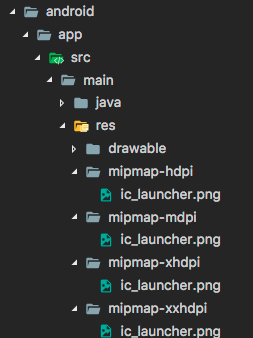

> 注意: 如果您重命名 .png 文件，则还必须在您 AndroidManifest.xml 的 <application> 标签的 android:icon 属性中更新名称

- iOS
  - 在 Flutter 项目的根目录中，导航到 .../ios/Runner。该目录中 Assets.xcassets/AppIcon.appiconset 已经包含占位符图片（如图）， 只需将它们替换为适当大小的图片，保留原始文件名称。


#### 1.4.5 更新启动页


在 Flutter 框架加载时，Flutter 会使用本地平台机制绘制启动页。此启动页将持续到 Flutter 渲染应用程序的第一帧时。

> 注意: 这意味着如果您不在应用程序的 main() 方法中调用 runApp 函数 （或者更具体地说，如果您不调用 window.render 去响应 window.onDrawFrame）的话， 启动屏幕将永远持续显示。

##### 1. Android

要将启动屏幕（splash screen）添加到您的 Flutter 应用程序， 请导航至 .../android/app/src/main。在 res/drawable/launch_background.xml，通过自定义 drawable 来实现自定义启动界面（你也可以直接换一张图片）。

##### 2. iOS

要将图片添加到启动屏幕（splash screen）的中心，请导航至 .../ios/Runner。在 Assets.xcassets/LaunchImage.imageset， 拖入图片，并命名为 LaunchImage.png、LaunchImage@2x.png、LaunchImage@3x.png。 如果你使用不同的文件名，那您还必须更新同一目录中的 Contents.json 文件，图片的具体尺寸可以查看苹果官方的标准。

您也可以通过打开 Xcode 完全自定义 storyboard。在 Project Navigator 中导航到 Runner/Runner 然后通过打开 Assets.xcassets 拖入图片，或者通过在 LaunchScreen.storyboard 中使用 Interface Builder 进行自定义，如下图。


### 1.5 调试 Flutter 应用

有各种各样的工具和功能来帮助调试 Flutter 应用程序

#### 1.5.1 Dart 分析器

在运行应用程序前，请运行 flutter analyze 测试你的代码。这个工具是一个静态代码检查工具，它是 dartanalyzer 工具的一个包装，主要用于分析代码并帮助开发者发现可能的错误，比如，Dart 分析器大量使用了代码中的类型注释来帮助追踪问题，避免 var、无类型的参数、无类型的列表文字等。

如果你使用 IntelliJ 的 Flutter 插件，那么分析器在打开 IDE 时就已经自动启用了，如果读者使用的是其它 IDE，强烈建议读者启用 Dart 分析器，因为在大多数时候，Dart 分析器可以在代码运行前发现大多数问题。

#### 1.5.2 Dart Observatory (语句级的单步调试和分析器)

### 1.6 Flutter 异常捕获

## 二、基础组件

### 2.1 Widget 简介

#### 2.1.1 概念

Flutter 中几乎所有的对象都是一个 Widget。与原生开发中“控件”不同的是，Flutter 中的 Widget 的概念更广泛，它不仅可以表示 UI 元素，也可以表示一些功能性的组件如：用于手势检测的 GestureDetector widget、用于 APP 主题数据传递的 Theme 等等，而原生开发中的控件通常只是指UI元素。在后面的内容中，我们在描述 UI 元素时可能会用到“控件”、“组件”这样的概念，读者心里需要知道他们就是 widget，只是在不同场景的不同表述而已。由于 Flutter 主要就是用于构建用户界面的，所以，在大多数时候，读者可以认为 widget 就是一个控件，不必纠结于概念。

#### 2.1.2 Widget 与 Element

Widget 的功能是“描述一个 UI 元素的配置数据”，它就是说，Widget 其实并不是表示最终绘制在设备屏幕上的显示元素，而它只是描述显示元素的一个配置数据；真正代表屏幕上显示元素的类是 Element，也就是说 Widget 只是描述 Element 的配置数据。

- Widget 实际上就是 Element 的配置数据，Widget 树实际上是一个配置树，而真正的 UI 渲染树是由 Element 构成；不过，由于 Element 是通过 Widget 生成的，所以它们之间有对应关系，在大多数场景，我们可以宽泛地认为 Widget 树就是指 UI 控件树或 UI 渲染树。
- 一个 Widget 对象可以对应多个 Element 对象。这很好理解，根据同一份配置（Widget），可以创建多个实例（Element）。

#### 2.1.3 Widget 主要接口

先来看一下Widget类的声明：

```dart
@immutable
abstract class Widget extends DiagnosticableTree {
  const Widget({ this.key });
  final Key key;

  @protected
  Element createElement();

  @override
  String toStringShort() {
    return key == null ? '$runtimeType' : '$runtimeType-$key';
  }

  @override
  void debugFillProperties(DiagnosticPropertiesBuilder properties) {
    super.debugFillProperties(properties);
    properties.defaultDiagnosticsTreeStyle = DiagnosticsTreeStyle.dense;
  }

  static bool canUpdate(Widget oldWidget, Widget newWidget) {
    return oldWidget.runtimeType == newWidget.runtimeType
        && oldWidget.key == newWidget.key;
  }
}
```

- Widget 类：继承自 DiagnosticableTree，DiagnosticableTree 即“诊断树”，主要作用是提供调试信息。
- Key: 主要的作用是决定是否在下一次 build 时复用旧的 widget，决定的条件在 canUpdate() 方法中。
- createElement()：正如前文所述“一个 Widget 可以对应多个 Element”；Flutter Framework 在构建 UI 树时，会先调用此方法生成对应节点的 Element 对象。此方法是 Flutter Framework 隐式调用的，在我们开发过程中基本不会调用到。
- debugFillProperties(...)：复写父类的方法，主要是设置诊断树的一些特性。
- canUpdate(...)：是一个静态方法，它主要用于在 Widget 树重新 build 时复用旧的 widget，其实具体来说，应该是：是否用新的 Widget 对象去更新旧 UI 树上所对应的 Element 对象的配置；通过其源码我们可以看到，只要 newWidget 与 oldWidget 的 runtimeType 和 key 同时相等时就会用 newWidget 去更新 Element 对象的配置，否则就会创建新的 Element。

现在只需知道，为 Widget 显式添加 key 的话可能（但不一定）会使 UI 在重新构建时变的高效，读者目前可以先忽略此参数。本书后面的示例中，只会在构建列表项 UI 时会显式指定 Key。

另外 Widget 类本身是一个抽象类，其中最核心的就是定义了 createElement() 接口，在 Flutter 开发中，我们一般都不用直接继承 Widget 类来实现一个新组件，相反，我们通常会通过继承 StatelessWidget 或 StatefulWidget 来间接继承 Widget 类来实现。StatelessWidget 和 StatefulWidget 都是直接继承自 Widget 类，而这两个类也正是 Flutter 中非常重要的两个抽象类，它们引入了两种 Widget 模型，接下来我们将重点介绍一下这两个类。

#### 2.1.4 StatelessWidget

StatelessWidget相对比较简单，它继承自 Widget 类，重写了 createElement() 方法：

```dart
@override
StatelessElement createElement() => new StatelessElement(this);
```

StatelessElement 间接继承自 Element 类，与 StatelessWidget 相对应（作为其配置数据）。

StatelessWidget 用于不需要维护状态的场景，它通常在 build 方法中通过嵌套其它 Widget 来构建 UI，在构建过程中会递归的构建其嵌套的 Widget。我们看一个简单的例子：

```dart
class Echo extends StatelessWidget {
  const Echo({
    Key key,
    @required this.text,
    this.backgroundColor:Colors.grey,
  }):super(key:key);

  final String text;
  final Color backgroundColor;

  @override
  Widget build(BuildContext context) {
    return Center(
      child: Container(
        color: backgroundColor,
        child: Text(text),
      ),
    );
  }
}
```

上面的代码，实现了一个回显字符串的 Echo widget。

> 按照惯例，widget 的构造函数参数应使用命名参数，命名参数中的必要参数要添加 @required 标注，这样有利于静态代码分析器进行检查。另外，在继承 widget 时，第一个参数通常应该是 Key，另外，如果 Widget 需要接收子 Widget，那么 child 或 children 参数通常应被放在参数列表的最后。同样是按照惯例，Widget 的属性应尽可能的被声明为 final，防止被意外改变。

然后我们可以通过如下方式使用它：

```
Widget build(BuildContext context) {
  return Echo(text: "hello world");
}
```

运行后效果如图：


##### Context

build 方法有一个 context 参数，它是 BuildContext 类的一个实例，表示当前 widget 在 widget 树中的上下文，每一个 widget 都会对应一个 context 对象（因为每一个 widget 都是 widget 树上的一个节点）。实际上，context 是当前 widget 在 widget 树中位置中执行 "相关操作" 的一个句柄，比如它提供了从当前 widget 开始向上遍历 widget 树以及按照 widget 类型查找父级 widget 的方法。下面是在子树中获取父级 widget 的一个示例：

```dart
class ContextRoute extends StatelessWidget {
  @override
  Widget build(BuildContext context) {
    return Scaffold(
      appBar: AppBar(
        title: Text("Context测试"),
      ),
      body: Container(
        child: Builder(builder: (context) {
          // 在 Widget 树中向上查找最近的父级 `Scaffold` widget
          Scaffold scaffold = context.findAncestorWidgetOfExactType<Scaffold>();
          // 直接返回 AppBar 的 title， 此处实际上是 Text("Context测试")
          return (scaffold.appBar as AppBar).title;
        }),
      ),
    );
  }
}
```
运行后效果如图：


#### 2.1.5 StatefulWidget

和 StatelessWidget 一样，StatefulWidget 也是继承自 Widget 类，并重写了 createElement() 方法，不同的是返回的 Element 对象并不相同；另外 StatefulWidget 类中添加了一个新的接口 createState()。

```dart
abstract class StatefulWidget extends Widget {
  const StatefulWidget({ Key key }) : super(key: key);

  @override
  StatefulElement createElement() => new StatefulElement(this);

  @protected
  State createState();
}
```

- StatefulElement 间接继承自 Element 类，与 StatefulWidget 相对应（作为其配置数据）。StatefulElement 中可能会多次调用 createState() 来创建状态(State)对象。
- createState() 用于创建和 Stateful widget 相关的状态，它在 Stateful widget 的生命周期中可能会被多次调用。例如，当一个 Stateful widget 同时插入到 widget 树的多个位置时，Flutter framework 就会调用该方法为每一个位置生成一个独立的 State 实例，其实，本质上就是一个 StatefulElement 对应一个 State 实例。

#### 2.1.6 State

一个 StatefulWidget 类会对应一个 State 类，State 表示与其对应的 StatefulWidget 要维护的状态，State 中的保存的状态信息可以：
- 在 widget 构建时可以被同步读取；
- 在 widget 生命周期中可以被改变，当 State 被改变时，可以手动调用其 setState() 方法通知 Flutter framework 状态发生改变，Flutter framework 在收到消息后，会重新调用其 build 方法重新构建 widget 树，从而达到更新 UI 的目的。

State中有两个常用属性：
- widget：它表示与该 State 实例关联的 widget 实例，由 Flutter framework 动态设置。注意，这种关联并非永久的，因为在应用生命周期中，UI 树上的某一个节点的 widget 实例在重新构建时可能会变化，但 State 实例只会在第一次插入到树中时被创建，当在重新构建时，如果 widget 被修改了，Flutter framework 会动态设置 State.widget 为新的 widget 实例；
- context：StatefulWidget 对应的 BuildContext，作用同 StatelessWidget 的 BuildContext。

##### State生命周期

理解 State 的生命周期对 flutter 开发非常重要，为了加深读者印象，本节我们通过一个实例来演示一下 State 的生命周期。在接下来的示例中，我们实现一个计数器 widget，点击它可以使计数器加 1，由于要保存计数器的数值状态，所以我们应继承 StatefulWidget，代码如下：

```dart
class CounterWidget extends StatefulWidget {
  const CounterWidget({
    Key key,
    this.initValue: 0
  });

  final int initValue;

  @override
  _CounterWidgetState createState() => new _CounterWidgetState();
}
```

CounterWidget 接收一个 initValue 整型参数，它表示计数器的初始值。下面我们看一下 State 的代码：

```dart
class _CounterWidgetState extends State<CounterWidget> {  
  int _counter;

  @override
  void initState() {
    super.initState();
    //初始化状态  
    _counter=widget.initValue;
    print("initState");
  }

  @override
  Widget build(BuildContext context) {
    print("build");
    return Scaffold(
      body: Center(
        child: FlatButton(
          child: Text('$_counter'),
          //点击后计数器自增
          onPressed:()=>setState(()=> ++_counter,
          ),
        ),
      ),
    );
  }

  @override
  void didUpdateWidget(CounterWidget oldWidget) {
    super.didUpdateWidget(oldWidget);
    print("didUpdateWidget");
  }

  @override
  void deactivate() {
    super.deactivate();
    print("deactive");
  }

  @override
  void dispose() {
    super.dispose();
    print("dispose");
  }

  @override
  void reassemble() {
    super.reassemble();
    print("reassemble");
  }

  @override
  void didChangeDependencies() {
    super.didChangeDependencies();
    print("didChangeDependencies");
  }

}
```

接下来，我们创建一个新路由，在新路由中，我们只显示一个CounterWidget：

```dart
Widget build(BuildContext context) {
  return CounterWidget();
}
```

我们运行应用并打开该路由页面，在新路由页打开后，屏幕中央就会出现一个数字 0，然后控制台日志输出：

```
I/flutter ( 5436): initState
I/flutter ( 5436): didChangeDependencies
I/flutter ( 5436): build
```

可以看到，在 StatefulWidget 插入到 Widget 树时首先 initState 方法会被调用。

然后我们点击 ⚡️ 按钮热重载，控制台输出日志如下：

```
I/flutter ( 5436): reassemble
I/flutter ( 5436): didUpdateWidget
I/flutter ( 5436): build
```

可以看到此时 initState 和 didChangeDependencies 都没有被调用，而此时 didUpdateWidget 被调用。

接下来，我们在 widget 树中移除 CounterWidget，将路由 build 方法改为：

```dart
Widget build(BuildContext context) {
  //移除计数器 
  //return CounterWidget();
  //随便返回一个Text()
  return Text("xxx");
}
```

然后热重载，日志如下：

```
I/flutter ( 5436): reassemble
I/flutter ( 5436): deactive
I/flutter ( 5436): dispose
```

我们可以看到，在 CounterWidget 从 widget 树中移除时，deactive 和 dispose 会依次被调用。

下面我们来看看各个回调函数：

- initState：当 Widget 第一次插入到 Widget 树时会被调用，对于每一个 State 对象，Flutter framework 只会调用一次该回调，所以，通常在该回调中做一些一次性的操作，如状态初始化、订阅子树的事件通知等。不能在该回调中调用 BuildContext.dependOnInheritedWidgetOfExactType（该方法用于在 Widget 树上获取离当前 widget 最近的一个父级 InheritFromWidget，关于 InheritedWidget 我们将在后面章节介绍），原因是在初始化完成后，Widget 树中的 InheritFromWidget 也可能会发生变化，所以正确的做法应该在在 build（）方法或 didChangeDependencies() 中调用它；
- didChangeDependencies()：当 State 对象的依赖发生变化时会被调用；例如：在之前build() 中包含了一个 InheritedWidget，然后在之后的 build() 中 InheritedWidget 发生了变化，那么此时 InheritedWidget 的子 widget 的 didChangeDependencies() 回调都会被调用。典型的场景是当系统语言 Locale 或应用主题改变时，Flutter framework 会通知 widget 调用此回调；
- build()：此回调读者现在应该已经相当熟悉了，它主要是用于构建 Widget 子树的，会在如下场景被调用：
    - 在调用 initState() 之后。
    - 在调用 didUpdateWidget() 之后。
    - 在调用 setState() 之后。
    - 在调用 didChangeDependencies() 之后。
    - 在State对象从树中一个位置移除后（会调用deactivate）又重新插入到树的其它位置之后。
- reassemble()：此回调是专门为了开发调试而提供的，在热重载 (hot reload) 时会被调用，此回调在 Release 模式下永远不会被调用；
- didUpdateWidget()：在 widget 重新构建时，Flutter framework 会调用 Widget.canUpdate 来检测 Widget 树中同一位置的新旧节点，然后决定是否需要更新，如果 Widget.canUpdate 返回 true 则会调用此回调。正如之前所述，Widget.canUpdate 会在新旧 widget 的 key 和 runtimeType 同时相等时会返回 true，也就是说在在新旧 widget 的 key 和 runtimeType 同时相等时 didUpdateWidget() 就会被调用；
- deactivate()：当 State 对象从树中被移除时，会调用此回调。在一些场景下，Flutter framework 会将 State 对象重新插到树中，如包含此 State 对象的子树在树的一个位置移动到另一个位置时（可以通过 GlobalKey 来实现）。如果移除后没有重新插入到树中则紧接着会调用 dispose() 方法；
- dispose()：当 State 对象从树中被永久移除时调用；通常在此回调中释放资源。

StatefulWidget生命周期如图所示：


#### 2.1.7 在 Widget 树中获取 State 对象

由于 StatefulWidget 的的具体逻辑都在其 State 中，所以很多时候，我们需要获取 StatefulWidget 对应的 State 对象来调用一些方法，比如 Scaffold 组件对应的状态类 ScaffoldState 中就定义了打开 SnackBar (路由页底部提示条)的方法。我们有两种方法在子 widget 树中获取父级 StatefulWidget 的 State 对象。

##### 1. 通过 Context 获取

context 对象有一个 findAncestorStateOfType() 方法，该方法可以从当前节点沿着 widget 树向上查找指定类型的 StatefulWidget 对应的 State 对象。下面是实现打开 SnackBar 的示例：

```dart
Scaffold(
  appBar: AppBar(
    title: Text("子树中获取State对象"),
  ),
  body: Center(
    child: Builder(builder: (context) {
      return RaisedButton(
        onPressed: () {
          // 查找父级最近的 Scaffold 对应的 ScaffoldState 对象
          ScaffoldState _state = context.findAncestorStateOfType<ScaffoldState>();
          // 调用 ScaffoldState 的 showSnackBar 来弹出 SnackBar
          _state.showSnackBar(
            SnackBar(
              content: Text("我是 SnackBar"),
            ),
          );
        },
        child: Text("显示SnackBar"),
      );
    }),
  ),
);
```

上面示例运行后，点击 "显示SnackBar"，效果如图所示：


一般来说，如果 StatefulWidget 的状态是私有的（不应该向外部暴露），那么我们代码中就不应该去直接获取其 State 对象；如果 StatefulWidget 的状态是希望暴露出的（通常还有一些组件的操作方法），我们则可以去直接获取其 State 对象。但是通过 context.findAncestorStateOfType 获取 StatefulWidget 的状态的方法是通用的，我们并不能在语法层面指定 StatefulWidget 的状态是否私有，所以在 Flutter 开发中便有了一个默认的约定：如果 StatefulWidget 的状态是希望暴露出的，应当在 StatefulWidget 中提供一个 of 静态方法来获取其 State 对象，开发者便可直接通过该方法来获取；如果 State 不希望暴露，则不提供 of 方法。这个约定在 Flutter SDK 里随处可见。所以，上面示例中的 Scaffold 也提供了一个 of 方法，我们其实是可以直接调用它的：

```dart
...//省略无关代码
// 直接通过of静态方法来获取ScaffoldState 
ScaffoldState _state=Scaffold.of(context); 
_state.showSnackBar(
  SnackBar(
    content: Text("我是SnackBar"),
  ),
);
```

##### 2. 通过 GlobalKey

Flutter 还有一种通用的获取 State 对象的方法——通过 GlobalKey 来获取！ 步骤分两步：

- 给目标 StatefulWidget 添加 GlobalKey；

```dart
//定义一个 globalKey, 由于 GlobalKey 要保持全局唯一性，我们使用静态变量存储
static GlobalKey<ScaffoldState> _globalKey= GlobalKey();
...
Scaffold(
    key: _globalKey , //设置key
    ...  
)
```

- 通过 GlobalKey 来获取 State 对象

```dart
_globalKey.currentState.openDrawer()
```

GlobalKey 是 Flutter 提供的一种在整个 APP 中引用 element 的机制。如果一个 widget 设置了 GlobalKey，那么我们便可以通过 globalKey.currentWidget 获得该 widget 对象、globalKey.currentElement 来获得 widget 对应的 element 对象，如果当前 widget 是 StatefulWidget，则可以通过 globalKey.currentState 来获得该 widget 对应的 state 对象。

> 注意：使用 GlobalKey 开销较大，如果有其他可选方案，应尽量避免使用它。另外同一个 GlobalKey 在整个 widget 树中必须是唯一的，不能重复。

#### 2.1.8 Flutter SDK内置组件库介绍

Flutter 提供了一套丰富、强大的基础组件，在基础组件库之上 Flutter 又提供了一套 Material 风格（Android默认的视觉风格）和一套 Cupertino 风格（iOS视觉风格）的组件库。要使用基础组件库，需要先导入：

```dart
import 'package:flutter/widgets.dart';
```

下面我们介绍一下常用的组件

##### 1. 基础组件

- Text：该组件可让您创建一个带格式的文本；
- Row、 Column：这些具有弹性空间的布局类 Widget 可让您在水平（Row）和垂直（Column）方向上创建灵活的布局。其设计是基于 Web 开发中的 Flexbox 布局模型；
- Stack：取代线性布局 ，Stack 允许子 widget 堆叠， 你可以使用 Positioned 来定位他们相对于 Stack 的上下左右四条边的位置。Stacks 是基于 Web 开发中的绝对定位（absolute positioning)布局模型设计的；
- Container： Container 可让您创建矩形视觉元素。container 可以装饰一个 BoxDecoration, 如 background、一个边框、或者一个阴影。 Container 也可以具有边距（margins）、填充(padding)和应用于其大小的约束(constraints)。另外， Container可以使用矩阵在三维空间中对其进行变换。

##### 2. Material 组件

Flutter 提供了一套丰富的 Material 组件，它可以帮助我们构建遵循 Material Design 设计规范的应用程序。Material 应用程序以 MaterialApp 组件开始，该组件在应用程序的根部创建了一些必要的组件，比如 Theme 组件，它用于配置应用的主题。 是否使用 MaterialApp 完全是可选的，但是使用它是一个很好的做法。在之前的示例中，我们已经使用过多个 Material 组件了，如：Scaffold、AppBar、FlatButton 等。要使用 Material 组件，需要先引入它：

```dart
import 'package:flutter/material.dart';
```

##### 3. Cupertino 组件

Flutter 也提供了一套丰富的 Cupertino 风格的组件，尽管目前还没有 Material 组件那么丰富，但是它仍在不断的完善中。值得一提的是在 Material 组件库中有一些组件可以根据实际运行平台来切换表现风格，比如 MaterialPageRoute，在路由切换时，如果是 Android 系统，它将会使用 Android 系统默认的页面切换动画(从底向上)；如果是 iOS 系统，它会使用 iOS 系统默认的页面切换动画（从右向左）。由于在前面的示例中还没有 Cupertino 组件的示例，下面我们实现一个简单的 Cupertino 组件风格的页面：

```dart
//导入cupertino widget库
import 'package:flutter/cupertino.dart';

class CupertinoTestRoute extends StatelessWidget {
  @override
  Widget build(BuildContext context) {
    return CupertinoPageScaffold(
      navigationBar: CupertinoNavigationBar(
        middle: Text("Cupertino Demo"),
      ),
      child: Center(
        child: CupertinoButton(
            color: CupertinoColors.activeBlue,
            child: Text("Press"),
            onPressed: () {}
        ),
      ),
    );
  }
}
```

下面是在 iPhoneX 上页面效果截图：


### 2.2 状态管理

- 以下是管理状态的最常见的方法：
  - Widget 管理自己的状态；
  - Widget 管理子 Widget 状态；
  - 混合管理（父 Widget 和子 Widget 都管理状态）。

- 如何决定使用哪种管理方法？下面是官方给出的一些原则可以帮助你做决定：
  - 如果状态是用户数据，如复选框的选中状态、滑块的位置，则该状态最好由父 Widget 管理；
  - 如果状态是有关界面外观效果的，例如颜色、动画，那么状态最好由 Widget 本身来管理；
  - 如果某一个状态是不同 Widget 共享的则最好由它们共同的父 Widget 管理。

在 Widget 内部管理状态封装性会好一些，而在父 Widget 中管理会比较灵活。有些时候，如果不确定到底该怎么管理状态，那么推荐的首选是在父 widget 中管理（灵活会显得更重要一些）。

接下来，我们将通过创建三个简单示例 TapboxA、TapboxB 和 TapboxC 来说明管理状态的不同方式。 这些例子功能是相似的 ——创建一个盒子，当点击它时，盒子背景会在绿色与灰色之间切换。状态 \_active 确定颜色：绿色为 true ，灰色为 false，如图所示。


下面的例子将使用 GestureDetector 来识别点击事件，关于该 GestureDetector 的详细内容我们将在后面“事件处理”一章中介绍。

#### 2.2.1 Widget管理自身状态

```dart
class TapboxA extends StatefulWidget {
  TapboxA({Key key}) : super(key: key);

  @override
  _TapboxAState createState() => new _TapboxAState();
}

class _TapboxAState extends State<TapboxA> {
  // 确定盒子的当前颜色的布尔值
  bool _active = false;
  // 该函数在点击该盒子时更新 _active，并调用 setState() 更新 UI
  void _handleTap() {
    setState(() {
      _active = !_active;
    });
  }

  Widget build(BuildContext context) {
    return new GestureDetector(
      onTap: _handleTap,
      child: new Container(
        child: new Center(
          child: new Text(
            _active ? 'Active' : 'Inactive',
            style: new TextStyle(fontSize: 32.0, color: Colors.white),
          ),
        ),
        width: 200.0,
        height: 200.0,
        decoration: new BoxDecoration(
          color: _active ? Colors.lightGreen[700] : Colors.grey[600],
        ),
      ),
    );
  }
}
```

#### 2.2.2 父Widget管理子Widget的状态

```dart
// ParentWidget 为 TapboxB 管理状态.
//------------------------ ParentWidget --------------------------------

class ParentWidget extends StatefulWidget {
  @override
  _ParentWidgetState createState() => new _ParentWidgetState();
}

class _ParentWidgetState extends State<ParentWidget> {
  // 按钮状态
  bool _active = false;
  // 状态转换更新
  void _handleTapboxChanged(bool newValue) {
    setState(() {
      _active = newValue;
    });
  }

  @override
  Widget build(BuildContext context) {
    // 将状态以参数方式传递给子容器
    return new Container(
      child: new TapboxB(
        active: _active,
        onChanged: _handleTapboxChanged,
      ),
    );
  }
}

//------------------------- TapboxB ----------------------------------

class TapboxB extends StatelessWidget {
  TapboxB({Key key, this.active: false, @required this.onChanged})
      : super(key: key);

  final bool active;
  final ValueChanged<bool> onChanged;

  void _handleTap() {
    onChanged(!active);
  }

  Widget build(BuildContext context) {
    return new GestureDetector(
      onTap: _handleTap,
      child: new Container(
        child: new Center(
          child: new Text(
            active ? 'Active' : 'Inactive',
            style: new TextStyle(fontSize: 32.0, color: Colors.white),
          ),
        ),
        width: 200.0,
        height: 200.0,
        decoration: new BoxDecoration(
          color: active ? Colors.lightGreen[700] : Colors.grey[600],
        ),
      ),
    );
  }
}
```

#### 2.2.3 混合状态管理

```dart
//---------------------------- ParentWidget ----------------------------

class ParentWidgetC extends StatefulWidget {
  @override
  _ParentWidgetCState createState() => new _ParentWidgetCState();
}

class _ParentWidgetCState extends State<ParentWidgetC> {
  bool _active = false;

  void _handleTapboxChanged(bool newValue) {
    setState(() {
      _active = newValue;
    });
  }

  @override
  Widget build(BuildContext context) {
    return new Container(
      child: new TapboxC(
        active: _active,
        onChanged: _handleTapboxChanged,
      ),
    );
  }
}

//----------------------------- TapboxC ------------------------------

class TapboxC extends StatefulWidget {
  TapboxC({Key key, this.active: false, @required this.onChanged})
      : super(key: key);

  final bool active;
  final ValueChanged<bool> onChanged;

  @override
  _TapboxCState createState() => new _TapboxCState();
}

class _TapboxCState extends State<TapboxC> {
  bool _highlight = false;

  void _handleTapDown(TapDownDetails details) {
    setState(() {
      _highlight = true;
    });
  }

  void _handleTapUp(TapUpDetails details) {
    setState(() {
      _highlight = false;
    });
  }

  void _handleTapCancel() {
    setState(() {
      _highlight = false;
    });
  }

  void _handleTap() {
    widget.onChanged(!widget.active);
  }

  @override
  Widget build(BuildContext context) {
    // 在按下时添加绿色边框，当抬起时，取消高亮  
    return new GestureDetector(
      onTapDown: _handleTapDown, // 处理按下事件
      onTapUp: _handleTapUp, // 处理抬起事件
      onTap: _handleTap,
      onTapCancel: _handleTapCancel,
      child: new Container(
        child: new Center(
          child: new Text(widget.active ? 'Active' : 'Inactive',
              style: new TextStyle(fontSize: 32.0, color: Colors.white)),
        ),
        width: 200.0,
        height: 200.0,
        decoration: new BoxDecoration(
          color: widget.active ? Colors.lightGreen[700] : Colors.grey[600],
          border: _highlight
              ? new Border.all(
                  color: Colors.teal[700],
                  width: 10.0,
                )
              : null,
        ),
      ),
    );
  }
}
```

### 2.3 文本及样式

#### 2.3.1 Text

Text 用于显示简单样式文本，它包含一些控制文本显示样式的一些属性，一个简单的例子如下：

```dart
Text("Hello world",
  textAlign: TextAlign.left,
);

Text("Hello world! I'm Jack. "*4,
  maxLines: 1,
  overflow: TextOverflow.ellipsis,
);

Text("Hello world",
  textScaleFactor: 1.5,
);
```

- textAlign：文本的对齐方式；可以选择左对齐、右对齐还是居中；注意，对齐的参考系是Text widget本身；本例中虽然是指定了左对齐，但因为 Text 文本内容宽度不足一行，Text 的宽度和文本内容长度相等，那么这时指定对齐方式是没有意义的，只有 Text 宽度大于文本内容长度时指定此属性才有意义；
- maxLines、overflow：指定文本显示的最大行数，默认情况下，文本是自动折行的，如果指定此参数，则文本最多不会超过指定的行；如果有多余的文本，可以通过 overflow 来指定截断方式，默认是直接截断，本例中指定的截断方式 TextOverflow.ellipsis，它会将多余文本截断后以省略符 “...” 表示；TextOverflow 的其它截断方式请参考 SDK 文档；
- textScaleFactor：代表文本相对于当前字体大小的缩放因子，相对于去设置文本的样式 style 属性的 fontSize，它是调整字体大小的一个快捷方式。该属性的默认值可以通过 MediaQueryData.textScaleFactor 获得，如果没有 MediaQuery，那么会默认值将为1.0。

#### 2.3.2 TextStyle

```dart
Text("Hello world",
  style: TextStyle(
    color: Colors.blue,
    fontSize: 18.0,
    height: 1.2,  
    fontFamily: "Courier",
    background: new Paint()..color=Colors.yellow,
    decoration:TextDecoration.underline,
    decorationStyle: TextDecorationStyle.dashed
  ),
);
```

- height：该属性用于指定行高，但它并不是一个绝对值，而是一个因子，具体的行高等于 fontSize * height；
- fontFamily ：由于不同平台默认支持的字体集不同，所以在手动指定字体时一定要先在不同平台测试一下；
- fontSize：该属性和 Text 的 textScaleFactor 都用于控制字体大小。但是有两个主要区别：
  - fontSize 可以精确指定字体大小，而 textScaleFactor 只能通过缩放比例来控制；
  - textScaleFactor 主要是用于系统字体大小设置改变时对 Flutter 应用字体进行全局调整，而 fontSize 通常用于单个文本，字体大小不会跟随系统字体大小变化。

#### 2.3.3 TextSpan

需要对一个Text内容的不同部分按照不同的样式显示，这时就可以使用TextSpan，它代表文本的一个“片段”；我们看看TextSpan的定义:

```dart
const TextSpan({
  TextStyle style, 
  Sting text,
  List<TextSpan> children,
  GestureRecognizer recognizer,
});
```

其中 style 和 text 属性代表该文本片段的样式和内容。 children 是一个 TextSpan 的数组，也就是说 TextSpan 可以包括其他 TextSpan。而 recognizer 用于对该文本片段上用于手势进行识别处理。下面我们看一个效果如图，然后用TextSpan实现它：


```dart
Text.rich(TextSpan(
    children: [
     TextSpan(
       text: "Home: "
     ),
     TextSpan(
       text: "https://flutterchina.club",
       style: TextStyle(
         color: Colors.blue
       ),  
       recognizer: _tapRecognizer
     ),
    ]
))
```

- 通过 TextSpan 实现了一个基础文本片段和一个链接片段，然后通过 Text.rich 方法将 TextSpan 添加到 Text 中，之所以可以这样做，是因为 Text 其实就是 RichText 的一个包装，而 RichText 是可以显示多种样式(富文本)的 widget；
- \_tapRecognizer，它是点击链接后的一个处理器（代码已省略），关于手势识别的更多内容我们将在后面单独介绍。

#### 2.3.4 DefaultTextStyle

文本的样式默认是可以被继承的（子类文本类组件未指定具体样式时可以使用 Widget 树中父级设置的默认样式），因此，如果在 Widget 树的某一个节点处设置一个默认的文本样式，那么该节点的子树中所有文本都会默认使用这个样式，而 DefaultTextStyle 正是用于设置默认文本样式的。下面我们看一个例子：

```dart
DefaultTextStyle(
  //1.设置文本默认样式  
  style: TextStyle(
    color:Colors.red,
    fontSize: 20.0,
  ),
  textAlign: TextAlign.start,
  child: Column(
    crossAxisAlignment: CrossAxisAlignment.start,
    children: <Widget>[
      Text("hello world"),
      Text("I am Jack"),
      Text("I am Jack",
        style: TextStyle(
          inherit: false, //2.不继承默认样式
          color: Colors.grey
        ),
      ),
    ],
  ),
);
```

#### 2.3.5 字体


可以在 Flutter 应用程序中使用不同的字体。例如，我们可能会使用设计人员创建的自定义字体，或者其它第三方的字体，如 [Google Fonts](https://fonts.google.com/) 中的字体。本节将介绍如何为 Flutter 应用配置字体，并在渲染文本时使用它们。

在 Flutter 中使用字体分两步完成。首先在 pubspec.yaml 中声明它们，以确保它们会打包到应用程序中。然后通过T extStyle 属性使用字体

- 在asset中声明

要将字体文件打包到应用中，和使用其它资源一样，要先在 pubspec.yaml 中声明它。然后将字体文件复制到在 pubspec.yaml 中指定的位置。如：

```dart
flutter:
  fonts:
    - family: Raleway
      fonts:
        - asset: assets/fonts/Raleway-Regular.ttf
        - asset: assets/fonts/Raleway-Medium.ttf
          weight: 500
        - asset: assets/fonts/Raleway-SemiBold.ttf
          weight: 600
    - family: AbrilFatface
      fonts:
        - asset: assets/fonts/abrilfatface/AbrilFatface-Regular.ttf
```

- 使用字体

```dart
// 声明文本样式
const textStyle = const TextStyle(
  fontFamily: 'Raleway',
);

// 使用文本样式
var buttonText = const Text(
  "Use the font for this text",
  style: textStyle,
);
```

- Package中的字体

要使用 Package 中定义的字体，必须提供 package 参数。例如，假设上面的字体声明位于 my_package 包中。然后创建 TextStyle 的过程如下：

```dart
const textStyle = const TextStyle(
  fontFamily: 'Raleway',
  package: 'my_package', //指定包名
);
```

如果在 package 包内部使用它自己定义的字体，也应该在创建文本样式时指定 package 参数，如上例所示。

一个包也可以只提供字体文件而不需要在 pubspec.yaml 中声明。 这些文件应该存放在包的 lib/文件夹中。字体文件不会自动绑定到应用程序中，应用程序可以在声明字体时有选择地使用这些字体。假设一个名为 my_package 的包中有一个字体文件：

```dart
lib/fonts/Raleway-Medium.ttf
```

然后，应用程序可以声明一个字体，如下面的示例所示：

```dart
 flutter:
   fonts:
     - family: Raleway
       fonts:
         - asset: assets/fonts/Raleway-Regular.ttf
         - asset: packages/my_package/fonts/Raleway-Medium.ttf
           weight: 500
```

在这种情况下，由于应用程序本地定义了字体，所以在创建 TextStyle 时可以不指定 package 参数：

```dart
const textStyle = const TextStyle(
  fontFamily: 'Raleway',
);
```

### 2.4 按钮

#### 2.4.1 Material组件库中的按钮

Material 组件库中提供了多种按钮组件如 RaisedButton、FlatButton、OutlineButton 等，它们都是直接或间接对 RawMaterialButton 组件的包装定制，所以他们大多数属性都和 RawMaterialButton 一样。在介绍各个按钮时我们先介绍其默认外观，而按钮的外观大都可以通过属性来自定义，我们在后面统一介绍这些属性。另外，所有 Material 库中的按钮都有如下相同点：

- 按下时都会有“水波动画”（又称“涟漪动画”，就是点击时按钮上会出现水波荡漾的动画）；
- 有一个 onPressed 属性来设置点击回调，当按钮按下时会执行该回调，如果不提供该回调则按钮会处于禁用状态，禁用状态不响应用户点击。

##### 1. RaisedButton

RaisedButton 即 "漂浮" 按钮，它默认带有阴影和灰色背景。按下后，阴影会变大，如图所示：


```dart
RaisedButton(
  child: Text("normal"),
  onPressed: () {},
);
```

##### 2. FlatButton

FlatButton 即扁平按钮，默认背景透明并不带阴影。按下后，会有背景色，如图所示：


```dart
FlatButton(
  child: Text("normal"),
  onPressed: () {},
)
```

##### 3. OutlineButton

OutlineButton 默认有一个边框，不带阴影且背景透明。按下后，边框颜色会变亮、同时出现背景和阴影(较弱)，如图所示：


```dart
OutlineButton(
  child: Text("normal"),
  onPressed: () {},
)
```

##### 4. IconButton

IconButton 是一个可点击的 Icon，不包括文字，默认没有背景，点击后会出现背景，如图所示：


```dart
IconButton(
  icon: Icon(Icons.thumb_up),
  onPressed: () {},
)
```

##### 5. 带图标的按钮

RaisedButton、FlatButton、OutlineButton 都有一个 icon 构造函数，通过它可以轻松创建带图标的按钮，如图所示：


```dart
RaisedButton.icon(
  icon: Icon(Icons.send),
  label: Text("发送"),
  onPressed: _onPressed,
),
OutlineButton.icon(
  icon: Icon(Icons.add),
  label: Text("添加"),
  onPressed: _onPressed,
),
FlatButton.icon(
  icon: Icon(Icons.info),
  label: Text("详情"),
  onPressed: _onPressed,
),
```

#### 2.4.2 自定义按钮外观

按钮外观可以通过其属性来定义，不同按钮属性大同小异，我们以 FlatButton 为例，介绍一下常见的按钮属性，详细的信息可以查看 API 文档。

```dart
const FlatButton({
  ...  
  @required this.onPressed,     //按钮点击回调
  this.textColor,               //按钮文字颜色
  this.disabledTextColor,       //按钮禁用时的文字颜色
  this.color,                   //按钮背景颜色
  this.disabledColor,           //按钮禁用时的背景颜色
  this.highlightColor,          //按钮按下时的背景颜色
  this.splashColor,             //点击时，水波动画中水波的颜色
  this.colorBrightness,         //按钮主题，默认是浅色主题 
  this.padding,                 //按钮的填充
  this.shape,                   //外形
  @required this.child,         //按钮的内容
})
```

##### 示例

```dart
FlatButton(
  color: Colors.blue,
  highlightColor: Colors.blue[700],
  colorBrightness: Brightness.dark,
  splashColor: Colors.grey,
  child: Text("Submit"),
  shape:RoundedRectangleBorder(borderRadius: BorderRadius.circular(20.0)),
  onPressed: () {},
)
```

- 效果如下：

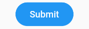

通过 shape 来指定其外形为一个圆角矩形，因为按钮背景是蓝色(深色)，我们需要指定按钮主题 colorBrightness 为 Brightness.dark，这是为了保证按钮文字颜色为浅色。

Flutter 中没有提供去除背景的设置，假若我们需要去除背景，则可以通过将背景颜色设置为全透明来实现。对应上面的代码，便是将 color: Colors.blue 替换为 color: Color(0x000000)。

细心的读者可能会发现这个按钮没有阴影(点击之后也没有)，这样会显得没有质感。其实这也很容易，将上面的 FlatButton 换成 RaisedButton 就行，其它代码不用改（这里 color 也不做更改），换了之后的效果如图所示：


### 2.5 图片及 ICON

#### 2.5.1 图片

Flutter中，我们可以通过 Image 组件来加载并显示图片，Image 的数据源可以是 asset、文件、内存以及网络。

##### 1. ImageProvider

ImageProvider 是一个抽象类，主要定义了图片数据获取的接口 load()，从不同的数据源获取图片需要实现不同的 ImageProvider ，如 AssetImage 是实现了从 Asset 中加载图片的 ImageProvider，而 NetworkImage 实现了从网络加载图片的 ImageProvider。

##### 2. Image

Image widget 有一个必选的 image 参数，它对应一个 ImageProvider。下面我们分别演示一下如何从 asset 和网络加载图片。

**从 asset 中加载图片**

1. 在工程根目录下创建一个 images 目录，并将图片 avatar.png 拷贝到该目录
2. 在 pubspec.yaml 中的 flutter 部分添加如下内容：

```yaml
assets:
    - images/avatar.png
```

3. 加载该图片

```dart
Image(
  image: AssetImage("images/avatar.png"),
  width: 100.0
);
```

Image 也提供了一个快捷的构造函数 Image.asset 用于从 asset 中加载、显示图片：

```dart
Image.asset("images/avatar.png",
  width: 100.0,
)
```

**从网络加载图片**

```dart
Image(
  image: NetworkImage(
      "https://avatars2.githubusercontent.com/u/20411648?s=460&v=4"),
  width: 100.0,
)
```

Image 也提供了一个快捷的构造函数 Image.network 用于从网络加载、显示图片：

```dart
Image.network(
  "https://avatars2.githubusercontent.com/u/20411648?s=460&v=4",
  width: 100.0,
)
```

运行上面两个示例，图片加载成功后如图所示：


##### 3. 参数

Image 在显示图片时定义了一系列参数，通过这些参数我们可以控制图片的显示外观、大小、混合效果等。我们看一下 Image 的主要参数：

```dart
const Image({
  ...
  this.width,           //图片的宽
  this.height,          //图片高度
  this.color,           //图片的混合色值
  this.colorBlendMode,  //混合模式
  this.fit,             //缩放模式
  this.alignment = Alignment.center,    //对齐方式
  this.repeat = ImageRepeat.noRepeat,   //重复方式
  ...
})
```

- width、height：用于设置图片的宽、高，当不指定宽高时，图片会根据当前父容器的限制，尽可能的显示其原始大小，如果只设置 width、height 的其中一个，那么另一个属性默认会按比例缩放，但可以通过下面介绍的 fit 属性来指定适应规则；
- fit：该属性用于在图片的显示空间和图片本身大小不同时指定图片的适应模式。适应模式是在 BoxFit 中定义，它是一个枚举类型，有如下值：
    - fill：会拉伸填充满显示空间，图片本身长宽比会发生变化，图片会变形；
    - cover：会按图片的长宽比放大后居中填满显示空间，图片不会变形，超出显示空间部分会被剪裁；
    - contain：这是图片的默认适应规则，图片会在保证图片本身长宽比不变的情况下缩放以适应当前显示空间，图片不会变形；
    - fitWidth：图片的宽度会缩放到显示空间的宽度，高度会按比例缩放，然后居中显示，图片不会变形，超出显示空间部分会被剪裁；
    - fitHeight：图片的高度会缩放到显示空间的高度，宽度会按比例缩放，然后居中显示，图片不会变形，超出显示空间部分会被剪裁；
    - none：图片没有适应策略，会在显示空间内显示图片，如果图片比显示空间大，则显示空间只会显示图片中间部分。

对一个宽高相同的头像图片应用不同的 fit 值，效果如图所示：


- color 和 colorBlendMode：在图片绘制时可以对每一个像素进行颜色混合处理，color 指定混合色，而 colorBlendMode 指定混合模式，下面是一个简单的示例：

```dart
Image(
  image: AssetImage("images/avatar.png"),
  width: 100.0,
  color: Colors.blue,
  colorBlendMode: BlendMode.difference,
);
```

效果如下：


- repeat：当图片本身大小小于显示空间时，指定图片的重复规则。简单示例如下：

```dart
Image(
  image: AssetImage("images/avatar.png"),
  width: 100.0,
  height: 200.0,
  repeat: ImageRepeat.repeatY ,
)
```

效果如下：


完整的示例代码如下：

```dart
import 'package:flutter/material.dart';

class ImageAndIconRoute extends StatelessWidget {
  @override
  Widget build(BuildContext context) {
    var img=AssetImage("imgs/avatar.png");
    return SingleChildScrollView(
      child: Column(
        children: <Image>[
          Image(
            image: img,
            height: 50.0,
            width: 100.0,
            fit: BoxFit.fill,
          ),
          Image(
            image: img,
            height: 50,
            width: 50.0,
            fit: BoxFit.contain,
          ),
          Image(
            image: img,
            width: 100.0,
            height: 50.0,
            fit: BoxFit.cover,
          ),
          Image(
            image: img,
            width: 100.0,
            height: 50.0,
            fit: BoxFit.fitWidth,
          ),
          Image(
            image: img,
            width: 100.0,
            height: 50.0,
            fit: BoxFit.fitHeight,
          ),
          Image(
            image: img,
            width: 100.0,
            height: 50.0,
            fit: BoxFit.scaleDown,
          ),
          Image(
            image: img,
            height: 50.0,
            width: 100.0,
            fit: BoxFit.none,
          ),
          Image(
            image: img,
            width: 100.0,
            color: Colors.blue,
            colorBlendMode: BlendMode.difference,
            fit: BoxFit.fill,
          ),
          Image(
            image: img,
            width: 100.0,
            height: 200.0,
            repeat: ImageRepeat.repeatY ,
          )
        ].map((e){
          return Row(
            children: <Widget>[
              Padding(
                padding: EdgeInsets.all(16.0),
                child: SizedBox(
                  width: 100,
                  child: e,
                ),
              ),
              Text(e.fit.toString())
            ],
          );
        }).toList()
      ),
    );
  }
}
```

##### 4. Image 缓存

Flutter 框架对加载过的图片是有缓存的（内存），默认最大缓存数量是 1000，最大缓存空间为 100M。关于 Image 的详细内容及原理我们将会在后面进阶部分深入介绍。

#### 2.5.2 ICON

Flutter 中，可以像 Web 开发一样使用 iconfont，iconfont 即“字体图标”，它是将图标做成字体文件，然后通过指定不同的字符而显示不同的图片。

> 在字体文件中，每一个字符都对应一个位码，而每一个位码对应一个显示字形，不同的字体就是指字形不同，即字符对应的字形是不同的。而在 iconfont 中，只是将位码对应的字形做成了图标，所以不同的字符最终就会渲染成不同的图标。

在 Flutter 开发中，iconfont 和图片相比有如下优势：

- 体积小：可以减小安装包大小；
- 矢量的：iconfont 都是矢量图标，放大不会影响其清晰度；
- 可以应用文本样式：可以像文本一样改变字体图标的颜色、大小对齐等；
- 可以通过 TextSpan 和文本混用。

**使用Material Design字体图标**

Flutter 默认包含了一套 Material Design 的字体图标，在 pubspec.yaml 文件中的配置如下

```yarm
flutter:
  uses-material-design: true
```

Material Design所有图标可以在其官网查看：[https://material.io/tools/icons/](https://material.io/tools/icons/)

我们看一个简单的例子：

```dart
String icons = "";
// accessible: &#xE914; or 0xE914 or E914
icons += "\uE914";
// error: &#xE000; or 0xE000 or E000
icons += " \uE000";
// fingerprint: &#xE90D; or 0xE90D or E90D
icons += " \uE90D";

Text(icons,
  style: TextStyle(
      fontFamily: "MaterialIcons",
      fontSize: 24.0,
      color: Colors.green
  ),
);
```

效果如下：


通过这个示例可以看到，使用图标就像使用文本一样，但是这种方式需要我们提供每个图标的码点，这并对开发者不友好，所以，Flutter 封装了 IconData 和 Icon 来专门显示字体图标，上面的例子也可以用如下方式实现：

```dart
Row(
  mainAxisAlignment: MainAxisAlignment.center,
  children: <Widget>[
    Icon(Icons.accessible,color: Colors.green,),
    Icon(Icons.error,color: Colors.green,),
    Icon(Icons.fingerprint,color: Colors.green,),
  ],
)
```

Icons 类中包含了所有 Material Design 图标的 IconData 静态变量定义。

##### 使用自定义字体图标

我们也可以使用自定义字体图标。iconfont.cn 上有很多字体图标素材，我们可以选择自己需要的图标打包下载后，会生成一些不同格式的字体文件，在 Flutter 中，我们使用 ttf 格式即可。

假设我们项目中需要使用一个书籍图标和微信图标，我们打包下载后导入：

1. 导入字体图标文件；这一步和导入字体文件相同，假设我们的字体图标文件保存在项目根目录下，路径为"fonts/iconfont.ttf"：

```dart
fonts:
  - family: myIcon  #指定一个字体名
    fonts:
      - asset: fonts/iconfont.ttf
```

2. 为了使用方便，我们定义一个 MyIcons 类，功能和 Icons 类一样：将字体文件中的所有图标都定义成静态变量：

```dart
class MyIcons{
  // book 图标
  static const IconData book = const IconData(
      0xe614, 
      fontFamily: 'myIcon', 
      matchTextDirection: true
  );
  // 微信图标
  static const IconData wechat = const IconData(
      0xec7d,  
      fontFamily: 'myIcon', 
      matchTextDirection: true
  );
}
```

3. 使用

```dart
Row(
  mainAxisAlignment: MainAxisAlignment.center,
  children: <Widget>[
    Icon(MyIcons.book,color: Colors.purple,),
    Icon(MyIcons.wechat,color: Colors.green,),
  ],
)
```

运行后效果如图所示：


### 2.6 单选开关和复选框

Material 组件库中提供了 Material 风格的单选开关 Switch 和复选框 Checkbox，虽然它们都是继承自 StatefulWidget，但它们本身不会保存当前选中状态，选中状态都是由父组件来管理的。当 Switch 或 Checkbox 被点击时，会触发它们的 onChanged 回调，我们可以在此回调中处理选中状态改变逻辑。下面看一个简单的例子：

```dart
class SwitchAndCheckBoxTestRoute extends StatefulWidget {
  @override
  _SwitchAndCheckBoxTestRouteState createState() => new _SwitchAndCheckBoxTestRouteState();
}

class _SwitchAndCheckBoxTestRouteState extends State<SwitchAndCheckBoxTestRoute> {
  bool _switchSelected=true; //维护单选开关状态
  bool _checkboxSelected=true;//维护复选框状态
  @override
  Widget build(BuildContext context) {
    return Column(
      children: <Widget>[
        Switch(
          value: _switchSelected,//当前状态
          onChanged:(value){
            //重新构建页面  
            setState(() {
              _switchSelected=value;
            });
          },
        ),
        Checkbox(
          value: _checkboxSelected,
          activeColor: Colors.red, //选中时的颜色
          onChanged:(value){
            setState(() {
              _checkboxSelected=value;
            });
          } ,
        )
      ],
    );
  }
}
```

- 效果如下：

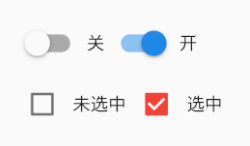

#### 属性及外观

Switch 和 Checkbox 属性比较简单，读者可以查看 API 文档，它们都有一个 activeColor 属性，用于设置激活态的颜色。至于大小，到目前为止，Checkbox 的大小是固定的，无法自定义，而 Switch 只能定义宽度，高度也是固定的。值得一提的是 Checkbox 有一个属性 tristate ，表示是否为三态，其默认值为 false ，这时 Checkbox 有两种状态即“选中”和“不选中”，对应的 value 值为 true 和 false 。如果 tristate 值为 true 时，value 的值会增加一个状态 null，可以自行了解。

### 2.7 输入框及表单

Material 组件库中提供了输入框组件 TextField 和表单组件 Form。下面我们分别介绍一下。

#### 2.7.1 TextField

TextField 用于文本输入，它提供了很多属性，我们先简单介绍一下主要属性的作用，然后通过几个示例来演示一下关键属性的用法。

```dart
const TextField({
  ...
  TextEditingController controller, 
  FocusNode focusNode,
  InputDecoration decoration = const InputDecoration(),
  TextInputType keyboardType,
  TextInputAction textInputAction,
  TextStyle style,
  TextAlign textAlign = TextAlign.start,
  bool autofocus = false,
  bool obscureText = false,
  int maxLines = 1,
  int maxLength,
  bool maxLengthEnforced = true,
  ValueChanged<String> onChanged,
  VoidCallback onEditingComplete,
  ValueChanged<String> onSubmitted,
  List<TextInputFormatter> inputFormatters,
  bool enabled,
  this.cursorWidth = 2.0,
  this.cursorRadius,
  this.cursorColor,
  ...
})
```

- controller：编辑框的控制器，通过它可以设置/获取编辑框的内容、选择编辑内容、监听编辑文本改变事件。大多数情况下我们都需要显式提供一个 controller 来与文本框交互。如果没有提供 controller，则 TextField 内部会自动创建一个；
- focusNode：用于控制 TextField 是否占有当前键盘的输入焦点。它是我们和键盘交互的一个句柄（handle）；
- InputDecoration：用于控制 TextField 的外观显示，如提示文本、背景颜色、边框等；
- keyboardType：用于设置该输入框默认的键盘输入类型，取值如下：
  - text  文本输入键盘
  - multiline：多行文本，需和maxLines配合使用(设为null或大于1)
  - number：数字；会弹出数字键盘
  - phone：优化后的电话号码输入键盘；会弹出数字键盘并显示“* #”
  - datetime：优化后的日期输入键盘；Android上会显示“: -”
  - emailAddress：优化后的电子邮件地址；会显示“@ .”
  - url：优化后的 url 输入键盘； 会显示“/ .”
- textInputAction：键盘动作按钮图标(即回车键位图标)，它是一个枚举值，有多个可选值，全部的取值列表读者可以查看 API 文档，下面是当值为 TextInputAction.search 时，原生 Android 系统下键盘样式如图所示：


- style：正在编辑的文本样式；
- textAlign: 输入框内编辑文本在水平方向的对齐方式；
- autofocus: 是否自动获取焦点；
- obscureText：是否隐藏正在编辑的文本，如用于输入密码的场景等，文本内容会用“•”替换；
- maxLines：输入框的最大行数，默认为 1；如果为 null，则无行数限制；
- maxLength 和 maxLengthEnforced ：maxLength 代表输入框文本的最大长度，设置后输入框右下角会显示输入的文本计数。maxLengthEnforced 决定当输入文本长度超过 maxLength 时是否阻止输入，为 true 时会阻止输入，为 false 时不会阻止输入但输入框会变红；
- onChange：输入框内容改变时的回调函数；注：内容改变事件也可以通过 controller 来监听；
- onEditingComplete 和 onSubmitted：这两个回调都是在输入框输入完成时触发，比如按了键盘的完成键（对号图标）或搜索键（🔍图标）。不同的是两个回调签名不同，onSubmitted 回调是 ValueChanged<String> 类型，它接收当前输入内容做为参数，而 onEditingComplete 不接收参数；
- inputFormatters：用于指定输入格式；当用户输入内容改变时，会根据指定的格式来校验；
- enable：如果为 false，则输入框会被禁用，禁用状态不接收输入和事件，同时显示禁用态样式（在其 decoration 中定义）；
- cursorWidth、cursorRadius 和 cursorColor：这三个属性是用于自定义输入框光标宽度、圆角和颜色的。

##### 示例：登录输入框

```dart
Column(
  children: <Widget>[
    TextField(
      autofocus: true,
      decoration: InputDecoration(
          labelText: "用户名",
          hintText: "用户名或邮箱",
          prefixIcon: Icon(Icons.person)
      ),
    ),
    TextField(
      decoration: InputDecoration(
          labelText: "密码",
          hintText: "您的登录密码",
          prefixIcon: Icon(Icons.lock)
      ),
      obscureText: true,
    ),
  ],
);
```

- 效果如下：


- 获取输入内容：
  - 定义两个变量，用于保存用户名和密码，然后在 onChange 触发时，各自保存一下输入内容；
  - 通过 controller 直接获取。

- 重点看一下第二种方式，我们以用户名输入框举例：

```dart
//定义一个controller
TextEditingController _unameController = TextEditingController();

TextField(
    autofocus: true,
    controller: _unameController, //设置controller
    ...
)

print(_unameController.text)  // 通过 controller 获取输入框内容
```

##### 监听文本变化

1. 设置 onChange 回调，如：

```dart
TextField(
    autofocus: true,
    onChanged: (v) {
      print("onChange: $v");
    }
)
```

2. 通过 controller 监听，如：

```dart
@override
void initState() {
  //监听输入改变  
  _unameController.addListener((){
    print(_unameController.text);
  });
}
```

两种方式相比，onChanged 是专门用于监听文本变化，而 controller 的功能却多一些，除了能监听文本变化外，它还可以设置默认值、选择文本，下面我们看一个例子：

```dart
// 创建一个 controller
TextEditingController _selectionController =  TextEditingController();
// 设置默认值，并从第三个字符开始选中后面的字符
_selectionController.text="hello world!";
_selectionController.selection=TextSelection(
    baseOffset: 2,
    extentOffset: _selectionController.text.length
);
// 设置 controlle
TextField(
  controller: _selectionController,
)
```

效果如下：


##### 控制焦点

焦点可以通过 FocusNode 和 FocusScopeNode 来控制，默认情况下，焦点由 FocusScope 来管理，它代表焦点控制范围，可以在这个范围内可以通过 FocusScopeNode 在输入框之间移动焦点、设置默认焦点等。我们可以通过 FocusScope.of(context) 来获取 Widget 树中默认的 FocusScopeNode。下面看一个示例，在此示例中创建两个 TextField，第一个自动获取焦点，然后创建两个按钮：

- 点击第一个按钮可以将焦点从第一个 TextField 挪到第二个 TextField；
- 点击第二个按钮可以关闭键盘。

我们要实现的效果如图所示：


```dart
class FocusTestRoute extends StatefulWidget {
  @override
  _FocusTestRouteState createState() => new _FocusTestRouteState();
}

class _FocusTestRouteState extends State<FocusTestRoute> {
  FocusNode focusNode1 = new FocusNode();
  FocusNode focusNode2 = new FocusNode();
  FocusScopeNode focusScopeNode;

  @override
  Widget build(BuildContext context) {
    return Padding(
      padding: EdgeInsets.all(16.0),
      child: Column(
        children: <Widget>[
          TextField(
            autofocus: true, 
            focusNode: focusNode1,//关联focusNode1
            decoration: InputDecoration(
                labelText: "input1"
            ),
          ),
          TextField(
            focusNode: focusNode2,//关联focusNode2
            decoration: InputDecoration(
                labelText: "input2"
            ),
          ),
          Builder(builder: (ctx) {
            return Column(
              children: <Widget>[
                RaisedButton(
                  child: Text("移动焦点"),
                  onPressed: () {
                    //将焦点从第一个TextField移到第二个TextField
                    // 这是一种写法 FocusScope.of(context).requestFocus(focusNode2);
                    // 这是第二种写法
                    if(null == focusScopeNode){
                      focusScopeNode = FocusScope.of(context);
                    }
                    focusScopeNode.requestFocus(focusNode2);
                  },
                ),
                RaisedButton(
                  child: Text("隐藏键盘"),
                  onPressed: () {
                    // 当所有编辑框都失去焦点时键盘就会收起  
                    focusNode1.unfocus();
                    focusNode2.unfocus();
                  },
                ),
              ],
            );
          },
          ),
        ],
      ),
    );
  }
}
```

FocusNode 和 FocusScopeNode 还有一些其它的方法，详情可以查看 API 文档。

##### 监听焦点状态改变事件

FocusNode 继承自 ChangeNotifier，通过 FocusNode 可以监听焦点的改变事件，如：

```dart
...
// 创建 focusNode   
FocusNode focusNode = new FocusNode();
...
// focusNode绑定输入框   
TextField(focusNode: focusNode);
...
// 监听焦点变化    
focusNode.addListener((){
   print(focusNode.hasFocus);
});
```

获得焦点时 focusNode.hasFocus 值为 true，失去焦点时为 false。

- 自定义样式

虽然我们可以通过 decoration 属性来定义输入框样式，下面以自定义输入框下划线颜色为例来介绍一下：

```dart
TextField(
  decoration: InputDecoration(
    labelText: "请输入用户名",
    prefixIcon: Icon(Icons.person),
    // 未获得焦点下划线设为灰色
    enabledBorder: UnderlineInputBorder(
      borderSide: BorderSide(color: Colors.grey),
    ),
    //获得焦点下划线设为蓝色
    focusedBorder: UnderlineInputBorder(
      borderSide: BorderSide(color: Colors.blue),
    ),
  ),
),
```

上面代码我们直接通过 InputDecoration 的 enabledBorder 和 focusedBorder 来分别设置了输入框在未获取焦点和获得焦点后的下划线颜色。另外，我们也可以通过主题来自定义输入框的样式，下面我们探索一下如何在不使用 enabledBorder 和 focusedBorder 的情况下来自定义下滑线颜色。

由于 TextField 在绘制下划线时使用的颜色是主题色里面的 hintColor，但提示文本颜色也是用的 hintColor， 如果我们直接修改 hintColor，那么下划线和提示文本的颜色都会变。值得高兴的是 decoration 中可以设置 hintStyle，它可以覆盖 hintColor，并且主题中可以通过 inputDecorationTheme 来设置输入框默认的 decoration。所以我们可以通过主题来自定义，代码如下：

```dart
Theme(
  data: Theme.of(context).copyWith(
      hintColor: Colors.grey[200], //定义下划线颜色
      inputDecorationTheme: InputDecorationTheme(
          labelStyle: TextStyle(color: Colors.grey),//定义label字体样式
          hintStyle: TextStyle(color: Colors.grey, fontSize: 14.0)//定义提示文本样式
      )
  ),
  child: Column(
    children: <Widget>[
      TextField(
        decoration: InputDecoration(
            labelText: "用户名",
            hintText: "用户名或邮箱",
            prefixIcon: Icon(Icons.person)
        ),
      ),
      TextField(
        decoration: InputDecoration(
            prefixIcon: Icon(Icons.lock),
            labelText: "密码",
            hintText: "您的登录密码",
            hintStyle: TextStyle(color: Colors.grey, fontSize: 13.0)
        ),
        obscureText: true,
      )
    ],
  )
)
```

效果如下：


我们成功的自定义了下划线颜色和提问文字样式，细心的读者可能已经发现，通过这种方式自定义后，输入框在获取焦点时，labelText 不会高亮显示了，正如上图中的"用户名"本应该显示蓝色，但现在却显示为灰色，并且我们还是无法定义下划线宽度。另一种灵活的方式是直接隐藏掉 TextField 本身的下划线，然后通过 Container 去嵌套定义样式，如:

```dart
Container(
  child: TextField(
    keyboardType: TextInputType.emailAddress,
    decoration: InputDecoration(
        labelText: "Email",
        hintText: "电子邮件地址",
        prefixIcon: Icon(Icons.email),
        border: InputBorder.none //隐藏下划线
    )
  ),
  decoration: BoxDecoration(
      // 下滑线浅灰色，宽度1像素
      border: Border(bottom: BorderSide(color: Colors.grey[200], width: 1.0))
  ),
)
```

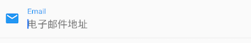

通过这种组件组合的方式，也可以定义背景圆角等。一般来说，优先通过 decoration 来自定义样式，如果 decoration 实现不了，再用 widget 组合的方式。

#### 2.7.2 表单 Form

实际业务中，在正式向服务器提交数据前，都会对各个输入框数据进行合法性校验，但是对每一个 TextField 都分别进行校验将会是一件很麻烦的事。还有，如果用户想清除一组 TextField 的内容，除了一个一个清除有没有什么更好的办法呢？为此，Flutter 提供了一个 Form 组件，它可以对输入框进行分组，然后进行一些统一操作，如输入内容校验、输入框重置以及输入内容保存。

##### Form

Form 继承自 StatefulWidget 对象，它对应的状态类为 FormState。我们先看看 Form 类的定义：

```dart
Form({
  @required Widget child,
  bool autovalidate = false,
  WillPopCallback onWillPop,
  VoidCallback onChanged,
})
```

- autovalidate：是否自动校验输入内容；当为true时，每一个子 FormField 内容发生变化时都会自动校验合法性，并直接显示错误信息；否则，需要通过调用 FormState.validate() 来手动校验；
- onWillPop：决定 Form 所在的路由是否可以直接返回（如点击返回按钮），该回调返回一个 Future 对象，如果 Future 的最终结果是 false，则当前路由不会返回；如果为 true，则会返回到上一个路由。此属性通常用于拦截返回按钮；
- onChanged：Form 的任意一个子 FormField 内容发生变化时会触发此回调。

##### FormField

Form 的子孙元素必须是 FormField 类型，FormField 是一个抽象类，定义几个属性，FormState 内部通过它们来完成操作，FormField 部分定义如下：

```dart
const FormField({
  ...
  FormFieldSetter<T> onSaved,       //保存回调
  FormFieldValidator<T>  validator, //验证回调
  T initialValue,                   //初始值
  bool autovalidate = false,        //是否自动校验
})
```

为了方便使用，Flutter 提供了一个 TextFormField 组件，它继承自 FormField 类，也是 TextField 的一个包装类，所以除了 FormField 定义的属性之外，它还包括 TextField 的属性。

##### FormState

- FormState 为 Form 的 State 类，可以通过 Form.of() 或 GlobalKey 获得。我们可以通过它来对 Form 的子孙 FormField 进行统一操作。我们看看其常用的三个方法：
  - FormState.validate()：调用此方法后，会调用 Form 子孙 FormField 的 validate 回调，如果有一个校验失败，则返回 false，所有校验失败项都会返回用户返回的错误提示；
  - FormState.save()：调用此方法后，会调用 Form 子孙 FormField 的 save 回调，用于保存表单内容；
  - FormState.reset()：调用此方法后，会将子孙 FormField 的内容清空。

##### 示例

- 我们修改一下上面用户登录的示例，在提交之前校验：
  - 用户名不能为空，如果为空则提示“用户名不能为空”；
  - 密码不能小于 6 位，如果小于 6 为则提示“密码不能少于6位”。

```dart
class FormTestRoute extends StatefulWidget {
  @override
  _FormTestRouteState createState() => new _FormTestRouteState();
}

class _FormTestRouteState extends State<FormTestRoute> {
  TextEditingController _unameController = new TextEditingController();
  TextEditingController _pwdController = new TextEditingController();
  GlobalKey _formKey= new GlobalKey<FormState>();

  @override
  Widget build(BuildContext context) {
    return Scaffold(
      appBar: AppBar(
        title:Text("Form Test"),
      ),
      body: Padding(
        padding: const EdgeInsets.symmetric(vertical: 16.0, horizontal: 24.0),
        child: Form(
          key: _formKey, //设置globalKey，用于后面获取FormState
          autovalidate: true, //开启自动校验
          child: Column(
            children: <Widget>[
              TextFormField(
                  autofocus: true,
                  controller: _unameController,
                  decoration: InputDecoration(
                      labelText: "用户名",
                      hintText: "用户名或邮箱",
                      icon: Icon(Icons.person)
                  ),
                  // 校验用户名
                  validator: (v) {
                    return v
                        .trim()
                        .length > 0 ? null : "用户名不能为空";
                  }

              ),
              TextFormField(
                  controller: _pwdController,
                  decoration: InputDecoration(
                      labelText: "密码",
                      hintText: "您的登录密码",
                      icon: Icon(Icons.lock)
                  ),
                  obscureText: true,
                  //校验密码
                  validator: (v) {
                    return v
                        .trim()
                        .length > 5 ? null : "密码不能少于6位";
                  }
              ),
              // 登录按钮
              Padding(
                padding: const EdgeInsets.only(top: 28.0),
                child: Row(
                  children: <Widget>[
                    Expanded(
                      child: RaisedButton(
                        padding: EdgeInsets.all(15.0),
                        child: Text("登录"),
                        color: Theme
                            .of(context)
                            .primaryColor,
                        textColor: Colors.white,
                        onPressed: () {
                          //在这里不能通过此方式获取FormState，context不对
                          //print(Form.of(context));

                          // 通过_formKey.currentState 获取FormState后，
                          // 调用validate()方法校验用户名密码是否合法，校验
                          // 通过后再提交数据。 
                          if((_formKey.currentState as FormState).validate()){
                            //验证通过提交数据
                          }
                        },
                      ),
                    ),
                  ],
                ),
              )
            ],
          ),
        ),
      ),
    );
  }
}
```

效果如下：


注意，登录按钮的 onPressed 方法中不能通过 Form.of(context) 来获取，原因是，此处的 context 为 FormTestRoute的context，而 Form.of(context) 是根据所指定 context 向根去查找，而 FormState 是在 FormTestRoute 的子树中，所以不行。正确的做法是通过 Builder 来构建登录按钮，Builder 会将 widget 节点的 context 作为回调参数：

```dart
Expanded(
 // 通过Builder来获取RaisedButton所在widget树的真正context(Element) 
  child:Builder(builder: (context){
    return RaisedButton(
      ...
      onPressed: () {
        //由于本widget也是Form的子代widget，所以可以通过下面方式获取FormState  
        if(Form.of(context).validate()){
          //验证通过提交数据
        }
      },
    );
  })
)
```

其实 context 正是操作 Widget 所对应的 Element 的一个接口，由于 Widget 树对应的 Element 都是不同的，所以 context 也都是不同的，有关 context 的更多内容会在后面高级部分详细讨论。Flutter 中有很多 “of(context)” 这种方法，读者在使用时一定要注意 context 是否正确。

### 2.8 进度指示器

Material 组件库中提供了两种进度指示器：LinearProgressIndicator 和 CircularProgressIndicator，它们都可以同时用于精确的进度指示和模糊的进度指示。精确进度通常用于任务进度可以计算和预估的情况，比如文件下载；而模糊进度则用户任务进度无法准确获得的情况，如下拉刷新，数据提交等。

#### 2.8.1 LinearProgressIndicator

LinearProgressIndicator 是一个线性、条状的进度条，定义如下：

```dart
LinearProgressIndicator({
  double value,
  Color backgroundColor,
  Animation<Color> valueColor,
  ...
})
```

- value：value 表示当前的进度，取值范围为 [0,1]；如果 value 为 null 时则指示器会执行一个循环动画（模糊进度）；当 value 不为 null 时，指示器为一个具体进度的进度条；
- backgroundColor：指示器的背景色；
- valueColor: 指示器的进度条颜色；值得注意的是，该值类型是 Animation<Color>，这允许我们对进度条的颜色也可以指定动画。如果我们不需要对进度条颜色执行动画，换言之，我们想对进度条应用一种固定的颜色，此时我们可以通过 AlwaysStoppedAnimation 来指定。

##### 示例

```dart
// 模糊进度条(会执行一个动画)
LinearProgressIndicator(
  backgroundColor: Colors.grey[200],
  valueColor: AlwaysStoppedAnimation(Colors.blue),
),
//进度条显示50%
LinearProgressIndicator(
  backgroundColor: Colors.grey[200],
  valueColor: AlwaysStoppedAnimation(Colors.blue),
  value: .5, 
)
```

效果如下：


第一个进度条在执行循环动画：蓝色条一直在移动，而第二个进度条是静止的，停在 50% 的位置。

#### 2.8.2 CircularProgressIndicator

CircularProgressIndicator 是一个圆形进度条，定义如下：

```dart
 CircularProgressIndicator({
  double value,
  Color backgroundColor,
  Animation<Color> valueColor,
  this.strokeWidth = 4.0,
  ...   
})
```

前三个参数和 LinearProgressIndicator 相同，不再赘述。strokeWidth 表示圆形进度条的粗细。示例如下：

```dart
// 模糊进度条(会执行一个旋转动画)
CircularProgressIndicator(
  backgroundColor: Colors.grey[200],
  valueColor: AlwaysStoppedAnimation(Colors.blue),
),
//进度条显示50%，会显示一个半圆
CircularProgressIndicator(
  backgroundColor: Colors.grey[200],
  valueColor: AlwaysStoppedAnimation(Colors.blue),
  value: .5,
),
```

运行效果如图所示：


第一个进度条会执行旋转动画，而第二个进度条是静止的，它停在50%的位置。

#### 2.8.3 自定义尺寸

我们可以发现 LinearProgressIndicator 和 CircularProgressIndicator，并没有提供设置圆形进度条尺寸的参数；如果我们希望 LinearProgressIndicator 的线细一些，或者希望 CircularProgressIndicator 的圆大一些该怎么做？

其实 LinearProgressIndicator 和 CircularProgressIndicator 都是取父容器的尺寸作为绘制的边界的。知道了这点，我们便可以通过尺寸限制类 Widget，如 ConstrainedBox、SizedBox （我们将在后面容器类组件一章中介绍）来指定尺寸，如：

```dart
// 线性进度条高度指定为3
SizedBox(
  height: 3,
  child: LinearProgressIndicator(
    backgroundColor: Colors.grey[200],
    valueColor: AlwaysStoppedAnimation(Colors.blue),
    value: .5,
  ),
),
// 圆形进度条直径指定为100
SizedBox(
  height: 100,
  width: 100,
  child: CircularProgressIndicator(
    backgroundColor: Colors.grey[200],
    valueColor: AlwaysStoppedAnimation(Colors.blue),
    value: .7,
  ),
),
```

效果如下：


注意，如果 CircularProgressIndicator 显示空间的宽高不同，则会显示为椭圆。如：

```dart
// 宽高不等
SizedBox(
  height: 100,
  width: 130,
  child: CircularProgressIndicator(
    backgroundColor: Colors.grey[200],
    valueColor: AlwaysStoppedAnimation(Colors.blue),
    value: .7,
  ),
),
```

效果如下：


#### 2.8.4 进度色动画

前面说过可以通过 valueColor 对进度条颜色做动画，关于动画我们将在后面专门的章节详细介绍，这里先给出一个例子，读者在了解了 Flutter 动画一章后再回过头来看。

我们实现一个进度条在 3 秒内从灰色变成蓝色的动画：

```dart
import 'package:flutter/material.dart';

class ProgressRoute extends StatefulWidget {
  @override
  _ProgressRouteState createState() => _ProgressRouteState();
}

class _ProgressRouteState extends State<ProgressRoute>
    with SingleTickerProviderStateMixin {
  AnimationController _animationController;

  @override
  void initState() {
    //动画执行时间3秒  
    _animationController =
        new AnimationController(vsync: this, duration: Duration(seconds: 3));
    _animationController.forward();
    _animationController.addListener(() => setState(() => {}));
    super.initState();
  }

  @override
  void dispose() {
    _animationController.dispose();
    super.dispose();
  }

  @override
  Widget build(BuildContext context) {
    return SingleChildScrollView(
      child: Column(
        children: <Widget>[
            Padding(
            padding: EdgeInsets.all(16),
            child: LinearProgressIndicator(
              backgroundColor: Colors.grey[200],
              valueColor: ColorTween(begin: Colors.grey, end: Colors.blue)
                .animate(_animationController), // 从灰色变成蓝色
              value: _animationController.value,
            ),
          );
        ],
      ),
    );
  }
}
```

#### 2.8.5 自定义进度指示器样式

定制进度指示器风格样式，可以通过 CustomPainter Widget 来自定义绘制逻辑，实际上 LinearProgressIndicator 和 CircularProgressIndicator 也正是通过 CustomPainter来实现外观绘制的。关于 CustomPainter，我们将在后面 “自定义Widget”一章中详细介绍

> [flutter_spinkit](https://pub.flutter-io.cn/packages/flutter_spinkit) 包提供了多种风格的模糊进度指示器，读者若是感兴趣，可以参考。

## 三、布局类组件

### 3.1 布局类组件简介

布局类组件都会包含一个或多个子组件，不同的布局类组件对子组件排版(layout)方式不同。我们在前面说过 Element 树才是最终的绘制树，Element 树是通过 Widget 树来创建的（通过 Widget.createElement()），Widget 其实就是 Element 的配置数据。在 Flutter 中，根据 Widget 是否需要包含子节点将 Widget 分为了三类，分别对应三种 Element，如下表：

|Widget  |对应的Element  |用途|
|:---|:---|:---|
|LeafRenderObjectWidget  |LeafRenderObjectElement |Widget 树的叶子节点，用于没有子节点的 widget，通常基础组件都属于这一类，如Image|
|SingleChildRenderObjectWidget |SingleChildRenderObjectElement  |包含一个子 Widget，如：ConstrainedBox、DecoratedBox 等|
|MultiChildRenderObjectWidget  |MultiChildRenderObjectElement |包含多个子 Widget，一般都有一个 children 参数，接受一个 Widget 数组。如 Row、Column、Stack 等|

> 注意，Flutter 中的很多 Widget 是直接继承自 StatelessWidget 或 StatefulWidget，然后在 build() 方法中构建真正的 RenderObjectWidget，如 Text，它其实是继承自 StatelessWidget，然后在 build() 方法中通过 RichText 来构建其子树，而 RichText 才是继承自 MultiChildRenderObjectWidget。所以为了方便叙述，我们也可以直接说 Text 属于 MultiChildRenderObjectWidget（其它 widget 也可以这么描述），这才是本质。读到这里我们也会发现，其实 StatelessWidget 和 StatefulWidget 就是两个用于组合 Widget 的基类，它们本身并不关联最终的渲染对象（RenderObjectWidget）。

布局类组件就是指直接或间接继承(包含) MultiChildRenderObjectWidget 的 Widget，它们一般都会有一个 children 属性用于接收子 Widget。我们看一下继承关系 Widget > RenderObjectWidget > (Leaf/SingleChild/MultiChild) RenderObjectWidget。

RenderObjectWidget 类中定义了创建、更新 RenderObject 的方法，子类必须实现他们，关于 RenderObject 我们现在只需要知道它是最终布局、渲染UI界面的对象即可，也就是说，对于布局类组件来说，其布局算法都是通过对应的 RenderObject 对象来实现的，所以读者如果对接下来介绍的某个布局类组件的原理感兴趣，可以查看其对应的 RenderObject 的实现，比如 Stack（层叠布局）对应的 RenderObject 对象就是 RenderStack，而层叠布局的实现就在 RenderStack 中。

在本章中，为了让读者对布局类 Widget 有个快速的认识，所以我们并不会深入到 RenderObject 的细节中去。在学习本章时，读者的重点是掌握不同布局组件的布局特点，具体原理和细节等我们对 Flutter 整体入门后，感兴趣的话再去研究。

### 3.2 线性布局（Row和Column）

所谓线性布局，即指沿水平或垂直方向排布子组件。Flutter 中通过 Row 和 Column 来实现线性布局，类似于 Android 中的 LinearLayout 控件。Row 和 Column 都继承自 Flex，我们将在弹性布局一节中详细介绍 Flex。

#### 3.2.1 主轴和纵轴

对于线性布局，有主轴和纵轴之分，如果布局是沿水平方向，那么主轴就是指水平方向，而纵轴即垂直方向；如果布局沿垂直方向，那么主轴就是指垂直方向，而纵轴就是水平方向。在线性布局中，有两个定义对齐方式的枚举类 MainAxisAlignment 和 CrossAxisAlignment，分别代表主轴对齐和纵轴对齐。

#### 3.2.2 Row

Row 可以在水平方向排列其子 widget。定义如下：

```dart
Row({
  ...  
  TextDirection textDirection,    
  MainAxisSize mainAxisSize = MainAxisSize.max,    
  MainAxisAlignment mainAxisAlignment = MainAxisAlignment.start,
  VerticalDirection verticalDirection = VerticalDirection.down,  
  CrossAxisAlignment crossAxisAlignment = CrossAxisAlignment.center,
  List<Widget> children = const <Widget>[],
})
```

- textDirection：表示水平方向子组件的布局顺序(是从左往右还是从右往左)，默认为系统当前 Locale 环境的文本方向(如中文、英语都是从左往右，而阿拉伯语是从右往左)；
- mainAxisSize：表示 Row 在主轴(水平)方向占用的空间，默认是 MainAxisSize.max，表示尽可能多的占用水平方向的空间，此时无论子 widgets 实际占用多少水平空间，Row 的宽度始终等于水平方向的最大宽度；而 MainAxisSize.min 表示尽可能少的占用水平空间，当子组件没有占满水平剩余空间，则 Row 的实际宽度等于所有子组件占用的的水平空间；
- mainAxisAlignment：表示子组件在 Row 所占用的水平空间内对齐方式，如果 mainAxisSize 值为 MainAxisSize.min，则此属性无意义，因为子组件的宽度等于 Row 的宽度。只有当 mainAxisSize 的值为 MainAxisSize.max 时，此属性才有意义；
  - MainAxisAlignment.start 表示沿 textDirection 的初始方向对齐，如 textDirection 取值为 TextDirection.ltr 时，则 MainAxisAlignment.start 表示左对齐，textDirection 取值为 TextDirection.rtl 时表示从右对齐；
  - 而 MainAxisAlignment.end 和 MainAxisAlignment.start 正好相反；
  - MainAxisAlignment.center 表示居中对齐。
  - 读者可以这么理解：textDirection 是 mainAxisAlignment 的参考系。
- verticalDirection：表示 Row 纵轴（垂直）的对齐方向，默认是 VerticalDirection.down，表示从上到下；
- crossAxisAlignment：表示子组件在纵轴方向的对齐方式，Row 的高度等于子组件中最高的子元素高度，它的取值和 MainAxisAlignment 一样(包含 start、end、 center 三个值)，不同的是 crossAxisAlignment 的参考系是 verticalDirection，即 verticalDirection 值为 VerticalDirection.down 时 crossAxisAlignment.start 指顶部对齐，verticalDirection 值为 VerticalDirection.up 时，crossAxisAlignment.start 指底部对齐；而 crossAxisAlignment.end 和 crossAxisAlignment.start 正好相反；
- children ：子组件数组。

##### 示例

```dart
Column(
  //测试Row对齐方式，排除Column默认居中对齐的干扰
  crossAxisAlignment: CrossAxisAlignment.start,
  children: <Widget>[
    Row(
      mainAxisAlignment: MainAxisAlignment.center,
      children: <Widget>[
        Text(" hello world "),
        Text(" I am Jack "),
      ],
    ),
    Row(
      mainAxisSize: MainAxisSize.min,
      mainAxisAlignment: MainAxisAlignment.center,
      children: <Widget>[
        Text(" hello world "),
        Text(" I am Jack "),
      ],
    ),
    Row(
      mainAxisAlignment: MainAxisAlignment.end,
      textDirection: TextDirection.rtl,
      children: <Widget>[
        Text(" hello world "),
        Text(" I am Jack "),
      ],
    ),
    Row(
      crossAxisAlignment: CrossAxisAlignment.start,  
      verticalDirection: VerticalDirection.up,
      children: <Widget>[
        Text(" hello world ", style: TextStyle(fontSize: 30.0),),
        Text(" I am Jack "),
      ],
    ),
  ],
);
```

效果如下：

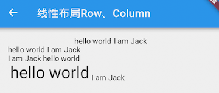

#### 3.2.3 Column

Column 可以在垂直方向排列其子组件。参数和 Row 一样，不同的是布局方向为垂直，主轴纵轴正好相反，读者可类比 Row 来理解，下面看一个例子：

```dart
import 'package:flutter/material.dart';

class CenterColumnRoute extends StatelessWidget {
  @override
  Widget build(BuildContext context) {
    return Column(
      crossAxisAlignment: CrossAxisAlignment.center,
      children: <Widget>[
        Text("hi"),
        Text("world"),
      ],
    );
  }
}
```

运行效果如图：


- 解释：
  - 由于我们没有指定 Column 的 mainAxisSize，所以使用默认值 MainAxisSize.max，则 Column 会在垂直方向占用尽可能多的空间，此例中为屏幕高度；
  - 由于我们指定了 crossAxisAlignment 属性为 CrossAxisAlignment.center，那么子项在 Column 纵轴方向（此时为水平方向）会居中对齐。注意，在水平方向对齐是有边界的，总宽度为 Column 占用空间的实际宽度，而实际的宽度取决于子项中宽度最大的 Widget。在本例中，Column 有两个子 Widget，而显示 “world” 的 Text 宽度最大，所以 Column 的实际宽度则为 Text("world") 的宽度，所以居中对齐后 Text("hi") 会显示在 Text("world") 的中间部分。

- 实际上，Row 和 Column 都只会在主轴方向占用尽可能大的空间，而纵轴的长度则取决于他们最大子元素的长度。如果我们想让本例中的两个文本控件在整个手机屏幕中间对齐，我们有两种方法：

将 Column 的宽度指定为屏幕宽度；这很简单，我们可以通过 ConstrainedBox 或 SizedBox（我们将在后面章节中专门介绍这两个 Widget）来强制更改宽度限制，例如：

```dart
ConstrainedBox(
  constraints: BoxConstraints(minWidth: double.infinity), 
  child: Column(
    crossAxisAlignment: CrossAxisAlignment.center,
    children: <Widget>[
      Text("hi"),
      Text("world"),
    ],
  ),
);
```

将 minWidth 设为 double.infinity，可以使宽度占用尽可能多的空间。

使用 Center Widget；我们将在后面章节中介绍。

#### 3.2.4 特殊情况

如果 Row 里面嵌套 Row，或者 Column 里面再嵌套 Column，那么只有最外面的 Row 或 Column 会占用尽可能大的空间，里面 Row 或 Column 所占用的空间为实际大小，下面以 Column 为例说明：

```dart
Container(
  color: Colors.green,
  child: Padding(
    padding: const EdgeInsets.all(16.0),
    child: Column(
      crossAxisAlignment: CrossAxisAlignment.start,
      mainAxisSize: MainAxisSize.max, //有效，外层Colum高度为整个屏幕
      children: <Widget>[
        Container(
          color: Colors.red,
          child: Column(
            mainAxisSize: MainAxisSize.max,//无效，内层Colum高度为实际高度  
            children: <Widget>[
              Text("hello world "),
              Text("I am Jack "),
            ],
          ),
        )
      ],
    ),
  ),
);
```

效果如下：


如果要让里面的 Column 占满外部 Column，可以使用 Expanded 组件：

```dart
Expanded( 
  child: Container(
    color: Colors.red,
    child: Column(
      mainAxisAlignment: MainAxisAlignment.center, //垂直方向居中对齐
      children: <Widget>[
        Text("hello world "),
        Text("I am Jack "),
      ],
    ),
  ),
)
```

效果如下：


#### 3.3 弹性布局（Flex）

弹性布局允许子组件按照一定比例来分配父容器空间。弹性布局的概念在其它 UI 系统中也都存在，如 H5 中的弹性盒子布局，Android 中的 FlexboxLayout 等。Flutter 中的弹性布局主要通过 Flex 和 Expanded 来配合实现。

#### 3.4.1 Flex

Flex 组件可以沿着水平或垂直方向排列子组件，如果你知道主轴方向，使用 Row 或 Column 会方便一些，因为 Row 和 Column 都继承自 Flex，参数基本相同，所以能使用 Flex 的地方基本上都可以使用 Row 或 Column。Flex 本身功能是很强大的，它也可以和 Expanded 组件配合实现弹性布局。接下来我们只讨论 Flex 和弹性布局相关的属性(其它属性已经在介绍 Row 和 Column 时介绍过了)。

```dart
Flex({
  ...
  @required this.direction, //弹性布局的方向, Row 默认为水平方向，Column 默认为垂直方向
  List<Widget> children = const <Widget>[],
})
```

Flex 继承自 MultiChildRenderObjectWidget，对应的 RenderObject 为 RenderFlex，RenderFlex 中实现了其布局算法。

#### 3.4.2 Expanded

可以按比例 “扩伸” Row、Column 和 Flex 子组件所占用的空间。

```dart
const Expanded({
  int flex = 1, 
  @required Widget child,
})
```

flex 参数为弹性系数，如果为 0 或 null，则 child 是没有弹性的，即不会被扩伸占用的空间。如果大于 0，所有的 Expanded 按照其 flex 的比例来分割主轴的全部空闲空间。下面我们看一个例子：

```dart
class FlexLayoutTestRoute extends StatelessWidget {
  @override
  Widget build(BuildContext context) {
    return Column(
      children: <Widget>[
        //Flex的两个子widget按1：2来占据水平空间  
        Flex(
          direction: Axis.horizontal,
          children: <Widget>[
            Expanded(
              flex: 1,
              child: Container(
                height: 30.0,
                color: Colors.red,
              ),
            ),
            Expanded(
              flex: 2,
              child: Container(
                height: 30.0,
                color: Colors.green,
              ),
            ),
          ],
        ),
        Padding(
          padding: const EdgeInsets.only(top: 20.0),
          child: SizedBox(
            height: 100.0,
            //Flex的三个子widget，在垂直方向按2：1：1来占用100像素的空间  
            child: Flex(
              direction: Axis.vertical,
              children: <Widget>[
                Expanded(
                  flex: 2,
                  child: Container(
                    height: 30.0,
                    color: Colors.red,
                  ),
                ),
                Spacer(
                  flex: 1,
                ),
                Expanded(
                  flex: 1,
                  child: Container(
                    height: 30.0,
                    color: Colors.green,
                  ),
                ),
              ],
            ),
          ),
        ),
      ],
    );
  }
}
```

运行效果如图所示：


示例中的 Spacer 的功能是占用指定比例的空间，实际上它只是 Expanded 的一个包装类，Spacer 的源码如下：

```dart
class Spacer extends StatelessWidget {
  const Spacer({Key key, this.flex = 1})
    : assert(flex != null),
      assert(flex > 0),
      super(key: key);

  final int flex;

  @override
  Widget build(BuildContext context) {
    return Expanded(
      flex: flex,
      child: const SizedBox.shrink(),
    );
  }
}
```

### 3.4 流式布局

在介绍 Row 和 Colum 时，如果子 widget 超出屏幕范围，则会报溢出错误，如：

```dart
Row(
  children: <Widget>[
    Text("xxx"*100)
  ],
);
```

运行效果如图所示：


可以看到，右边溢出部分报错。这是因为 Row 默认只有一行，如果超出屏幕不会折行。我们把超出屏幕显示范围会自动折行的布局称为流式布局。Flutter 中通过 Wrap 和 Flow 来支持流式布局，将上例中的 Row 换成 Wrap 后溢出部分则会自动折行，下面我们分别介绍 Wrap 和 Flow.

#### 3.4.1 Wrap

下面是 Wrap 的定义:

```dart
Wrap({
  ...
  this.direction = Axis.horizontal,
  this.alignment = WrapAlignment.start,
  this.spacing = 0.0,
  this.runAlignment = WrapAlignment.start,
  this.runSpacing = 0.0,
  this.crossAxisAlignment = WrapCrossAlignment.start,
  this.textDirection,
  this.verticalDirection = VerticalDirection.down,
  List<Widget> children = const <Widget>[],
})
```

我们可以看到 Wrap 的很多属性在 Row（包括Flex和Column）中也有，如 direction、crossAxisAlignment、textDirection、verticalDirection 等，这些参数意义是相同的；读者可以认为 Wrap 和 Flex（包括Row和Column）除了超出显示范围后 Wrap 会折行外，其它行为基本相同。下面我们看一下 Wrap 特有的几个属性：

- spacing：主轴方向子widget的间距
- runSpacing：纵轴方向的间距
- runAlignment：纵轴方向的对齐方式

下面看一个示例子：

```dart
Wrap(
  spacing: 8.0, // 主轴(水平)方向间距
  runSpacing: 4.0, // 纵轴（垂直）方向间距
  alignment: WrapAlignment.center, //沿主轴方向居中
  children: <Widget>[
    new Chip(
      avatar: new CircleAvatar(backgroundColor: Colors.blue, child: Text('A')),
      label: new Text('Hamilton'),
    ),
    new Chip(
      avatar: new CircleAvatar(backgroundColor: Colors.blue, child: Text('M')),
      label: new Text('Lafayette'),
    ),
    new Chip(
      avatar: new CircleAvatar(backgroundColor: Colors.blue, child: Text('H')),
      label: new Text('Mulligan'),
    ),
    new Chip(
      avatar: new CircleAvatar(backgroundColor: Colors.blue, child: Text('J')),
      label: new Text('Laurens'),
    ),
  ],
)
```

运行效果如图所示：


#### 3.4.2 Flow

我们一般很少会使用 Flow，因为其过于复杂，需要自己实现子 widget 的位置转换，在很多场景下首先要考虑的是 Wrap 是否满足需求。Flow 主要用于一些需要自定义布局策略或性能要求较高(如动画中)的场景。

- Flow 有如下优点：
  - 性能好；Flow是一个对子组件尺寸以及位置调整非常高效的控件，Flow用转换矩阵在对子组件进行位置调整的时候进行了优化：在Flow定位过后，如果子组件的尺寸或者位置发生了变化，在FlowDelegate中的paintChildren()方法中调用context.paintChild 进行重绘，而context.paintChild在重绘时使用了转换矩阵，并没有实际调整组件位置。
  - 灵活；由于我们需要自己实现FlowDelegate的paintChildren()方法，所以我们需要自己计算每一个组件的位置，因此，可以自定义布局策略。

- 缺点：
  - 使用复杂。
  - 不能自适应子组件大小，必须通过指定父容器大小或实现TestFlowDelegate的getSize返回固定大小。


- 示例：

我们对六个色块进行自定义流式布局：

```dart
Flow(
  delegate: TestFlowDelegate(margin: EdgeInsets.all(10.0)),
  children: <Widget>[
    new Container(width: 80.0, height:80.0, color: Colors.red,),
    new Container(width: 80.0, height:80.0, color: Colors.green,),
    new Container(width: 80.0, height:80.0, color: Colors.blue,),
    new Container(width: 80.0, height:80.0,  color: Colors.yellow,),
    new Container(width: 80.0, height:80.0, color: Colors.brown,),
    new Container(width: 80.0, height:80.0,  color: Colors.purple,),
  ],
)
```

实现 TestFlowDelegate:

```dart
class TestFlowDelegate extends FlowDelegate {
  EdgeInsets margin = EdgeInsets.zero;
  TestFlowDelegate({this.margin});
  @override
  void paintChildren(FlowPaintingContext context) {
    var x = margin.left;
    var y = margin.top;
    //计算每一个子widget的位置  
    for (int i = 0; i < context.childCount; i++) {
      var w = context.getChildSize(i).width + x + margin.right;
      if (w < context.size.width) {
        context.paintChild(i,
            transform: new Matrix4.translationValues(
                x, y, 0.0));
        x = w + margin.left;
      } else {
        x = margin.left;
        y += context.getChildSize(i).height + margin.top + margin.bottom;
        //绘制子widget(有优化)  
        context.paintChild(i,
            transform: new Matrix4.translationValues(
                x, y, 0.0));
         x += context.getChildSize(i).width + margin.left + margin.right;
      }
    }
  }

  @override
  getSize(BoxConstraints constraints){
    //指定Flow的大小  
    return Size(double.infinity,200.0);
  }

  @override
  bool shouldRepaint(FlowDelegate oldDelegate) {
    return oldDelegate != this;
  }
}
```

运行效果见图：


可以看到我们主要的任务就是实现 paintChildren，它的主要任务是确定每个子 widget 位置。由于 Flow 不能自适应子 widget 的大小，我们通过在 getSize 返回一个固定大小来指定 Flow 的大小。

### 3.5 层叠布局 Stack、Positioned

层叠布局和 Web 中的绝对定位、Android 中的 Frame 布局是相似的，子组件可以根据距父容器四个角的位置来确定自身的位置。绝对定位允许子组件堆叠起来（按照代码中声明的顺序）。Flutter 中使用 Stack 和 Positioned 这两个组件来配合实现绝对定位。Stack 允许子组件堆叠，而 Positioned 用于根据 Stack 的四个角来确定子组件的位置。

#### 3.5.1 Stack

```dart
Stack({
  this.alignment = AlignmentDirectional.topStart,
  this.textDirection,
  this.fit = StackFit.loose,
  this.overflow = Overflow.clip,
  List<Widget> children = const <Widget>[],
})
```

- alignment：此参数决定如何去对齐没有定位（没有使用Positioned）或部分定位的子组件。所谓部分定位，在这里特指没有在某一个轴上定位：left、right 为横轴，top、bottom 为纵轴，只要包含某个轴上的一个定位属性就算在该轴上有定位；
- textDirection：和 Row、Wrap 的 textDirection 功能一样，都用于确定 alignment 对齐的参考系，即：textDirection 的值为 TextDirection.ltr，则 alignment 的 start 代表左，end 代表右，即从左往右的顺序；textDirection 的值为 TextDirection.rtl，则 alignment 的 start 代表右，end 代表左，即从右往左的顺序；
- fit：此参数用于确定没有定位的子组件如何去适应 Stack 的大小。StackFit.loose 表示使用子组件的大小，StackFit.expand 表示扩伸到 Stack 的大小；
overflow：此属性决定如何显示超出 Stack 显示空间的子组件；值为 Overflow.clip 时，超出部分会被剪裁（隐藏），值为 Overflow.visible 时则不会。

#### 3.5.1 Positioned

```dart
const Positioned({
  Key key,
  this.left, 
  this.top,
  this.right,
  this.bottom,
  this.width,
  this.height,
  @required Widget child,
})
```
- left、top 、right、 bottom 分别代表离 Stack 左、上、右、底四边的距离；width 和 height 用于指定需要定位元素的宽度和高度。注意，Positioned 的 width、height 和其它地方的意义稍微有点区别，此处用于配合 left、top 、right、 bottom 来定位组件，举个例子，在水平方向时，你只能指定 left、right、width 三个属性中的两个，如指定 left 和 width 后，right 会自动算出(left+width)，如果同时指定三个属性则会报错，垂直方向同理；

- 示例：


在下面的例子中，我们通过对几个 Text 组件的定位来演示 Stack 和 Positioned 的特性：

```dart
//通过ConstrainedBox来确保Stack占满屏幕
ConstrainedBox(
  constraints: BoxConstraints.expand(),
  child: Stack(
    alignment:Alignment.center , //指定未定位或部分定位widget的对齐方式
    children: <Widget>[
      Container(child: Text("Hello world",style: TextStyle(color: Colors.white)),
        color: Colors.red,
      ),
      Positioned(
        left: 18.0,
        child: Text("I am Jack"),
      ),
      Positioned(
        top: 18.0,
        child: Text("Your friend"),
      )        
    ],
  ),
);
```

运行效果见图：


由于第一个子文本组件 Text("Hello world") 没有指定定位，并且 alignment 值为 Alignment.center，所以它会居中显示。第二个子文本组件 Text("I am Jack") 只指定了水平方向的定位 (left)，所以属于部分定位，即垂直方向上没有定位，那么它在垂直方向的对齐方式则会按照 alignment 指定的对齐方式对齐，即垂直方向居中。对于第三个子文本组件 Text("Your friend")，和第二个 Text 原理一样，只不过是水平方向没有定位，则水平方向居中。

我们给上例中的 Stack 指定一个 fit 属性，然后将三个子文本组件的顺序调整一下：

```dart
Stack(
  alignment:Alignment.center ,
  fit: StackFit.expand, //未定位widget占满Stack整个空间
  children: <Widget>[
    Positioned(
      left: 18.0,
      child: Text("I am Jack"),
    ),
    Container(child: Text("Hello world",style: TextStyle(color: Colors.white)),
      color: Colors.red,
    ),
    Positioned(
      top: 18.0,
      child: Text("Your friend"),
    )
  ],
),
```

显示效果如图所示：


可以看到，由于第二个子文本组件没有定位，所以 fit 属性会对它起作用，就会占满 Stack。由于 Stack 子元素是堆叠的，所以第一个子文本组件被第二个遮住了，而第三个在最上层，所以可以正常显示。

### 3.6 对齐与相对定位（Align）

在上一节中我们讲过通过 Stack 和 Positioned，我们可以指定一个或多个子元素相对于父元素各个边的精确偏移，并且可以重叠。但如果我们只想简单的调整一个子元素在父元素中的位置的话，使用 Align 组件会更简单一些。

#### 3.6.1 Align

Align 组件可以调整子组件的位置，并且可以根据子组件的宽高来确定自身的的宽高，定义如下：

```dart
Align({
  Key key,
  this.alignment = Alignment.center,
  this.widthFactor,
  this.heightFactor,
  Widget child,
})
```

- alignment : 需要一个 AlignmentGeometry 类型的值，表示子组件在父组件中的起始位置。AlignmentGeometry 是一个抽象类，它有两个常用的子类：Alignment 和 FractionalOffset，我们将在下面的示例中详细介绍；
- widthFactor 和 heightFactor 是用于确定 Align 组件本身宽高的属性；它们是两个缩放因子，会分别乘以子元素的宽、高，最终的结果就是 Align 组件的宽高。如果值为 null，则组件的宽高将会占用尽可能多的空间。


##### 示例

我们先来看一个简单的例子：

```dart
Container(
  height: 120.0,
  width: 120.0,
  color: Colors.blue[50],
  child: Align(
    alignment: Alignment.topRight,
    child: FlutterLogo(
      size: 60,
    ),
  ),
)
```

运行效果如图所示：


FlutterLogo 是 Flutter SDK 提供的一个组件，内容就是 Flutter 的商标。在上面的例子中，我们显式指定了 Container 的宽、高都为 120。如果我们不显式指定宽高，而通过同时指定 widthFactor 和 heightFactor 为 2 也是可以达到同样的效果：

```dart
Align(
  widthFactor: 2,
  heightFactor: 2,
  alignment: Alignment.topRight,
  child: FlutterLogo(
    size: 60,
  ),
),
```

因为 FlutterLogo 的宽高为 60，则 Align 的最终宽高都为 2\*60=120。

另外，我们通过 Alignment.topRight 将 FlutterLogo 定位在 Container 的右上角。那 Alignment.topRight 是什么呢？通过源码我们可以看到其定义如下：

```dart
//右上角
static const Alignment topRight = Alignment(1.0, -1.0);
```

可以看到它只是 Alignment 的一个实例，下面我们介绍一下 Alignment。

#### 3.6.2 Alignment

Alignment 继承自 AlignmentGeometry，表示矩形内的一个点，他有两个属性 x、y，分别表示在水平和垂直方向的偏移，Alignment 定义如下：

```dart
Alignment(this.x, this.y)
```

Alignment Widget 会以矩形的中心点作为坐标原点，即 Alignment(0.0, 0.0) 。x、y 的值从 -1 到 1 分别代表矩形左边到右边的距离和顶部到底边的距离，因此 2 个水平（或垂直）单位则等于矩形的宽（或高），如 Alignment(-1.0, -1.0) 代表矩形的左侧顶点，而 Alignment(1.0, 1.0) 代表右侧底部终点，而 Alignment(1.0, -1.0) 则正是右侧顶点，即 Alignment.topRight。为了使用方便，矩形的原点、四个顶点，以及四条边的终点在 Alignment 类中都已经定义为了静态常量。

Alignment 可以通过其坐标转换公式将其坐标转为子元素的具体偏移坐标：

```dart
(Alignment.x*childWidth/2+childWidth/2, Alignment.y*childHeight/2+childHeight/2)
```

其中 childWidth 为子元素的宽度，childHeight 为子元素高度。

现在我们再看看上面的示例，我们将 Alignment(1.0, -1.0) 带入上面公式，可得 FlutterLogo 的实际偏移坐标正是（60，0）。下面再看一个例子：

```dart
 Align(
  widthFactor: 2,
  heightFactor: 2,
  alignment: Alignment(2,0.0),
  child: FlutterLogo(
    size: 60,
  ),
)
```

我们可以先想象一下运行效果：将 Alignment(2,0.0)带入上述坐标转换公式，可以得到 FlutterLogo 的实际偏移坐标为（90，30）。实际运行如图所示：


#### 3.6.3 FractionalOffset

FractionalOffset 继承自 Alignment，它和 Alignment 唯一的区别就是坐标原点不同！FractionalOffset 的坐标原点为矩形的左侧顶点，这和布局系统的一致，所以理解起来会比较容易。FractionalOffset 的坐标转换公式为：

```dart
实际偏移 = (FractionalOffse.x * childWidth, FractionalOffse.y * childHeight)
```

下面看一个例子：

```dart
Container(
  height: 120.0,
  width: 120.0,
  color: Colors.blue[50],
  child: Align(
    alignment: FractionalOffset(0.2, 0.6),
    child: FlutterLogo(
      size: 60,
    ),
  ),
)
```

实际运行效果如图所示下：


我们将 FractionalOffset(0.2, 0.6) 带入坐标转换公式得 FlutterLogo 实际偏移为（12，36），和实际运行效果吻合。

#### 3.6.4 Align 和 Stack 对比

可以看到，Align 和 Stack/Positioned 都可以用于指定子元素相对于父元素的偏移，但它们还是有两个主要区别：

- 定位参考系统不同；Stack/Positioned定位的的参考系可以是父容器矩形的四个顶点；而 Align 则需要先通过 alignment 参数来确定坐标原点，不同的 alignment 会对应不同原点，最终的偏移是需要通过 alignment 的转换公式来计算出；
- Stack 可以有多个子元素，并且子元素可以堆叠，而 Align 只能有一个子元素，不存在堆叠。

#### 3.6.5 Center 组件

我们在前面章节的例子中已经使用过 Center 组件来居中子元素了，现在我们正式来介绍一下它。通过查找 SDK 源码，我们看到 Center 组件定义如下：

```dart
class Center extends Align {
  const Center({ Key key, double widthFactor, double heightFactor, Widget child })
    : super(key: key, widthFactor: widthFactor, heightFactor: heightFactor, child: child);
}
```

可以看到 Center 继承自 Align，它比 Align 只少了一个 alignment 参数；由于 Align 的构造函数中 alignment 值为 Alignment.center，所以，我们可以认为 Center 组件其实是对齐方式确定（Alignment.center）了的 Align。

上面我们讲过当 widthFactor 或 heightFactor 为 null 时组件的宽高将会占用尽可能多的空间，这一点需要特别注意，我们通过一个示例说明：

```dart
...//省略无关代码
DecoratedBox(
  decoration: BoxDecoration(color: Colors.red),
  child: Center(
    child: Text("xxx"),
  ),
),
DecoratedBox(
  decoration: BoxDecoration(color: Colors.red),
  child: Center(
    widthFactor: 1,
    heightFactor: 1,
    child: Text("xxx"),
  ),
)
```

运行效果如图所示：


#### 3.6.6 总结

本节重点介绍了 Align 组件及两种偏移类 Alignment 和 FractionalOffset，读者需要理解这两种偏移类的区别及各自的坐标转化公式。另外，在此建议读者在需要制定一些精确的偏移时应优先使用 FractionalOffset，因为它的坐标原点和布局系统相同，能更容易算出实际偏移。

在后面，我们又介绍了 Align 组件和 Stack/Positioned、Center 的关系，读者可以对比理解。

## 四、容器类组件

### 4.1 填充（Padding）

Padding 可以给其子节点添加填充（留白），和边距效果类似。我们在前面很多示例中都已经使用过它了，现在来看看它的定义：

```dart
Padding({
  ...
  EdgeInsetsGeometry padding,
  Widget child,
})
```

EdgeInsetsGeometry 是一个抽象类，开发中，我们一般都使用 EdgeInsets 类，它是 EdgeInsetsGeometry 的一个子类，定义了一些设置填充的便捷方法。

#### 4.1.1 EdgeInsets

- 我们看看 EdgeInsets 提供的便捷方法：
  - fromLTRB(double left, double top, double right, double bottom)：分别指定四个方向的填充。
  - all(double value) : 所有方向均使用相同数值的填充。
  - only({left, top, right ,bottom })：可以设置具体某个方向的填充(可以同时指定多个方向)。
  - symmetric({ vertical, horizontal })：用于设置对称方向的填充，vertical指top和bottom，horizontal指left和right。

##### 示例

下面的示例主要展示了 EdgeInsets 的不同用法，比较简单，源码如下：

```dart
class PaddingTestRoute extends StatelessWidget {
  @override
  Widget build(BuildContext context) {
    return Padding(
      //上下左右各添加16像素补白
      padding: EdgeInsets.all(16.0),
      child: Column(
        //显式指定对齐方式为左对齐，排除对齐干扰
        crossAxisAlignment: CrossAxisAlignment.start,
        children: <Widget>[
          Padding(
            //左边添加8像素补白
            padding: const EdgeInsets.only(left: 8.0),
            child: Text("Hello world"),
          ),
          Padding(
            //上下各添加8像素补白
            padding: const EdgeInsets.symmetric(vertical: 8.0),
            child: Text("I am Jack"),
          ),
          Padding(
            // 分别指定四个方向的补白
            padding: const EdgeInsets.fromLTRB(20.0,.0,20.0,20.0),
            child: Text("Your friend"),
          )
        ],
      ),
    );
  }
}
```


### 4.2 尺寸限制类容器

尺寸限制类容器用于限制容器大小，Flutter 中提供了多种这样的容器，如 ConstrainedBox、SizedBox、UnconstrainedBox、AspectRatio 等，本节将介绍一些常用的。

#### 4.2.1 ConstrainedBox

ConstrainedBox 用于对子组件添加额外的约束。例如，如果你想让子组件的最小高度是 80 像素，你可以使用 const BoxConstraints(minHeight: 80.0) 作为子组件的约束。

##### 示例

我们先定义一个redBox，它是一个背景颜色为红色的盒子，不指定它的宽度和高度：

```dart
Widget redBox=DecoratedBox(
  decoration: BoxDecoration(color: Colors.red),
);
```

我们实现一个最小高度为 50，宽度尽可能大的红色容器。

```dart
ConstrainedBox(
  constraints: BoxConstraints(
    minWidth: double.infinity, //宽度尽可能大
    minHeight: 50.0 //最小高度为50像素
  ),
  child: Container(
      height: 5.0, 
      child: redBox 
  ),
)
```

运行效果如图所示：


可以看到，我们虽然将 Container 的高度设置为 5 像素，但是最终却是 50 像素，这正是 ConstrainedBox 的最小高度限制生效了。如果将 Container 的高度设置为 80 像素，那么最终红色区域的高度也会是 80 像素，因为在此示例中，ConstrainedBox 只限制了最小高度，并未限制最大高度。

##### BoxConstraints

BoxConstraints 用于设置限制条件，它的定义如下：

```dart
const BoxConstraints({
  this.minWidth = 0.0, //最小宽度
  this.maxWidth = double.infinity, //最大宽度
  this.minHeight = 0.0, //最小高度
  this.maxHeight = double.infinity //最大高度
})
```

BoxConstraints 还定义了一些便捷的构造函数，用于快速生成特定限制规则的 BoxConstraints，如 BoxConstraints.tight(Size size)，它可以生成给定大小的限制；const BoxConstraints.expand() 可以生成一个尽可能大的用以填充另一个容器的 BoxConstraints。除此之外还有一些其它的便捷函数，读者可以查看API文档。

#### 4.2.2 SizedBox

SizedBox 用于给子元素指定固定的宽高，如：

```dart
SizedBox(
  width: 80.0,
  height: 80.0,
  child: redBox
)
```

运行效果如图所示：

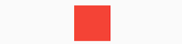

实际上 SizedBox 只是 ConstrainedBox 的一个定制，上面代码等价于：

```dart
ConstrainedBox(
  constraints: BoxConstraints.tightFor(width: 80.0,height: 80.0),
  child: redBox, 
)
```

而 BoxConstraints.tightFor(width: 80.0,height: 80.0) 等价于：

```dart
BoxConstraints(minHeight: 80.0,maxHeight: 80.0,minWidth: 80.0,maxWidth: 80.0)
```

而实际上 ConstrainedBox 和 SizedBox 都是通过 RenderConstrainedBox 来渲染的，我们可以看到 ConstrainedBox 和 SizedBox 的 createRenderObject() 方法都返回的是一个 RenderConstrainedBox 对象：

```dart
@override
RenderConstrainedBox createRenderObject(BuildContext context) {
  return new RenderConstrainedBox(
    additionalConstraints: ...,
  );
}
```

#### 4.2.3 多重限制

如果某一个组件有多个父级 ConstrainedBox 限制，那么最终会是哪个生效？我们看一个例子：

```dart
ConstrainedBox(
    constraints: BoxConstraints(minWidth: 60.0, minHeight: 60.0), //父
    child: ConstrainedBox(
      constraints: BoxConstraints(minWidth: 90.0, minHeight: 20.0),//子
      child: redBox,
    )
)
```

上面我们有父子两个 ConstrainedBox，他们的限制条件不同，运行后效果如图所示：


最终显示效果是宽 90，高 60，也就是说是子 ConstrainedBox 的 minWidth 生效，而 minHeight 是父 ConstrainedBox 生效。单凭这个例子，我们还总结不出什么规律，我们将上例中父子限制条件换一下：

```dart
ConstrainedBox(
    constraints: BoxConstraints(minWidth: 90.0, minHeight: 20.0),
    child: ConstrainedBox(
      constraints: BoxConstraints(minWidth: 60.0, minHeight: 60.0),
      child: redBox,
    )
)
```

运行效果如图所示：


最终的显示效果仍然是 90，高 60，效果相同，但意义不同，因为此时 minWidth 生效的是父 ConstrainedBox，而 minHeight 是子 ConstrainedBox 生效。

通过上面示例，我们发现有多重限制时，对于 minWidth 和 minHeight 来说，是取父子中相应数值较大的。实际上，只有这样才能保证父限制与子限制不冲突。

思考题：对于 maxWidth 和 maxHeight，多重限制的策略是什么样的呢？

#### 4.2.4 UnconstrainedBox

UnconstrainedBox 不会对子组件产生任何限制，它允许其子组件按照其本身大小绘制。一般情况下，我们会很少直接使用此组件，但在"去除"多重限制的时候也许会有帮助，我们看下下面的代码：

```dart
ConstrainedBox(
    constraints: BoxConstraints(minWidth: 60.0, minHeight: 100.0),  //父
    child: UnconstrainedBox( //“去除”父级限制
      child: ConstrainedBox(
        constraints: BoxConstraints(minWidth: 90.0, minHeight: 20.0),//子
        child: redBox,
      ),
    )
)
```

上面代码中，如果没有中间的 UnconstrainedBox，那么根据上面所述的多重限制规则，那么最终将显示一个 90×100 的红色框。但是由于 UnconstrainedBox “去除”了父 ConstrainedBox 的限制，则最终会按照子 ConstrainedBox 的限制来绘制 redBox，即 90×20：


但是，读者请注意，UnconstrainedBox 对父组件限制的“去除”并非是真正的去除：上面例子中虽然红色区域大小是 90×20，但上方仍然有 80 的空白空间。也就是说父限制的 minHeight(100.0) 仍然是生效的，只不过它不影响最终子元素 redBox 的大小，但仍然还是占有相应的空间，可以认为此时的父 ConstrainedBox 是作用于子 UnconstrainedBox 上，而 redBox 只受子 ConstrainedBox 限制，这一点请读者务必注意。

那么有什么方法可以彻底去除父 ConstrainedBox 的限制吗？答案是否定的！所以在此提示读者，在定义一个通用的组件时，如果要对子组件指定限制，那么一定要注意，因为一旦指定限制条件，子组件如果要进行相关自定义大小时将可能非常困难，因为子组件在不更改父组件的代码的情况下无法彻底去除其限制条件。

在实际开发中，当我们发现已经使用 SizedBox 或 ConstrainedBox 给子元素指定了宽高，但是仍然没有效果时，几乎可以断定：已经有父元素已经设置了限制！举个例子，如 Material 组件库中的 AppBar（导航栏）的右侧菜单中，我们使用 SizedBox 指定了 loading 按钮的大小，代码如下：

```dart
 AppBar(
   title: Text(title),
   actions: <Widget>[
         SizedBox(
             width: 20, 
             height: 20,
             child: CircularProgressIndicator(
                 strokeWidth: 3,
                 valueColor: AlwaysStoppedAnimation(Colors.white70),
             ),
         )
   ],
)
```

上面代码运行后，效果如图所示：


我们会发现右侧 loading 按钮大小并没有发生变化！这正是因为 AppBar 中已经指定了 actions 按钮的限制条件，所以我们要自定义 loading 按钮大小，就必须通过 UnconstrainedBox 来“去除”父元素的限制，代码如下：

```dart
AppBar(
  title: Text(title),
  actions: <Widget>[
      UnconstrainedBox(
            child: SizedBox(
              width: 20,
              height: 20,
              child: CircularProgressIndicator(
                strokeWidth: 3,
                valueColor: AlwaysStoppedAnimation(Colors.white70),
              ),
          ),
      )
  ],
)
```

运行后效果如图所示：


生效了！

#### 4.2.4 其它尺寸限制类容器

除了上面介绍的这些常用的尺寸限制类容器外，还有一些其他的尺寸限制类容器，比如 AspectRatio，它可以指定子组件的长宽比、LimitedBox 用于指定最大宽高、FractionallySizedBox 可以根据父容器宽高的百分比来设置子组件宽高等，由于这些容器使用起来都比较简单，我们便不再赘述，读者可以自行了解。

### 4.3 装饰容器 DecoratedBox

DecoratedBox 可以在其子组件绘制前(或后)绘制一些装饰（Decoration），如背景、边框、渐变等。DecoratedBox 定义如下：

```dart
const DecoratedBox({
  Decoration decoration,
  DecorationPosition position = DecorationPosition.background,
  Widget child
})
```

  - decoration：代表将要绘制的装饰，它的类型为 Decoration。Decoration 是一个抽象类，它定义了一个接口 createBoxPainter()，子类的主要职责是需要通过实现它来创建一个画笔，该画笔用于绘制装饰；
  - position：此属性决定在哪里绘制Decoration，它接收DecorationPosition的枚举类型，该枚举类有两个值：
    - background：在子组件之后绘制，即背景装饰；
    - foreground：在子组件之上绘制，即前景。

##### BoxDecoration

我们通常会直接使用 BoxDecoration 类，它是一个 Decoration 的子类，实现了常用的装饰元素的绘制。

```dart
BoxDecoration({
  Color color, //颜色
  DecorationImage image,//图片
  BoxBorder border, //边框
  BorderRadiusGeometry borderRadius, //圆角
  List<BoxShadow> boxShadow, //阴影,可以指定多个
  Gradient gradient, //渐变
  BlendMode backgroundBlendMode, //背景混合模式
  BoxShape shape = BoxShape.rectangle, //形状
})
```

各个属性名都是自解释的，详情读者可以查看 API 文档。下面我们实现一个带阴影的背景色渐变的按钮：

```dart
 DecoratedBox(
    decoration: BoxDecoration(
      gradient: LinearGradient(colors:[Colors.red,Colors.orange[700]]), //背景渐变
      borderRadius: BorderRadius.circular(3.0), //3像素圆角
      boxShadow: [ //阴影
        BoxShadow(
            color:Colors.black54,
            offset: Offset(2.0,2.0),
            blurRadius: 4.0
        )
      ]
    ),
  child: Padding(padding: EdgeInsets.symmetric(horizontal: 80.0, vertical: 18.0),
    child: Text("Login", style: TextStyle(color: Colors.white),),
  )
)
```

运行后效果如图所示：


怎么样，通过 BoxDecoration 我们实现了一个渐变按钮的外观，但此示例还不是一个标准的按钮，因为它还不能响应点击事件，我们将在后面“自定义组件”一章中实现一个完整功能的 GradientButton。另外，上面的例子中使用了 LinearGradient 类，它用于定义线性渐变的类，Flutter 中还提供了其它渐变配置类，如 RadialGradient、SweepGradient，读者若有需要可以自行查看API文档。

### 4.4 变换（Transform）

Transform 可以在其子组件绘制时对其应用一些矩阵变换来实现一些特效。Matrix4 是一个 4D 矩阵，通过它我们可以实现各种矩阵操作，下面是一个例子：

```dart
Container(
  color: Colors.black,
  child: new Transform(
    alignment: Alignment.topRight, //相对于坐标系原点的对齐方式
    transform: new Matrix4.skewY(0.3), //沿Y轴倾斜0.3弧度
    child: new Container(
      padding: const EdgeInsets.all(8.0),
      color: Colors.deepOrange,
      child: const Text('Apartment for rent!'),
    ),
  ),
);
```

运行效果如图所示：


> 关于矩阵变换的相关内容属于线性代数范畴，本书不做讨论，读者有兴趣可以自行了解。本书中，我们把焦点放在 Flutter 中一些常见的变换效果上。另外，由于矩阵变化时发生在绘制时，而无需重新布局和构建等过程，所以性能很好。

#### 4.4.1 平移

Transform.translate 接收一个 offset 参数，可以在绘制时沿 x、y 轴对子组件平移指定的距离。

```dart
DecoratedBox(
  decoration:BoxDecoration(color: Colors.red),
  //默认原点为左上角，左移20像素，向上平移5像素  
  child: Transform.translate(
    offset: Offset(-20.0, -5.0),
    child: Text("Hello world"),
  ),
)
```

效果如图所示：


#### 4.4.2 旋转

Transform.rotate 可以对子组件进行旋转变换，如：

```dart
DecoratedBox(
  decoration:BoxDecoration(color: Colors.red),
  child: Transform.rotate(
    //旋转90度
    angle:math.pi/2 ,
    child: Text("Hello world"),
  ),
)；
```

注意：要使用 math.pi 需先进行如下导包。

```dart
import 'dart:math' as math;
```

效果如图所示：


#### 4.4.3 缩放

Transform.scale 可以对子组件进行缩小或放大，如：

```dart
DecoratedBox(
  decoration:BoxDecoration(color: Colors.red),
  child: Transform.scale(
      scale: 1.5, //放大到1.5倍
      child: Text("Hello world")
  )
);
```

效果如图所示：


#### 4.4.4 注意

Transform 的变换是应用在绘制阶段，而并不是应用在布局(layout)阶段，所以无论对子组件应用何种变化，其占用空间的大小和在屏幕上的位置都是固定不变的，因为这些是在布局阶段就确定的。下面我们具体说明：

```dart
 Row(
  mainAxisAlignment: MainAxisAlignment.center,
  children: <Widget>[
    DecoratedBox(
      decoration:BoxDecoration(color: Colors.red),
      child: Transform.scale(scale: 1.5,
          child: Text("Hello world")
      )
    ),
    Text("你好", style: TextStyle(color: Colors.green, fontSize: 18.0),)
  ],
)
```

运行效果如图所示：


由于第一个 Text 应用变换(放大)后，其在绘制时会放大，但其占用的空间依然为红色部分，所以第二个 Text 会紧挨着红色部分，最终就会出现文字重合。

由于矩阵变化只会作用在绘制阶段，所以在某些场景下，在 UI 需要变化时，可以直接通过矩阵变化来达到视觉上的 UI 改变，而不需要去重新触发 build 流程，这样会节省 layout 的开销，所以性能会比较好。如之前介绍的 Flow 组件，它内部就是用矩阵变换来更新 UI，除此之外，Flutter 的动画组件中也大量使用了 Transform 以提高性能。

> 思考题：使用 Transform 对其子组件先进行平移然后再旋转和先旋转再平移，两者最终的效果一样吗？为什么？

#### 4.4.5 RotatedBox

RotatedBox 和 Transform.rotate 功能相似，它们都可以对子组件进行旋转变换，但是有一点不同：RotatedBox 的变换是在 layout 阶段，会影响在子组件的位置和大小。我们将上面介绍 Transform.rotate 时的示例改一下：

```dart
Row(
  mainAxisAlignment: MainAxisAlignment.center,
  children: <Widget>[
    DecoratedBox(
      decoration: BoxDecoration(color: Colors.red),
      //将Transform.rotate换成RotatedBox  
      child: RotatedBox(
        quarterTurns: 1, //旋转90度(1/4圈)
        child: Text("Hello world"),
      ),
    ),
    Text("你好", style: TextStyle(color: Colors.green, fontSize: 18.0),)
  ],
),
```

效果如图所示：


由于 RotatedBox 是作用于 layout 阶段，所以子组件会旋转 90 度（而不只是绘制的内容），decoration 会作用到子组件所占用的实际空间上，所以最终就是上图的效果，读者可以和前面 Transform.rotate 示例对比理解。

### 4.5 Container

我们在前面的章节示例中多次用到过 Container 组件，本节我们就详细介绍一下 Container 组件。Container 是一个组合类容器，它本身不对应具体的 RenderObject，它是 DecoratedBox、ConstrainedBox、Transform、Padding、Align 等组件组合的一个多功能容器，所以我们只需通过一个 Container 组件可以实现同时需要装饰、变换、限制的场景。下面是 Container 的定义：

```dart
Container({
  this.alignment,
  this.padding, //容器内补白，属于decoration的装饰范围
  Color color, // 背景色
  Decoration decoration, // 背景装饰
  Decoration foregroundDecoration, //前景装饰
  double width,//容器的宽度
  double height, //容器的高度
  BoxConstraints constraints, //容器大小的限制条件
  this.margin,//容器外补白，不属于decoration的装饰范围
  this.transform, //变换
  this.child,
})
```

- Container 的大多数属性在介绍其它容器时都已经介绍过了，不再赘述，但有两点需要说明：
  - 容器的大小可以通过 width、height 属性来指定，也可以通过 constraints 来指定；如果它们同时存在时，width、height 优先。实际上 Container 内部会根据 width、height 来生成一个 constraints；
  - color 和 decoration 是互斥的，如果同时设置它们则会报错！实际上，当指定 color 时，Container 内会自动创建一个 decoration。

##### 实例

我们通过 Container 来实现如图所示的卡片：


- 实现代码如下：

```dart
Container(
  margin: EdgeInsets.only(top: 50.0, left: 120.0), //容器外填充
  constraints: BoxConstraints.tightFor(width: 200.0, height: 150.0), //卡片大小
  decoration: BoxDecoration(//背景装饰
      gradient: RadialGradient( //背景径向渐变
          colors: [Colors.red, Colors.orange],
          center: Alignment.topLeft,
          radius: .98
      ),
      boxShadow: [ //卡片阴影
        BoxShadow(
            color: Colors.black54,
            offset: Offset(2.0, 2.0),
            blurRadius: 4.0
        )
      ]
  ),
  transform: Matrix4.rotationZ(.2), //卡片倾斜变换
  alignment: Alignment.center, //卡片内文字居中
  child: Text( //卡片文字
    "5.20", style: TextStyle(color: Colors.white, fontSize: 40.0),
  ),
);
```

可以看到 Container 具备多种组件的功能，通过查看 Container 源码，我们会很容易发现它正是前面我们介绍过的多种组件组合而成。在 Flutter 中，Container 组件也正是组合优先于继承的实例。

#### Padding 和 Margin

接下来我们来研究一下 Container 组件 margin 和 padding 属性的区别:

```dart
...
Container(
  margin: EdgeInsets.all(20.0), //容器外补白
  color: Colors.orange,
  child: Text("Hello world!"),
),
Container(
  padding: EdgeInsets.all(20.0), //容器内补白
  color: Colors.orange,
  child: Text("Hello world!"),
),
...
```


可以发现，直观的感觉就是 margin 的留白是在容器外部，而 padding 的留白是在容器内部，读者需要记住这个差异。事实上，Container 内 margin 和 padding 都是通过 Padding 组件来实现的，上面的示例代码实际上等价于：

```dart
...
Padding(
  padding: EdgeInsets.all(20.0),
  child: DecoratedBox(
    decoration: BoxDecoration(color: Colors.orange),
    child: Text("Hello world!"),
  ),
),
DecoratedBox(
  decoration: BoxDecoration(color: Colors.orange),
  child: Padding(
    padding: const EdgeInsets.all(20.0),
    child: Text("Hello world!"),
  ),
),
...
```

### 4.6 Scaffold、TabBar、底部导航

Material 组件库提供了丰富多样的组件，本节介绍一些常用的组件，其余的读者可以自行查看文档或 Flutter Gallery 中 Material 组件部分的示例。

> Flutter Gallery 是 Flutter 官方提供的 Flutter Demo，源码位于 flutter 源码中的 examples 目录下，笔者强烈建议用户将 Flutter Gallery 示例跑起来，它是一个很全面的 Flutter 示例应用，是非常好的参考 Demo，也是笔者学习 Flutter 的第一手资料。

#### 4.6.1 Scaffold

一个完整的路由页可能会包含导航栏、抽屉菜单(Drawer)以及底部 Tab 导航菜单等。如果每个路由页面都需要开发者自己手动去实现这些，这会是一件非常麻烦且无聊的事。幸运的是，Flutter Material 组件库提供了一些现成的组件来减少我们的开发任务。Scaffold 是一个路由页的骨架，我们使用它可以很容易地拼装出一个完整的页面。

##### 示例

- 实现一个页面，它包含：
  - 一个导航栏
  - 导航栏右边有一个分享按钮
  - 有一个抽屉菜单
  - 有一个底部导航
  - 右下角有一个悬浮的动作按钮

最终效果如图所示：


实现代码如下：

```dart
class ScaffoldRoute extends StatefulWidget {
  @override
  _ScaffoldRouteState createState() => _ScaffoldRouteState();
}

class _ScaffoldRouteState extends State<ScaffoldRoute> {
  int _selectedIndex = 1;

  @override
  Widget build(BuildContext context) {
    return Scaffold(
      appBar: AppBar( //导航栏
        title: Text("App Name"), 
        actions: <Widget>[ //导航栏右侧菜单
          IconButton(icon: Icon(Icons.share), onPressed: () {}),
        ],
      ),
      drawer: new MyDrawer(), //抽屉
      bottomNavigationBar: BottomNavigationBar( // 底部导航
        items: <BottomNavigationBarItem>[
          BottomNavigationBarItem(icon: Icon(Icons.home), title: Text('Home')),
          BottomNavigationBarItem(icon: Icon(Icons.business), title: Text('Business')),
          BottomNavigationBarItem(icon: Icon(Icons.school), title: Text('School')),
        ],
        currentIndex: _selectedIndex,
        fixedColor: Colors.blue,
        onTap: _onItemTapped,
      ),
      floatingActionButton: FloatingActionButton( //悬浮按钮
          child: Icon(Icons.add),
          onPressed:_onAdd
      ),
    );
  }
  void _onItemTapped(int index) {
    setState(() {
      _selectedIndex = index;
    });
  }
  void _onAdd(){
  }
}
```

- 上面代码中我们用到了如下组件：

|组件名称  |解释|
|:---|:---|
|AppBar  |一个导航栏骨架|
|MyDrawer  |抽屉菜单|
|BottomNavigationBar |底部导航栏|
|FloatingActionButton  |漂浮按钮|

下面我们来分别介绍一下它们。

#### 4.6.2 AppBar

AppBar 是一个 Material 风格的导航栏，通过它可以设置导航栏标题、导航栏菜单、导航栏底部的 Tab 标题等。下面我们看看 AppBar 的定义：

```dart
AppBar({
  Key key,
  this.leading, //导航栏最左侧Widget，常见为抽屉菜单按钮或返回按钮。
  this.automaticallyImplyLeading = true, //如果leading为null，是否自动实现默认的leading按钮
  this.title,// 页面标题
  this.actions, // 导航栏右侧菜单
  this.bottom, // 导航栏底部菜单，通常为Tab按钮组
  this.elevation = 4.0, // 导航栏阴影
  this.centerTitle, //标题是否居中 
  this.backgroundColor,
  ...   //其它属性见源码注释
})
```

如果给 Scaffold 添加了抽屉菜单，默认情况下 Scaffold 会自动将 AppBar 的 leading 设置为菜单按钮（如上面截图所示），点击它便可打开抽屉菜单。如果我们想自定义菜单图标，可以手动来设置 leading，如：

```dart
Scaffold(
  appBar: AppBar(
    title: Text("App Name"),
    leading: Builder(builder: (context) {
      return IconButton(
        icon: Icon(Icons.dashboard, color: Colors.white), //自定义图标
        onPressed: () {
          // 打开抽屉菜单  
          Scaffold.of(context).openDrawer(); 
        },
      );
    }),
    ...  
  )
```

代码运行效果如图所示：


可以看到左侧菜单已经替换成功。

代码中打开抽屉菜单的方法在 ScaffoldState 中，通过 Scaffold.of(context) 可以获取父级最近的 Scaffold 组件的 State 对象。

##### TabBar

下面我们通过 “bottom” 属性来添加一个导航栏底部 Tab 按钮组，将要实现的效果如图所示：

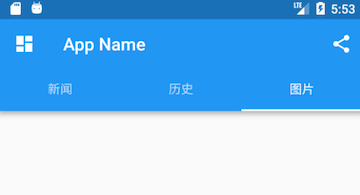

Material 组件库中提供了一个 TabBar 组件，它可以快速生成 Tab 菜单，下面是上图对应的源码：

```dart
class _ScaffoldRouteState extends State<ScaffoldRoute>
    with SingleTickerProviderStateMixin {

  TabController _tabController; //需要定义一个Controller
  List tabs = ["新闻", "历史", "图片"];

  @override
  void initState() {
    super.initState();
    // 创建Controller  
    _tabController = TabController(length: tabs.length, vsync: this);
  }

  @override
  Widget build(BuildContext context) {
    return Scaffold(
      appBar: AppBar(
        ... //省略无关代码
        bottom: TabBar(   //生成Tab菜单
          controller: _tabController,
          tabs: tabs.map((e) => Tab(text: e)).toList()
        ),
      ),
      ... //省略无关代码

  }
```

上面代码首先创建了一个 TabController ，它是用于控制/监听 Tab 菜单切换的。接下来通过 TabBar 生成了一个底部菜单栏，TabBar 的 tabs 属性接受一个 Widget 数组，表示每一个 Tab 子菜单，我们可以自定义，也可以像示例中一样直接使用 Tab 组件，它是 Material 组件库提供的 Material 风格的 Tab 菜单。

Tab 组件有三个可选参数，除了可以指定文字外，还可以指定 Tab 菜单图标，或者直接自定义组件样式。Tab 组件定义如下：

```dart
Tab({
  Key key,
  this.text, // 菜单文本
  this.icon, // 菜单图标
  this.child, // 自定义组件样式
})
```

开发者可以根据实际需求来定制。

##### TabBarView

通过 TabBar 我们只能生成一个静态的菜单，真正的 Tab 页还没有实现。由于 Tab 菜单和 Tab 页的切换需要同步，我们需要通过 TabController 去监听 Tab 菜单的切换去切换 Tab 页，代码如：

```dart
_tabController.addListener((){  
  switch(_tabController.index){
    case 1: ...;
    case 2: ... ;   
  }
});
```

如果我们 Tab 页可以滑动切换的话，还需要在滑动过程中更新 TabBar 指示器的偏移！显然，要手动处理这些是很麻烦的，为此，Material 库提供了一个 TabBarView 组件，通过它不仅可以轻松的实现 Tab 页，而且可以非常容易的配合 TabBar 来实现同步切换和滑动状态同步，示例如下：

```dart
Scaffold(
  appBar: AppBar(
    ... //省略无关代码
    bottom: TabBar(
      controller: _tabController,
      tabs: tabs.map((e) => Tab(text: e)).toList()),
  ),
  drawer: new MyDrawer(),
  body: TabBarView(
    controller: _tabController,
    children: tabs.map((e) { //创建3个Tab页
      return Container(
        alignment: Alignment.center,
        child: Text(e, textScaleFactor: 5),
      );
    }).toList(),
  ),
  ... // 省略无关代码  
)
```

运行后效果如图所示：

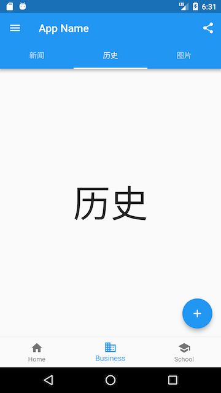

现在，无论是点击导航栏 Tab 菜单还是在页面上左右滑动，Tab 页面都会切换，并且 Tab 菜单的状态和 Tab 页面始终保持同步！那它们是如何实现同步的呢？细心的读者可能已经发现，上例中 TabBar 和 TabBarView 的 controller 是同一个！正是如此，TabBar 和 TabBarView 正是通过同一个 controller 来实现菜单切换和滑动状态同步的，有关 TabController 的详细信息，我们不在本书做过多介绍，使用时读者直接查看SDK即可。

另外，Material 组件库也提供了一个 PageView 组件，它和 TabBarView 功能相似，读者可以自行了解一下。

#### 4.6.3 抽屉菜单 Drawer

Scaffold 的 drawer 和 endDrawer 属性可以分别接受一个 Widget 来作为页面的左、右抽屉菜单。如果开发者提供了抽屉菜单，那么当用户手指从屏幕左（或右）侧向里滑动时便可打开抽屉菜单。本节开始部分的示例中实现了一个左抽屉菜单 MyDrawer，它的源码如下：

```dart
class MyDrawer extends StatelessWidget {
  const MyDrawer({
    Key key,
  }) : super(key: key);

  @override
  Widget build(BuildContext context) {
    return Drawer(
      child: MediaQuery.removePadding(
        context: context,
        //移除抽屉菜单顶部默认留白
        removeTop: true,
        child: Column(
          crossAxisAlignment: CrossAxisAlignment.start,
          children: <Widget>[
            Padding(
              padding: const EdgeInsets.only(top: 38.0),
              child: Row(
                children: <Widget>[
                  Padding(
                    padding: const EdgeInsets.symmetric(horizontal: 16.0),
                    child: ClipOval(
                      child: Image.asset(
                        "imgs/avatar.png",
                        width: 80,
                      ),
                    ),
                  ),
                  Text(
                    "Wendux",
                    style: TextStyle(fontWeight: FontWeight.bold),
                  )
                ],
              ),
            ),
            Expanded(
              child: ListView(
                children: <Widget>[
                  ListTile(
                    leading: const Icon(Icons.add),
                    title: const Text('Add account'),
                  ),
                  ListTile(
                    leading: const Icon(Icons.settings),
                    title: const Text('Manage accounts'),
                  ),
                ],
              ),
            ),
          ],
        ),
      ),
    );
  }
}
```

抽屉菜单通常将 Drawer 组件作为根节点，它实现了 Material 风格的菜单面板，MediaQuery.removePadding 可以移除 Drawer 默认的一些留白（比如 Drawer 默认顶部会留和手机状态栏等高的留白），读者可以尝试传递不同的参数来看看实际效果。抽屉菜单页由顶部和底部组成，顶部由用户头像和昵称组成，底部是一个菜单列表，用 ListView 实现，关于 ListView 我们将在后面“可滚动组件”一节详细介绍。

#### 4.6.4 FloatingActionButton

FloatingActionButton 是 Material 设计规范中的一种特殊 Button，通常悬浮在页面的某一个位置作为某种常用动作的快捷入口，如本节示例中页面右下角的 "➕" 号按钮。我们可以通过 Scaffold 的 floatingActionButton 属性来设置一个 FloatingActionButton，同时通过 floatingActionButtonLocation 属性来指定其在页面中悬浮的位置，这个比较简单，不再赘述。

#### 4.6.5 底部Tab导航栏

我们可以通过 Scaffold 的 bottomNavigationBar 属性来设置底部导航，如本节开始示例所示，我们通过 Material 组件库提供的 BottomNavigationBar 和 BottomNavigationBarItem 两种组件来实现 Material 风格的底部导航栏。可以看到上面的实现代码非常简单，所以不再赘述，但是如果我们想实现如图所示效果的底部导航栏应该怎么做呢？


Material 组件库中提供了一个 BottomAppBar 组件，它可以和 FloatingActionButton 配合实现这种“打洞”效果，源码如下：

```dart
bottomNavigationBar: BottomAppBar(
  color: Colors.white,
  shape: CircularNotchedRectangle(), // 底部导航栏打一个圆形的洞
  child: Row(
    children: [
      IconButton(icon: Icon(Icons.home)),
      SizedBox(), //中间位置空出
      IconButton(icon: Icon(Icons.business)),
    ],
    mainAxisAlignment: MainAxisAlignment.spaceAround, //均分底部导航栏横向空间
  ),
)
```

可以看到，上面代码中没有控制打洞位置的属性，实际上，打洞的位置取决于 FloatingActionButton 的位置，上面 FloatingActionButton 的位置为：

```dart
floatingActionButtonLocation: FloatingActionButtonLocation.centerDocked,
```

所以打洞位置在底部导航栏的正中间。

BottomAppBar 的 shape 属性决定洞的外形，CircularNotchedRectangle 实现了一个圆形的外形，我们也可以自定义外形，比如，Flutter Gallery 示例中就有一个 “钻石” 形状的示例，读者感兴趣可以自行查看。

### 4.7 剪裁（Clip）

Flutter 中提供了一些剪裁函数，用于对组件进行剪裁。

｜剪裁Widget  ｜作用｜
｜ClipOval  ｜子组件为正方形时剪裁为内贴圆形，为矩形时，剪裁为内贴椭圆｜
｜ClipRRect ｜将子组件剪裁为圆角矩形｜
｜ClipRect  ｜剪裁子组件到实际占用的矩形大小（溢出部分剪裁）｜

下面看一个例子：

```dart
import 'package:flutter/material.dart';

class ClipTestRoute extends StatelessWidget {
  @override
  Widget build(BuildContext context) {
    // 头像  
    Widget avatar = Image.asset("imgs/avatar.png", width: 60.0);
    return Center(
      child: Column(
        children: <Widget>[
          avatar, //不剪裁
          ClipOval(child: avatar), //剪裁为圆形
          ClipRRect( //剪裁为圆角矩形
            borderRadius: BorderRadius.circular(5.0),
            child: avatar,
          ), 
          Row(
            mainAxisAlignment: MainAxisAlignment.center,
            children: <Widget>[
              Align(
                alignment: Alignment.topLeft,
                widthFactor: .5,//宽度设为原来宽度一半，另一半会溢出
                child: avatar,
              ),
              Text("你好世界", style: TextStyle(color: Colors.green),)
            ],
          ),
          Row(
            mainAxisAlignment: MainAxisAlignment.center,
            children: <Widget>[
              ClipRect(//将溢出部分剪裁
                child: Align(
                  alignment: Alignment.topLeft,
                  widthFactor: .5,//宽度设为原来宽度一半
                  child: avatar,
                ),
              ),
              Text("你好世界",style: TextStyle(color: Colors.green))
            ],
          ),
        ],
      ),
    );
  }
}
```

运行效果如图所示：


上面示例代码注释比较详细，在此不再赘述。但值得一提的是最后的两个 Row！它们通过 Align 设置 widthFactor 为 0.5 后，图片的实际宽度等于 60×0.5，即原宽度一半，但此时图片溢出部分依然会显示，所以第一个“你好世界”会和图片的另一部分重合，为了剪裁掉溢出部分，我们在第二个 Row 中通过 ClipRect 将溢出部分剪裁掉了。

#### CustomClipper

如果我们想剪裁子组件的特定区域，比如，在上面示例的图片中，如果我们只想截取图片中部 40×30 像素的范围应该怎么做？这时我们可以使用 CustomClipper 来自定义剪裁区域，实现代码如下：

首先，自定义一个CustomClipper：

```dart
class MyClipper extends CustomClipper<Rect> {
  @override
  Rect getClip(Size size) => Rect.fromLTWH(10.0, 15.0, 40.0, 30.0);

  @override
  bool shouldReclip(CustomClipper<Rect> oldClipper) => false;
}
```

- getClip() 是用于获取剪裁区域的接口，由于图片大小是 60×60，我们返回剪裁区域为 Rect.fromLTWH(10.0, 15.0, 40.0, 30.0)，即图片中部 40×30 像素的范围；
- shouldReclip() 接口决定是否重新剪裁。如果在应用中，剪裁区域始终不会发生变化时应该返回 false，这样就不会触发重新剪裁，避免不必要的性能开销。如果剪裁区域会发生变化（比如在对剪裁区域执行一个动画），那么变化后应该返回 true 来重新执行剪裁。

然后，我们通过 ClipRect 来执行剪裁，为了看清图片实际所占用的位置，我们设置一个红色背景：

```dart
DecoratedBox(
  decoration: BoxDecoration(
    color: Colors.red
  ),
  child: ClipRect(
      clipper: MyClipper(), //使用自定义的clipper
      child: avatar
  ),
)
```

运行效果如图所示：


可以看到我们的剪裁成功了，但是图片所占用的空间大小仍然是 60×60（红色区域），这是因为剪裁是在 layout 完成后的绘制阶段进行的，所以不会影响组件的大小，这和 Transform 原理是相似的。

## 五、可滚动组件

### 5.1 可滚动组件简介

当组件内容超过当前显示视口 (ViewPort) 时，如果没有特殊处理，Flutter 则会提示 Overflow 错误。为此，Flutter 提供了多种可滚动组件（Scrollable Widget）用于显示列表和长布局。在本章中，我们先介绍一下常用的可滚动组件（如ListView、GridView等），然后介绍一下 ScrollController。可滚动组件都直接或间接包含一个 Scrollable 组件，因此它们包括一些共同的属性，为了避免重复介绍，我们在此统一介绍一下：

```dart
Scrollable({
  ...
  this.axisDirection = AxisDirection.down,
  this.controller,
  this.physics,
  @required this.viewportBuilder, //后面介绍
})
```

- axisDirection：滚动方向；
- physics：此属性接受一个 ScrollPhysics 类型的对象，它决定可滚动组件如何响应用户操作，比如用户滑动完抬起手指后，继续执行动画；或者滑动到边界时，如何显示；默认情况下，Flutter 会根据具体平台分别使用不同的 ScrollPhysics 对象，应用不同的显示效果，如当滑动到边界时，继续拖动的话，在 iOS 上会出现弹性效果，而在 Android 上会出现微光效果。如果你想在所有平台下使用同一种效果，可以显式指定一个固定的 ScrollPhysics，Flutter SDK 中包含了两个 ScrollPhysics 的子类，他们可以直接使用：
  - ClampingScrollPhysics：Android下微光效果；
  - BouncingScrollPhysics：iOS下弹性效果；
- controller：此属性接受一个 ScrollController 对象；ScrollController 的主要作用是控制滚动位置和监听滚动事件；默认情况下，Widget 树中会有一个默认的 PrimaryScrollController，如果子树中的可滚动组件没有显式的指定 controller，并且 primary 属性值为 true 时（默认就为true），可滚动组件会使用这个默认的 PrimaryScrollController；这种机制带来的好处是父组件可以控制子树中可滚动组件的滚动行为，例如，Scaffold 正是使用这种机制在 iOS 中实现了点击导航栏回到顶部的功能；我们将在本章后面“滚动控制”一节详细介绍 ScrollController。

#### 5.1.1 Scrollbar

Scrollbar 是一个 Material 风格的滚动指示器（滚动条），如果要给可滚动组件添加滚动条，只需将 Scrollbar 作为可滚动组件的任意一个父级组件即可，如：

```dart
Scrollbar(
  child: SingleChildScrollView(
    ...
  ),
);
```

Scrollbar 和 CupertinoScrollbar 都是通过监听滚动通知来确定滚动条位置的。关于的滚动通知的详细内容我们将在本章最后一节中专门介绍。

#### 5.1.2 CupertinoScrollbar

CupertinoScrollbar 是 iOS 风格的滚动条，如果你使用的是 Scrollbar，那么在 iOS 平台它会自动切换为 CupertinoScrollbar。

#### 5.1.3 ViewPort 视口

在很多布局系统中都有 ViewPort 的概念，在 Flutter 中，术语 ViewPort（视口），如无特别说明，则是指一个 Widget 的实际显示区域。例如，一个 ListView 的显示区域高度是 800 像素，虽然其列表项总高度可能远远超过 800 像素，但是其 ViewPort 仍然是 800 像素。

#### 5.1.4 基于 Sliver 的延迟构建

通常可滚动组件的子组件可能会非常多、占用的总高度也会非常大；如果要一次性将子组件全部构建出将会非常昂贵！为此，Flutter 中提出一个 Sliver（中文为“薄片”的意思）概念，如果一个可滚动组件支持 Sliver 模型，那么该滚动可以将子组件分成好多个“薄片”（Sliver），只有当 Sliver 出现在视口中时才会去构建它，这种模型也称为 “基于Sliver的延迟构建模型”。可滚动组件中有很多都支持基于 Sliver 的延迟构建模型，如 ListView、GridView，但是也有不支持该模型的，如 SingleChildScrollView。

#### 5.1.5 主轴和纵轴

在可滚动组件的坐标描述中，通常将滚动方向称为主轴，非滚动方向称为纵轴。由于可滚动组件的默认方向一般都是沿垂直方向，所以默认情况下主轴就是指垂直方向，水平方向同理。

### 5.2 SingleChildScrollView

SingleChildScrollView 类似于 Android 中的 ScrollView，它只能接收一个子组件。定义如下：

```dart
SingleChildScrollView({
  this.scrollDirection = Axis.vertical, //滚动方向，默认是垂直方向
  this.reverse = false, 
  this.padding, 
  bool primary, 
  this.physics, 
  this.controller,
  this.child,
})
```

除了上一节我们介绍过的可滚动组件的通用属性外，我们重点看一下 reverse 和 primary 两个属性：

- reverse：该属性 API 文档解释是：是否按照阅读方向相反的方向滑动，如：scrollDirection 值为 Axis.horizontal，如果阅读方向是从左到右(取决于语言环境，阿拉伯语就是从右到左)。reverse 为 true 时，那么滑动方向就是从右往左。其实此属性本质上是决定可滚动组件的初始滚动位置是在“头”还是“尾”，取 false 时，初始滚动位置在“头”，反之则在“尾”，读者可以自己试验；
- primary：指是否使用 widget 树中默认的 PrimaryScrollController；当滑动方向为垂直方向（scrollDirection 值为 Axis.vertical）并且没有指定 controller时，primary 默认为 true。

需要注意的是，通常 SingleChildScrollView 只应在期望的内容不会超过屏幕太多时使用，这是因为 SingleChildScrollView 不支持基于 Sliver 的延迟实例化模型，所以如果预计视口可能包含超出屏幕尺寸太多的内容时，那么使用 SingleChildScrollView 将会非常昂贵（性能差），此时应该使用一些支持 Sliver 延迟加载的可滚动组件，如 ListView。

##### 示例

下面是一个将大写字母 A\-Z 沿垂直方向显示的例子，由于垂直方向空间会超过屏幕视口高度，所以我们使用 SingleChildScrollView：

```dart
class SingleChildScrollViewTestRoute extends StatelessWidget {
  @override
  Widget build(BuildContext context) {
    String str = "ABCDEFGHIJKLMNOPQRSTUVWXYZ";
    return Scrollbar( // 显示进度条
      child: SingleChildScrollView(
        padding: EdgeInsets.all(16.0),
        child: Center(
          child: Column( 
            //动态创建一个List<Widget>  
            children: str.split("") 
                //每一个字母都用一个Text显示,字体为原来的两倍
                .map((c) => Text(c, textScaleFactor: 2.0,)) 
                .toList(),
          ),
        ),
      ),
    );
  }
}
```

运行效果如图所示：


### 5.3 ListView

ListView 是最常用的可滚动组件之一，它可以沿一个方向线性排布所有子组件，并且它也支持基于 Sliver 的延迟构建模型。我们看看 ListView 的默认构造函数定义：

```dart
ListView({
  ...  
  //可滚动widget公共参数
  Axis scrollDirection = Axis.vertical,
  bool reverse = false,
  ScrollController controller,
  bool primary,
  ScrollPhysics physics,
  EdgeInsetsGeometry padding,

  //ListView各个构造函数的共同参数  
  double itemExtent,
  bool shrinkWrap = false,
  bool addAutomaticKeepAlives = true,
  bool addRepaintBoundaries = true,
  double cacheExtent,

  //子widget列表
  List<Widget> children = const <Widget>[],
})
```

- 上面参数分为两组：第一组是可滚动组件的公共参数，本章第一节中已经介绍过，不再赘述；第二组是 ListView 各个构造函数（ListView 有多个构造函数）的共同参数，我们重点来看看这些参数：
  - itemExtent：该参数如果不为 null，则会强制 children 的“长度”为 itemExtent 的值；这里的“长度”是指滚动方向上子组件的长度，也就是说如果滚动方向是垂直方向，则 itemExtent 代表子组件的高度；如果滚动方向为水平方向，则 itemExtent 就代表子组件的宽度；在 ListView 中，指定 itemExtent 比让子组件自己决定自身长度会更高效，这是因为指定 itemExtent 后，滚动系统可以提前知道列表的长度，而无需每次构建子组件时都去再计算一下，尤其是在滚动位置频繁变化时（滚动系统需要频繁去计算列表高度）；
  - shrinkWrap：该属性表示是否根据子组件的总长度来设置 ListView 的长度，默认值为false ；默认情况下，ListView 会在滚动方向尽可能多的占用空间。当 ListView 在一个无边界(滚动方向上)的容器中时，shrinkWrap 必须为 true；
  - addAutomaticKeepAlives：该属性表示是否将列表项（子组件）包裹在 AutomaticKeepAlive 组件中；典型地，在一个懒加载列表中，如果将列表项包裹在 AutomaticKeepAlive中，在该列表项滑出视口时它也不会被 GC（垃圾回收），它会使用 KeepAliveNotification 来保存其状态。如果列表项自己维护其 KeepAlive 状态，那么此参数必须置为 false；
  - addRepaintBoundaries：该属性表示是否将列表项（子组件）包裹在 RepaintBoundary 组件中；当可滚动组件滚动时，将列表项包裹在 RepaintBoundary 中可以避免列表项重绘，但是当列表项重绘的开销非常小（如一个颜色块，或者一个较短的文本）时，不添加 RepaintBoundary 反而会更高效。和 addAutomaticKeepAlive 一样，如果列表项自己维护其 KeepAlive 状态，那么此参数必须置为false。

> 注意：上面这些参数并非 ListView 特有，在本章后面介绍的其它可滚动组件也可能会拥有这些参数，它们的含义是相同的。

#### 5.3.1 默认构造函数

默认构造函数有一个 children 参数，它接受一个 Widget 列表（List）。这种方式适合只有少量的子组件的情况，因为这种方式需要将所有 children 都提前创建好（这需要做大量工作），而不是等到子 widget 真正显示的时候再创建，也就是说通过默认构造函数构建的 ListView 没有应用基于 Sliver 的懒加载模型；实际上通过此方式创建的 ListView 和使用 SingleChildScrollView+Column 的方式没有本质的区别。下面是一个例子：

```dart
ListView(
  shrinkWrap: true, 
  padding: const EdgeInsets.all(20.0),
  children: <Widget>[
    const Text('I\'m dedicating every day to you'),
    const Text('Domestic life was never quite my style'),
    const Text('When you smile, you knock me out, I fall apart'),
    const Text('And I thought I was so smart'),
  ],
);
```

再次强调，可滚动组件通过一个 List 来作为其 children 属性时，只适用于子组件较少的情况，这是一个通用规律，并非 ListView 自己的特性，像 GridView 也是如此。

#### 5.3.2 ListView.builder

ListView.builder 适合列表项比较多（或者无限）的情况，因为只有当子组件真正显示的时候才会被创建，也就说通过该构造函数创建的 ListView 是支持基于 Sliver 的懒加载模型的。下面看一下 ListView.builder 的核心参数列表：

```dart
ListView.builder({
  // ListView公共参数已省略  
  ...
  @required IndexedWidgetBuilder itemBuilder,
  int itemCount,
  ...
})
```

- itemBuilder：它是列表项的构建器，类型为 IndexedWidgetBuilder，返回值为一个 widget。当列表滚动到具体的 index 位置时，会调用该构建器构建列表项；
- itemCount：列表项的数量，如果为 null，则为无限列表。

可滚动组件的构造函数如果需要一个列表项 Builder，那么通过该构造函数构建的可滚动组件通常就是支持基于 Sliver 的懒加载模型的，反之则不支持，这是个一般规律。我们在后面在介绍可滚动组件的构造函数时将不再专门说明其是否支持基于 Sliver 的懒加载模型了。

- 下面看一个例子：

```dart
ListView.builder(
    itemCount: 100,
    itemExtent: 50.0, //强制高度为50.0
    itemBuilder: (BuildContext context, int index) {
      return ListTile(title: Text("$index"));
    }
);
```

运行效果如图所示：

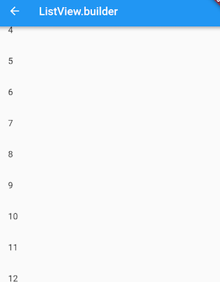

#### 5.3.3 ListView.separated

ListView.separated 可以在生成的列表项之间添加一个分割组件，它比 ListView.builder 多了一个 separatorBuilder 参数，该参数是一个分割组件生成器。

下面我们看一个例子：奇数行添加一条蓝色下划线，偶数行添加一条绿色下划线。

```dart
class ListView3 extends StatelessWidget {
  @override
  Widget build(BuildContext context) {
    //下划线widget预定义以供复用。  
    Widget divider1=Divider(color: Colors.blue,);
    Widget divider2=Divider(color: Colors.green);
    return ListView.separated(
        itemCount: 100,
        //列表项构造器
        itemBuilder: (BuildContext context, int index) {
          return ListTile(title: Text("$index"));
        },
        //分割器构造器
        separatorBuilder: (BuildContext context, int index) {
          return index%2==0?divider1:divider2;
        },
    );
  }
}
```

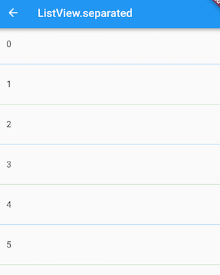

#### 5.3.4 实例：无限加载列表

假设我们要从数据源异步分批拉取一些数据，然后用 ListView 展示，当我们滑动到列表末尾时，判断是否需要再去拉取数据，如果是，则去拉取，拉取过程中在表尾显示一个 loading，拉取成功后将数据插入列表；如果不需要再去拉取，则在表尾提示"没有更多"。代码如下：

```dart
class InfiniteListView extends StatefulWidget {
  @override
  _InfiniteListViewState createState() => new _InfiniteListViewState();
}

class _InfiniteListViewState extends State<InfiniteListView> {
  static const loadingTag = "##loading##"; //表尾标记
  var _words = <String>[loadingTag];

  @override
  void initState() {
    super.initState();
    _retrieveData();
  }

  @override
  Widget build(BuildContext context) {
    return ListView.separated(
      itemCount: _words.length,
      itemBuilder: (context, index) {
        //如果到了表尾
        if (_words[index] == loadingTag) {
          //不足100条，继续获取数据
          if (_words.length - 1 < 100) {
            //获取数据
            _retrieveData();
            //加载时显示loading
            return Container(
              padding: const EdgeInsets.all(16.0),
              alignment: Alignment.center,
              child: SizedBox(
                  width: 24.0,
                  height: 24.0,
                  child: CircularProgressIndicator(strokeWidth: 2.0)
              ),
            );
          } else {
            //已经加载了100条数据，不再获取数据。
            return Container(
                alignment: Alignment.center,
                padding: EdgeInsets.all(16.0),
                child: Text("没有更多了", style: TextStyle(color: Colors.grey),)
            );
          }
        }
        //显示单词列表项
        return ListTile(title: Text(_words[index]));
      },
      separatorBuilder: (context, index) => Divider(height: .0),
    );
  }

  void _retrieveData() {
    Future.delayed(Duration(seconds: 2)).then((e) {
      setState(() {
        //重新构建列表
        _words.insertAll(_words.length - 1,
          //每次生成20个单词
          generateWordPairs().take(20).map((e) => e.asPascalCase).toList()
          );
      });
    });
  }

}
```

运行后效果如图所示：


代码比较简单，读者可以参照代码中的注释理解，故不再赘述。需要说明的是，\_retrieveData() 的功能是模拟从数据源异步获取数据，我们使用 english_words 包的 generateWordPairs() 方法每次生成20个单词。

#### 5.3.5 添加固定列表头

很多时候我们需要给列表添加一个固定表头，比如我们想实现一个商品列表，需要在列表顶部添加一个“商品列表”标题，期望的效果如图所示：

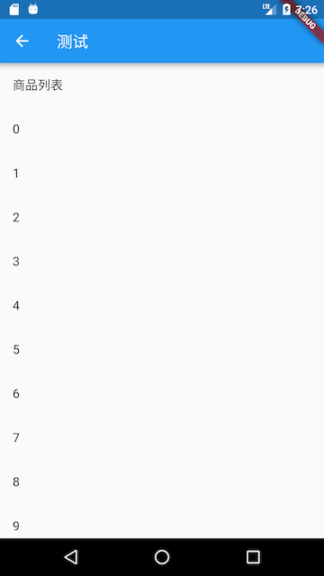

我们按照之前经验，写出如下代码：

```dart
@override
Widget build(BuildContext context) {
  return Column(children: <Widget>[
    ListTile(title:Text("商品列表")),
    ListView.builder(itemBuilder: (BuildContext context, int index) {
        return ListTile(title: Text("$index"));
    }),
  ]);
}
```

然后运行，发现并没有出现我们期望的效果，相反触发了一个异常；

```dart
Error caught by rendering library, thrown during performResize()。
Vertical viewport was given unbounded height ...
```

从异常信息中我们可以看到是因为 ListView 高度边界无法确定引起，所以解决的办法也很明显，我们需要给 ListView 指定边界，我们通过 SizedBox 指定一个列表高度看看是否生效：

```dart
... //省略无关代码
SizedBox(
    height: 400, //指定列表高度为400
    child: ListView.builder(itemBuilder: (BuildContext context, int index) {
        return ListTile(title: Text("$index"));
    }),
),
...
```

运行效果如图所示：

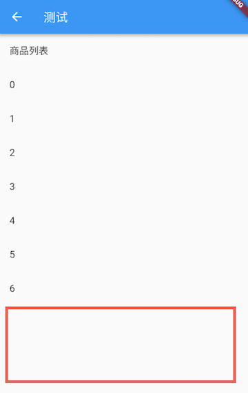

可以看到，现在没有触发异常并且列表已经显示出来了，但是我们的手机屏幕高度要大于 400，所以底部会有一些空白。那如果我们要实现列表铺满除表头以外的屏幕空间应该怎么做？直观的方法是我们去动态计算，用屏幕高度减去状态栏、导航栏、表头的高度即为剩余屏幕高度，代码如下：

```dart
... //省略无关代码
SizedBox(
  //Material设计规范中状态栏、导航栏、ListTile高度分别为24、56、56 
  height: MediaQuery.of(context).size.height-24-56-56,
  child: ListView.builder(itemBuilder: (BuildContext context, int index) {
    return ListTile(title: Text("$index"));
  }),
)
...
```

运行效果如下图所示：


可以看到，我们期望的效果实现了，但是这种方法并不优雅，如果页面布局发生变化，比如表头布局调整导致表头高度改变，那么剩余空间的高度就得重新计算。那么有什么方法可以自动拉伸 ListView 以填充屏幕剩余空间的方法吗？当然有！答案就是 Flex。前面已经介绍过在弹性布局中，可以使用 Expanded 自动拉伸组件大小，并且我们也说过 Column 是继承自 Flex 的，所以我们可以直接使用 Column+Expanded 来实现，代码如下：

```dart
@override
Widget build(BuildContext context) {
  return Column(children: <Widget>[
    ListTile(title:Text("商品列表")),
    Expanded(
      child: ListView.builder(itemBuilder: (BuildContext context, int index) {
        return ListTile(title: Text("$index"));
      }),
    ),
  ]);
}
```

运行后，和上图一样，完美实现了！

### 5.4 GridView

GridView 可以构建一个二维网格列表，其默认构造函数定义如下：

```dart
GridView({
  Axis scrollDirection = Axis.vertical,
  bool reverse = false,
  ScrollController controller,
  bool primary,
  ScrollPhysics physics,
  bool shrinkWrap = false,
  EdgeInsetsGeometry padding,
  @required SliverGridDelegate gridDelegate, //控制子widget layout的委托
  bool addAutomaticKeepAlives = true,
  bool addRepaintBoundaries = true,
  double cacheExtent,
  List<Widget> children = const <Widget>[],
})
```

我们可以看到，GridView 和 ListView 的大多数参数都是相同的，它们的含义也都相同的，如有疑惑读者可以翻阅 ListView 一节，在此不再赘述。我们唯一需要关注的是 gridDelegate 参数，类型是 SliverGridDelegate，它的作用是控制 GridView 子组件如何排列(layout)。

SliverGridDelegate 是一个抽象类，定义 了GridView Layout 相关接口，子类需要通过实现它们来实现具体的布局算法。Flutter 中提供了两个 SliverGridDelegate 的子类 SliverGridDelegateWithFixedCrossAxisCount 和 SliverGridDelegateWithMaxCrossAxisExtent，我们可以直接使用，下面我们分别来介绍一下它们。

#### 5.4.1 SliverGridDelegateWithFixedCrossAxisCount

该子类实现了一个横轴为固定数量子元素的 layout 算法，其构造函数为：

```dart
SliverGridDelegateWithFixedCrossAxisCount({
  @required double crossAxisCount, 
  double mainAxisSpacing = 0.0,
  double crossAxisSpacing = 0.0,
  double childAspectRatio = 1.0,
})
```

- crossAxisCount：横轴子元素的数量。此属性值确定后子元素在横轴的长度就确定了，即 ViewPort 横轴长度除以 crossAxisCount 的商；
- mainAxisSpacing：主轴方向的间距；
- crossAxisSpacing：横轴方向子元素的间距；
- childAspectRatio：子元素在横轴长度和主轴长度的比例；由于 crossAxisCount 指定后，子元素横轴长度就确定了，然后通过此参数值就可以确定子元素在主轴的长度。

可以发现，子元素的大小是通过 crossAxisCount 和 childAspectRatio 两个参数共同决定的；注意，这里的子元素指的是子组件的最大显示空间，注意确保子组件的实际大小不要超出子元素的空间。

- 下面看一个例子：

```dart
GridView(
  gridDelegate: SliverGridDelegateWithFixedCrossAxisCount(
      crossAxisCount: 3, //横轴三个子widget
      childAspectRatio: 1.0 //宽高比为1时，子widget
  ),
  children:<Widget>[
    Icon(Icons.ac_unit),
    Icon(Icons.airport_shuttle),
    Icon(Icons.all_inclusive),
    Icon(Icons.beach_access),
    Icon(Icons.cake),
    Icon(Icons.free_breakfast)
  ]
);
```


##### GridView.count

GridView.count 构造函数内部使用了 SliverGridDelegateWithFixedCrossAxisCount，我们通过它可以快速的创建横轴固定数量子元素的 GridView，上面的示例代码等价于：

```dart
GridView.count( 
  crossAxisCount: 3,
  childAspectRatio: 1.0,
  children: <Widget>[
    Icon(Icons.ac_unit),
    Icon(Icons.airport_shuttle),
    Icon(Icons.all_inclusive),
    Icon(Icons.beach_access),
    Icon(Icons.cake),
    Icon(Icons.free_breakfast),
  ],
);
```

#### 5.4.2 SliverGridDelegateWithMaxCrossAxisExtent

该子类实现了一个横轴子元素为固定最大长度的 layout 算法，其构造函数为：

```dart
SliverGridDelegateWithMaxCrossAxisExtent({
  double maxCrossAxisExtent,
  double mainAxisSpacing = 0.0,
  double crossAxisSpacing = 0.0,
  double childAspectRatio = 1.0,
})
```

maxCrossAxisExtent 为子元素在横轴上的最大长度，之所以是“最大”长度，是因为横轴方向每个子元素的长度仍然是等分的，举个例子，如果 ViewPort 的横轴长度是 450，那么当 maxCrossAxisExtent 的值在区间 [450/4，450/3) 内的话，子元素最终实际长度都为 112.5，而 childAspectRatio 所指的子元素横轴和主轴的长度比为最终的长度比；其它参数和 SliverGridDelegateWithFixedCrossAxisCount 相同。

下面我们看一个例子：

```dart
GridView(
  padding: EdgeInsets.zero,
  gridDelegate: SliverGridDelegateWithMaxCrossAxisExtent(
      maxCrossAxisExtent: 120.0,
      childAspectRatio: 2.0 //宽高比为2
  ),
  children: <Widget>[
    Icon(Icons.ac_unit),
    Icon(Icons.airport_shuttle),
    Icon(Icons.all_inclusive),
    Icon(Icons.beach_access),
    Icon(Icons.cake),
    Icon(Icons.free_breakfast),
  ],
);
```


##### GridView.extent
GridView.extent 构造函数内部使用了 SliverGridDelegateWithMaxCrossAxisExtent，我们通过它可以快速的创建纵轴子元素为固定最大长度的的 GridView，上面的示例代码等价于：

```dart
GridView.extent(
   maxCrossAxisExtent: 120.0,
   childAspectRatio: 2.0,
   children: <Widget>[
     Icon(Icons.ac_unit),
     Icon(Icons.airport_shuttle),
     Icon(Icons.all_inclusive),
     Icon(Icons.beach_access),
     Icon(Icons.cake),
     Icon(Icons.free_breakfast),
   ],
 );
```

#### 5.4.3 GridView.builder

上面我们介绍的 GridView 都需要一个 widget 数组作为其子元素，这些方式都会提前将所有子 widget 都构建好，所以只适用于子 widget 数量比较少时，当子 widget 比较多时，我们可以通过 GridView.builder 来动态创建子 widget。GridView.builder 必须指定的参数有两个：

```dart
GridView.builder(
 ...
 @required SliverGridDelegate gridDelegate, 
 @required IndexedWidgetBuilder itemBuilder,
)
```

其中 itemBuilder 为子 widget 构建器。

##### 示例

假设我们需要从一个异步数据源（如网络）分批获取一些 Icon，然后用 GridView 来展示：

```dart
class InfiniteGridView extends StatefulWidget {
  @override
  _InfiniteGridViewState createState() => new _InfiniteGridViewState();
}

class _InfiniteGridViewState extends State<InfiniteGridView> {

  List<IconData> _icons = []; //保存Icon数据

  @override
  void initState() {
    // 初始化数据  
    _retrieveIcons();
  }

  @override
  Widget build(BuildContext context) {
    return GridView.builder(
        gridDelegate: SliverGridDelegateWithFixedCrossAxisCount(
            crossAxisCount: 3, //每行三列
            childAspectRatio: 1.0 //显示区域宽高相等
        ),
        itemCount: _icons.length,
        itemBuilder: (context, index) {
          //如果显示到最后一个并且Icon总数小于200时继续获取数据
          if (index == _icons.length - 1 && _icons.length < 200) {
            _retrieveIcons();
          }
          return Icon(_icons[index]);
        }
    );
  }

  //模拟异步获取数据
  void _retrieveIcons() {
    Future.delayed(Duration(milliseconds: 200)).then((e) {
      setState(() {
        _icons.addAll([
          Icons.ac_unit,
          Icons.airport_shuttle,
          Icons.all_inclusive,
          Icons.beach_access, Icons.cake,
          Icons.free_breakfast
        ]);
      });
    });
  }
}
```

- \_retrieveIcons()：在此方法中我们通过 Future.delayed 来模拟从异步数据源获取数据，每次获取数据需要 200 毫秒，获取成功后将新数据添加到 \_icons，然后调用 setState 重新构建；
- 在 itemBuilder 中，如果显示到最后一个时，判断是否需要继续获取数据，然后返回一个 Icon。

#### 5.4.4 更多

Flutter 的 GridView 默认子元素显示空间是相等的，但在实际开发中，你可能会遇到子元素大小不等的情况，如下面这样的布局：


Pub 上有一个包 “flutter_staggered_grid_view” ，它实现了一个交错 GridView 的布局模型，可以很轻松的实现这种布局，详情读者可以自行了解。

### 5.5 CustomScrollView

CustomScrollView 是可以使用 Sliver 来自定义滚动模型（效果）的组件。它可以包含多种滚动模型，举个例子，假设有一个页面，顶部需要一个 GridView，底部需要一个 ListView，而要求整个页面的滑动效果是统一的，即它们看起来是一个整体；如果使用 GridView+ListView 来实现的话，就不能保证一致的滑动效果，因为它们的滚动效果是分离的，所以这时就需要一个 "胶水"，把这些彼此独立的可滚动组件 "粘" 起来，而 CustomScrollView 的功能就相当于“胶水”。

#### 5.5.1 可滚动组件的 Sliver 版 

Sliver 在前面讲过，有细片、薄片之意，在 Flutter 中，Sliver 通常指可滚动组件子元素（就像一个个薄片一样）。但是在 CustomScrollView 中，需要粘起来的可滚动组件就是 CustomScrollView 的 Sliver 了，如果直接将 ListView、GridView 作为 CustomScrollView 是不行的，因为它们本身是可滚动组件而并不是 Sliver！因此，为了能让可滚动组件能和 CustomScrollView 配合使用，Flutter 提供了一些可滚动组件的 Sliver 版，如 SliverList、SliverGrid 等；实际上 Sliver 版的可滚动组件和非 Sliver 版的可滚动组件最大的区别就是前者不包含滚动模型（自身不能再滚动），而后者包含滚动模型 ，也正因如此，CustomScrollView 才可以将多个 Sliver "粘"在一起，这些 Sliver 共用 CustomScrollView 的 Scrollable，所以最终才实现了统一的滑动效果。

Sliver 系列 Widget 比较多，我们不会一一介绍，读者只需记住它的特点，需要时再去查看文档即可。上面之所以说“大多数” Sliver 都和可滚动组件对应，是由于还有一些如 SliverPadding、SliverAppBar 等是和可滚动组件无关的，它们主要是为了结合 CustomScrollView 一起使用，这是因为 CustomScrollView 的子组件必须都是 Sliver。

##### 示例

```dart
import 'package:flutter/material.dart';

class CustomScrollViewTestRoute extends StatelessWidget {
  @override
  Widget build(BuildContext context) {
    //因为本路由没有使用Scaffold，为了让子级Widget(如Text)使用
    //Material Design 默认的样式风格,我们使用Material作为本路由的根。
    return Material(
      child: CustomScrollView(
        slivers: <Widget>[
          //AppBar，包含一个导航栏
          SliverAppBar(
            pinned: true,
            expandedHeight: 250.0,
            flexibleSpace: FlexibleSpaceBar(
              title: const Text('Demo'),
              background: Image.asset(
                "./images/avatar.png", fit: BoxFit.cover,),
            ),
          ),

          SliverPadding(
            padding: const EdgeInsets.all(8.0),
            sliver: new SliverGrid( //Grid
              gridDelegate: new SliverGridDelegateWithFixedCrossAxisCount(
                crossAxisCount: 2, //Grid按两列显示
                mainAxisSpacing: 10.0,
                crossAxisSpacing: 10.0,
                childAspectRatio: 4.0,
              ),
              delegate: new SliverChildBuilderDelegate(
                    (BuildContext context, int index) {
                  //创建子widget      
                  return new Container(
                    alignment: Alignment.center,
                    color: Colors.cyan[100 * (index % 9)],
                    child: new Text('grid item $index'),
                  );
                },
                childCount: 20,
              ),
            ),
          ),
          //List
          new SliverFixedExtentList(
            itemExtent: 50.0,
            delegate: new SliverChildBuilderDelegate(
                    (BuildContext context, int index) {
                  //创建列表项      
                  return new Container(
                    alignment: Alignment.center,
                    color: Colors.lightBlue[100 * (index % 9)],
                    child: new Text('list item $index'),
                  );
                },
                childCount: 50 //50个列表项
            ),
          ),
        ],
      ),
    );
  }
}
```

代码分为三部分：

- 头部 SliverAppBar：SliverAppBar 对应 AppBar，两者不同之处在于 SliverAppBar 可以集成到 CustomScrollView。SliverAppBar 可以结合 FlexibleSpaceBar 实现 Material Design 中头部伸缩的模型，具体效果，读者可以运行该示例查看；
- 中间的 SliverGrid：它用 SliverPadding 包裹以给 SliverGrid 添加补白。SliverGrid 是一个两列，宽高比为 4 的网格，它有 20 个子组件；
- 底部 SliverFixedExtentList：它是一个所有子元素高度都为 50 像素的列表。

运行效果如图：


### 5.6 滚动监听及控制

在前几节中，我们介绍了 Flutter 中常用的可滚动组件，也说过可以用 ScrollController 来控制可滚动组件的滚动位置，本节先介绍一下 ScrollController，然后以 ListView 为例，展示一下 ScrollController 的具体用法。最后，再介绍一下路由切换时如何来保存滚动位置。

#### 5.6.1 ScrollController

ScrollController 构造函数如下：

```dart
ScrollController({
  double initialScrollOffset = 0.0, //初始滚动位置
  this.keepScrollOffset = true,//是否保存滚动位置
  ...
})
```

- 我们介绍一下 ScrollController 常用的属性和方法：
  - offset：可滚动组件当前的滚动位置；
  - jumpTo(double offset)、animateTo(double offset,...)：这两个方法用于跳转到指定的位置，它们不同之处在于，后者在跳转时会执行一个动画，而前者不会。

ScrollController 还有一些属性和方法，我们将在后面原理部分解释。

##### 滚动监听

ScrollController 间接继承自 Listenable，我们可以根据 ScrollController 来监听滚动事件，如：

```dart
controller.addListener(()=>print(controller.offset))
```

##### 示例

我们创建一个 ListView，当滚动位置发生变化时，我们先打印出当前滚动位置，然后判断当前位置是否超过 1000 像素，如果超过则在屏幕右下角显示一个“返回顶部”的按钮，该按钮点击后可以使 ListView 恢复到初始位置；如果没有超过 1000 像素，则隐藏“返回顶部”按钮。代码如下：

```dart
class ScrollControllerTestRoute extends StatefulWidget {
  @override
  ScrollControllerTestRouteState createState() {
    return new ScrollControllerTestRouteState();
  }
}

class ScrollControllerTestRouteState extends State<ScrollControllerTestRoute> {
  ScrollController _controller = new ScrollController();
  bool showToTopBtn = false; //是否显示“返回到顶部”按钮

  @override
  void initState() {
    super.initState();
    //监听滚动事件，打印滚动位置
    _controller.addListener(() {
      print(_controller.offset); //打印滚动位置
      if (_controller.offset < 1000 && showToTopBtn) {
        setState(() {
          showToTopBtn = false;
        });
      } else if (_controller.offset >= 1000 && showToTopBtn == false) {
        setState(() {
          showToTopBtn = true;
        });
      }
    });
  }

  @override
  void dispose() {
    //为了避免内存泄露，需要调用_controller.dispose
    _controller.dispose();
    super.dispose();
  }

  @override
  Widget build(BuildContext context) {
    return Scaffold(
      appBar: AppBar(title: Text("滚动控制")),
      body: Scrollbar(
        child: ListView.builder(
            itemCount: 100,
            itemExtent: 50.0, //列表项高度固定时，显式指定高度是一个好习惯(性能消耗小)
            controller: _controller,
            itemBuilder: (context, index) {
              return ListTile(title: Text("$index"),);
            }
        ),
      ),
      floatingActionButton: !showToTopBtn ? null : FloatingActionButton(
          child: Icon(Icons.arrow_upward),
          onPressed: () {
            //返回到顶部时执行动画
            _controller.animateTo(.0,
                duration: Duration(milliseconds: 200),
                curve: Curves.ease
            );
          }
      ),
    );
  }
}
```

代码说明已经包含在注释里，下面我们看看运行效果：


由于列表项高度为 50 像素，当滑动到第 20 个列表项后，右下角“返回顶部”按钮会显示，点击该按钮，ListView 会在返回顶部的过程中执行一个滚动动画，动画时间是 200 毫秒，动画曲线是 Curves.ease，关于动画的详细内容我们将在后面 “动画” 一章中详细介绍。

##### 滚动位置恢复

PageStorage 是一个用于保存页面 (路由) 相关数据的组件，它并不会影响子树的 UI 外观，其实，PageStorage 是一个功能型组件，它拥有一个存储桶（bucket），子树中的 Widget 可以通过指定不同的 PageStorageKey 来存储各自的数据或状态。

每次滚动结束，可滚动组件都会将滚动位置 offset 存储到 PageStorage 中，当可滚动组件重新创建时再恢复；如果 ScrollController.keepScrollOffset为false，则滚动位置将不会被存储，可滚动组件重新创建时会使用 ScrollController.initialScrollOffset；ScrollController.keepScrollOffset 为 true 时，可滚动组件在第一次创建时，会滚动到 initialScrollOffset 处，因为这时还没有存储过滚动位置；在接下来的滚动中就会存储、恢复滚动位置，而 initialScrollOffset 会被忽略。

当一个路由中包含多个可滚动组件时，如果你发现在进行一些跳转或切换操作后，滚动位置不能正确恢复，这时你可以通过显式指定 PageStorageKey 来分别跟踪不同的可滚动组件的位置，如：

```dart
ListView(key: PageStorageKey(1), ... );
...
ListView(key: PageStorageKey(2), ... );
```

不同的 PageStorageKey，需要不同的值，这样才可以为不同可滚动组件保存其滚动位置。

> 注意：一个路由中包含多个可滚动组件时，如果要分别跟踪它们的滚动位置，并非一定就得给他们分别提供 PageStorageKey。这是因为 Scrollable 本身是一个 StatefulWidget，它的状态中也会保存当前滚动位置，所以，只要可滚动组件本身没有被从树上 detach 掉，那么其 State 就不会销毁(dispose)，滚动位置就不会丢失。只有当 Widget 发生结构变化，导致可滚动组件的 State 销毁或重新构建时才会丢失状态，这种情况就需要显式指定 PageStorageKey，通过 PageStorage 来存储滚动位置，一个典型的场景是在使用 TabBarView 时，在 Tab 发生切换时，Tab 页中的可滚动组件的 State 就会销毁，这时如果想恢复滚动位置就需要指定 PageStorageKey。

##### ScrollPosition

ScrollPosition 是用来保存可滚动组件的滚动位置的。一个 ScrollController 对象可以同时被多个可滚动组件使用，ScrollController 会为每一个可滚动组件创建一个 ScrollPosition 对象，这些 ScrollPosition 保存在 ScrollController 的 positions 属性中（List<ScrollPosition>）。ScrollPosition 是真正保存滑动位置信息的对象，offset 只是一个便捷属性：

```dart
double get offset => position.pixels;
```

一个 ScrollController 虽然可以对应多个可滚动组件，但是有一些操作，如读取滚动位置 offset，则需要一对一！但是我们仍然可以在一对多的情况下，通过其它方法读取滚动位置，举个例子，假设一个 ScrollController 同时被两个可滚动组件使用，那么我们可以通过如下方式分别读取他们的滚动位置：

```dart
...
controller.positions.elementAt(0).pixels
controller.positions.elementAt(1).pixels
...
```

我们可以通过 controller.positions.length 来确定 controller 被几个可滚动组件使用。

###### ScrollPosition的方法

- ScrollPosition 有两个常用方法：animateTo() 和 jumpTo()，它们是真正来控制跳转滚动位置的方法，ScrollController 的这两个同名方法，内部最终都会调用 ScrollPosition 的。

##### ScrollController 控制原理

我们来介绍一下 ScrollController 的另外三个方法：

```dart
ScrollPosition createScrollPosition(
    ScrollPhysics physics,
    ScrollContext context,
    ScrollPosition oldPosition);
void attach(ScrollPosition position);
void detach(ScrollPosition position);
```

当 ScrollController 和可滚动组件关联时，可滚动组件首先会调用 ScrollController 的 createScrollPosition() 方法来创建一个 ScrollPosition 来存储滚动位置信息，接着，可滚动组件会调用 attach() 方法，将创建的 ScrollPosition 添加到 ScrollController 的 positions 属性中，这一步称为“注册位置”，只有注册后 animateTo() 和 jumpTo() 才可以被调用。

当可滚动组件销毁时，会调用 ScrollController 的 detach() 方法，将其 ScrollPosition 对象从 ScrollController 的 positions 属性中移除，这一步称为“注销位置”，注销后 animateTo() 和 jumpTo() 将不能再被调用。

需要注意的是，ScrollController 的 animateTo() 和 jumpTo() 内部会调用所有 ScrollPosition 的 animateTo() 和 jumpTo()，以实现所有和该 ScrollController 关联的可滚动组件都滚动到指定的位置。

#### 5.6.2 滚动监听

Flutter Widget 树中子 Widget 可以通过发送通知（Notification）与父(包括祖先) Widget 通信。父级组件可以通过 NotificationListener 组件来监听自己关注的通知，这种通信方式类似于 Web 开发中浏览器的事件冒泡，我们在 Flutter 中沿用“冒泡”这个术语，关于通知冒泡我们将在后面“事件处理与通知”一章中详细介绍。

可滚动组件在滚动时会发送 ScrollNotification 类型的通知，ScrollBar 正是通过监听滚动通知来实现的。通过 NotificationListener 监听滚动事件和通过 ScrollController 有两个主要的不同：

通过 NotificationListener 可以在从可滚动组件到 widget 树根之间任意位置都能监听。而 ScrollController 只能和具体的可滚动组件关联后才可以。

收到滚动事件后获得的信息不同；NotificationListener 在收到滚动事件时，通知中会携带当前滚动位置和 ViewPort 的一些信息，而 ScrollController 只能获取当前滚动位置。

##### 示例

下面，我们监听 ListView 的滚动通知，然后显示当前滚动进度百分比：

```dart
import 'package:flutter/material.dart';

class ScrollNotificationTestRoute extends StatefulWidget {
  @override
  _ScrollNotificationTestRouteState createState() =>
      new _ScrollNotificationTestRouteState();
}

class _ScrollNotificationTestRouteState
    extends State<ScrollNotificationTestRoute> {
  String _progress = "0%"; //保存进度百分比

  @override
  Widget build(BuildContext context) {
    return Scrollbar( //进度条
      // 监听滚动通知
      child: NotificationListener<ScrollNotification>(
        onNotification: (ScrollNotification notification) {
          double progress = notification.metrics.pixels /
              notification.metrics.maxScrollExtent;
          //重新构建
          setState(() {
            _progress = "${(progress * 100).toInt()}%";
          });
          print("BottomEdge: ${notification.metrics.extentAfter == 0}");
          //return true; //放开此行注释后，进度条将失效
        },
        child: Stack(
          alignment: Alignment.center,
          children: <Widget>[
            ListView.builder(
                itemCount: 100,
                itemExtent: 50.0,
                itemBuilder: (context, index) {
                  return ListTile(title: Text("$index"));
                }
            ),
            CircleAvatar(  //显示进度百分比
              radius: 30.0,
              child: Text(_progress),
              backgroundColor: Colors.black54,
            )
          ],
        ),
      ),
    );
  }
}
```

运行结果如图所示：


在接收到滚动事件时，参数类型为 ScrollNotification，它包括一个 metrics 属性，它的类型是 ScrollMetrics，该属性包含当前 ViewPort 及滚动位置等信息：

- pixels：当前滚动位置；
- maxScrollExtent：最大可滚动长度；
- extentBefore：滑出ViewPort顶部的长度；此示例中相当于顶部滑出屏幕上方的列表长度；
- extentInside：ViewPort内部长度；此示例中屏幕显示的列表部分的长度；
- extentAfter：列表中未滑入ViewPort部分的长度；此示例中列表底部未显示到屏幕范围部分的长度；
- atEdge：是否滑到了可滚动组件的边界（此示例中相当于列表顶或底部）。

ScrollMetrics 还有一些其它属性，读者可以自行查阅 API 文档。

## 六、功能性组件

功能型 Widget 指的是不会影响 UI 布局及外观的 Widget，它们通常具有一定的功能，如事件监听、数据存储等，我们之前介绍过的 FocusScope（焦点控制）、PageStorage（数据存储）、NotificationListener（事件监听）都属于功能型 Widget。由于 Widget 是 Flutter 的一等公民，功能型 Widget 非常多，我们不会去一一介绍，本章中主要介绍几种常用的功能型 Widget。

### 6.1 导航返回拦截（WillPopScope）

为了避免用户误触返回按钮而导致 APP 退出，在很多 APP 中都拦截了用户点击返回键的按钮，然后进行一些防误触判断，比如当用户在某一个时间段内点击两次时，才会认为用户是要退出（而非误触）。Flutter 中可以通过 WillPopScope 来实现返回按钮拦截，我们看看 WillPopScope 的默认构造函数：

```dart
const WillPopScope({
  ...
  @required WillPopCallback onWillPop,
  @required Widget child
})
```

onWillPop 是一个回调函数，当用户点击返回按钮时被调用（包括导航返回按钮及 Android 物理返回按钮）。该回调需要返回一个 Future 对象，如果返回的 Future 最终值为 false 时，则当前路由不出栈(不会返回)；最终值为 true 时，当前路由出栈退出。我们需要提供这个回调来决定是否退出。

##### 示例

为了防止用户误触返回键退出，我们拦截返回事件。当用户在 1 秒内点击两次返回按钮时，则退出；如果间隔超过 1 秒则不退出，并重新记时。代码如下：

```dart
import 'package:flutter/material.dart';

class WillPopScopeTestRoute extends StatefulWidget {
  @override
  WillPopScopeTestRouteState createState() {
    return new WillPopScopeTestRouteState();
  }
}

class WillPopScopeTestRouteState extends State<WillPopScopeTestRoute> {
  DateTime _lastPressedAt; //上次点击时间

  @override
  Widget build(BuildContext context) {
    return new WillPopScope(
        onWillPop: () async {
          if (_lastPressedAt == null ||
              DateTime.now().difference(_lastPressedAt) > Duration(seconds: 1)) {
            //两次点击间隔超过1秒则重新计时
            _lastPressedAt = DateTime.now();
            return false;
          }
          return true;
        },
        child: Container(
          alignment: Alignment.center,
          child: Text("1秒内连续按两次返回键退出"),
        )
    );
  }
}
```

可以运行示例看看效果。

### 6.2 数据共享（InheritedWidget）

InheritedWidget 是 Flutter 中非常重要的一个功能型组件，它提供了一种数据在 widget 树中从上到下传递、共享的方式，比如我们在应用的根 widget 中通过 InheritedWidget 共享了一个数据，那么我们便可以在任意子 widget 中来获取该共享的数据！这个特性在一些需要在 widget 树中共享数据的场景中非常方便！如 Flutter SDK 中正是通过 InheritedWidget 来共享应用主题（Theme）和 Locale (当前语言环境)信息的。

InheritedWidget 和 React 中的 context 功能类似，和逐级传递数据相比，它们能实现组件跨级传递数据。InheritedWidget 的在 widget 树中数据传递方向是从上到下的，这和通知 Notification（将在下一章中介绍）的传递方向正好相反。

#### 6.2.1 didChangeDependencies

在之前介绍 StatefulWidget 时，我们提到 State 对象有一个 didChangeDependencies 回调，它会在“依赖”发生变化时被 Flutter Framework 调用。而这个“依赖”指的就是子 widget 是否使用了父 widget 中 InheritedWidget 的数据！如果使用了，则代表子 widget 依赖有依赖 InheritedWidget；如果没有使用则代表没有依赖。这种机制可以使子组件在所依赖的 InheritedWidget 变化时来更新自身！比如当主题、locale(语言)等发生变化时，依赖其的子 widget 的 didChangeDependencies 方法将会被调用。

下面我们看一下之前“计数器”示例应用程序的 InheritedWidget 版本。需要说明的是，本示例主要是为了演示 InheritedWidget 的功能特性，并不是计数器的推荐实现方式。

首先，我们通过继承 InheritedWidget，将当前计数器点击次数保存在 ShareDataWidget 的 data 属性中：

```dart
class ShareDataWidget extends InheritedWidget {
  ShareDataWidget({
    @required this.data,
    Widget child
  }) :super(child: child);

  final int data; //需要在子树中共享的数据，保存点击次数

  //定义一个便捷方法，方便子树中的widget获取共享数据  
  static ShareDataWidget of(BuildContext context) {
    return context.dependOnInheritedWidgetOfExactType<ShareDataWidget>();
  }

  //该回调决定当data发生变化时，是否通知子树中依赖data的Widget  
  @override
  bool updateShouldNotify(ShareDataWidget old) {
    //如果返回true，则子树中依赖(build函数中有调用)本widget
    //的子widget的`state.didChangeDependencies`会被调用
    return old.data != data;
  }
}
```

然后我们实现一个子组件 \_TestWidget，在其 build 方法中引用 ShareDataWidget 中的数据。同时，在其 didChangeDependencies() 回调中打印日志：

```dart
class _TestWidget extends StatefulWidget {
  @override
  __TestWidgetState createState() => new __TestWidgetState();
}

class __TestWidgetState extends State<_TestWidget> {
  @override
  Widget build(BuildContext context) {
    //使用InheritedWidget中的共享数据
    return Text(ShareDataWidget
        .of(context)
        .data
        .toString());
  }

  @override
  void didChangeDependencies() {
    super.didChangeDependencies();
    //父或祖先widget中的InheritedWidget改变(updateShouldNotify返回true)时会被调用。
    //如果build中没有依赖InheritedWidget，则此回调不会被调用。
    print("Dependencies change");
  }
}
```

最后，我们创建一个按钮，每点击一次，就将 ShareDataWidget 的值自增：

```dart
class InheritedWidgetTestRoute extends StatefulWidget {
  @override
  _InheritedWidgetTestRouteState createState() => new _InheritedWidgetTestRouteState();
}

class _InheritedWidgetTestRouteState extends State<InheritedWidgetTestRoute> {
  int count = 0;

  @override
  Widget build(BuildContext context) {
    return  Center(
      child: ShareDataWidget( //使用ShareDataWidget
        data: count,
        child: Column(
          mainAxisAlignment: MainAxisAlignment.center,
          children: <Widget>[
            Padding(
              padding: const EdgeInsets.only(bottom: 20.0),
              child: _TestWidget(),//子widget中依赖ShareDataWidget
            ),
            RaisedButton(
              child: Text("Increment"),
              //每点击一次，将count自增，然后重新build,ShareDataWidget的data将被更新  
              onPressed: () => setState(() => ++count),
            )
          ],
        ),
      ),
    );
  }
}
```

运行后界面如图所示：


每点击一次按钮，计数器就会自增，控制台就会打印一句日志：

```dart
I/flutter ( 8513): Dependencies change
```

可见依赖发生变化后，其 didChangeDependencies() 会被调用。但是读者要注意，如果 \_TestWidget 的 build 方法中没有使用 ShareDataWidget 的数据，那么它的 didChangeDependencies() 将不会被调用，因为它并没有依赖 ShareDataWidget。例如，我们将 \_\_TestWidgetState 代码改为下面这样，didChangeDependencies() 将不会被调用:

```dart
class __TestWidgetState extends State<_TestWidget> {
  @override
  Widget build(BuildContext context) {
    // 使用InheritedWidget中的共享数据
    //    return Text(ShareDataWidget
    //        .of(context)
    //        .data
    //        .toString());
     return Text("text");
  }

  @override
  void didChangeDependencies() {
    super.didChangeDependencies();
    // build方法中没有依赖InheritedWidget，此回调不会被调用。
    print("Dependencies change");
  }
}
```

上面的代码中，我们将 build() 方法中依赖 ShareDataWidget 的代码注释掉了，然后返回一个固定 Text，这样一来，当点击 Increment 按钮后，ShareDataWidget 的 data 虽然发生变化，但由于 \_\_TestWidgetState 并未依赖 ShareDataWidget，所以 \_\_TestWidgetState 的 didChangeDependencies 方法不会被调用。其实，这个机制很好理解，因为在数据发生变化时只对使用该数据的 Widget 更新是合理并且性能友好的。

> 思考题：Flutter framework 是怎么知道子 widget 有没有依赖 InheritedWidget的？

##### 应该在 didChangeDependencies() 中做什么？

一般来说，子 widget 很少会重写此方法，因为在依赖改变后 framework 也都会调用 build() 方法。但是，如果你需要在依赖改变后执行一些昂贵的操作，比如网络请求，这时最好的方式就是在此方法中执行，这样可以避免每次 build() 都执行这些昂贵操作。

#### 6.2.2 深入了解 InheritedWidget

现在来思考一下，如果我们只想在 \_\_TestWidgetState 中引用 ShareDataWidget 数据，但却不希望在 ShareDataWidget 发生变化时调用 \_\_TestWidgetState 的 didChangeDependencies() 方法应该怎么办？其实答案很简单，我们只需要将 ShareDataWidget.of() 的实现改一下即可：

```dart
//定义一个便捷方法，方便子树中的widget获取共享数据
static ShareDataWidget of(BuildContext context) {
  //return context.dependOnInheritedWidgetOfExactType<ShareDataWidget>();
  return context.getElementForInheritedWidgetOfExactType<ShareDataWidget>().widget;
}
```

唯一的改动就是获取 ShareDataWidget 对象的方式，把 dependOnInheritedWidgetOfExactType() 方法换成了 context.getElementForInheritedWidgetOfExactType<ShareDataWidget>().widget，那么他们到底有什么区别呢，我们看一下这两个方法的源码（实现代码在 Element 类中，Context 和 Element 的关系我们将在后面专门介绍）：

```dart
@override
InheritedElement getElementForInheritedWidgetOfExactType<T extends InheritedWidget>() {
  assert(_debugCheckStateIsActiveForAncestorLookup());
  final InheritedElement ancestor = _inheritedWidgets == null ? null : _inheritedWidgets[T];
  return ancestor;
}
@override
InheritedWidget dependOnInheritedWidgetOfExactType({ Object aspect }) {
  assert(_debugCheckStateIsActiveForAncestorLookup());
  final InheritedElement ancestor = _inheritedWidgets == null ? null : _inheritedWidgets[T];
  //多出的部分
  if (ancestor != null) {
    assert(ancestor is InheritedElement);
    return dependOnInheritedElement(ancestor, aspect: aspect) as T;
  }
  _hadUnsatisfiedDependencies = true;
  return null;
}
```

我们可以看到，dependOnInheritedWidgetOfExactType() 比 getElementForInheritedWidgetOfExactType() 多调了 dependOnInheritedElement 方法，dependOnInheritedElement 源码如下：

```dart
  @override
  InheritedWidget dependOnInheritedElement(InheritedElement ancestor, { Object aspect }) {
    assert(ancestor != null);
    _dependencies ??= HashSet<InheritedElement>();
    _dependencies.add(ancestor);
    ancestor.updateDependencies(this, aspect);
    return ancestor.widget;
  }
```

可以看到 dependOnInheritedElement 方法中主要是注册了依赖关系！看到这里也就清晰了，调用 dependOnInheritedWidgetOfExactType() 和 getElementForInheritedWidgetOfExactType() 的区别就是前者会注册依赖关系，而后者不会，所以在调用 dependOnInheritedWidgetOfExactType() 时，InheritedWidget 和依赖它的子孙组件关系便完成了注册，之后当 InheritedWidget 发生变化时，就会更新依赖它的子孙组件，也就是会调这些子孙组件的 didChangeDependencies() 方法和 build() 方法。而当调用的是 getElementForInheritedWidgetOfExactType() 时，由于没有注册依赖关系，所以之后当 InheritedWidget 发生变化时，就不会更新相应的子孙 Widget。

注意，如果将上面示例中 ShareDataWidget.of() 方法实现改成调用 getElementForInheritedWidgetOfExactType()，运行示例后，点击 "Increment" 按钮，会发现 \_\_TestWidgetState 的 didChangeDependencies() 方法确实不会再被调用，但是其 build() 仍然会被调用！造成这个的原因其实是，点击 "Increment" 按钮后，会调用 \_\InheritedWidgetTestRouteState的setState() 方法，此时会重新构建整个页面，由于示例中，\_\_TestWidget 并没有任何缓存，所以它也都会被重新构建，所以也会调用 build() 方法。

那么，现在就带来了一个问题：实际上，我们只想更新子树中依赖了 ShareDataWidget 的组件，而现在只要调用 \_InheritedWidgetTestRouteState的setState() 方法，所有子节点都会被重新 build，这很没必要，那么有什么办法可以避免呢？答案是缓存！一个简单的做法就是通过封装一个 StatefulWidget，将子 Widget 树缓存起来，具体做法下一节我们将通过实现一个 Provider Widget 来演示如何缓存，以及如何利用 InheritedWidget 来实现 Flutter 全局状态共享。

### 6.3 跨组件状态共享（Provider）

在 Flutter 开发中，状态管理是一个永恒的话题。一般的原则是：如果状态是组件私有的，则应该由组件自己管理；如果状态要跨组件共享，则该状态应该由各个组件共同的父元素来管理。对于组件私有的状态管理很好理解，但对于跨组件共享的状态，管理的方式就比较多了，如使用全局事件总线 EventBus（将在下一章中介绍），它是一个观察者模式的实现，通过它就可以实现跨组件状态同步：状态持有方（发布者）负责更新、发布状态，状态使用方（观察者）监听状态改变事件来执行一些操作。下面我们看一个登陆状态同步的简单示例：

定义事件：

```dart
enum Event{
  login,
  ... //省略其它事件
}
```

登录页代码大致如下：

```dart
// 登录状态改变后发布状态改变事件
bus.emit(Event.login);
```

依赖登录状态的页面：

```dart
void onLoginChanged(e){
  //登录状态变化处理逻辑
}

@override
void initState() {
  //订阅登录状态改变事件
  bus.on(Event.login,onLogin);
  super.initState();
}

@override
void dispose() {
  //取消订阅
  bus.off(Event.login,onLogin);
  super.dispose();
}
```

我们可以发现，通过观察者模式来实现跨组件状态共享有一些明显的缺点：

- 必须显式定义各种事件，不好管理；
- 订阅者必须需显式注册状态改变回调，也必须在组件销毁时手动去解绑回调以避免内存泄露。

在 Flutter 当中有没有更好的跨组件状态管理方式了呢？答案是肯定的，那怎么做的？我们想想前面介绍的 InheritedWidget，它的天生特性就是能绑定 InheritedWidget 与依赖它的子孙组件的依赖关系，并且当 InheritedWidget 数据发生变化时，可以自动更新依赖的子孙组件！利用这个特性，我们可以将需要跨组件共享的状态保存在 InheritedWidget 中，然后在子组件中引用 InheritedWidget 即可，Flutter 社区著名的 Provider 包正是基于这个思想实现的一套跨组件状态共享解决方案，接下来我们便详细介绍一下 Provider 的用法及原理。

#### 6.3.1 Provider

为了加强读者的理解，我们不直接去看 Provider 包的源代码，相反，我会带着你根据上面描述的通过 InheritedWidget 实现的思路来一步一步地实现一个最小功能的 Provider。

首先，我们需要一个保存需要共享的数据 InheritedWidget，由于具体业务数据类型不可预期，为了通用性，我们使用泛型，定义一个通用的 InheritedProvider 类，它继承自 InheritedWidget：

```dart
// 一个通用的InheritedWidget，保存任需要跨组件共享的状态
class InheritedProvider<T> extends InheritedWidget {
  InheritedProvider({@required this.data, Widget child}) : super(child: child);

  //共享状态使用泛型
  final T data;

  @override
  bool updateShouldNotify(InheritedProvider<T> old) {
    //在此简单返回true，则每次更新都会调用依赖其的子孙节点的`didChangeDependencies`。
    return true;
  }
}
```

数据保存的地方有了，那么接下来我们需要做的就是在数据发生变化的时候来重新构建 InheritedProvider，那么现在就面临两个问题：

- 数据发生变化怎么通知？
- 谁来重新构建 InheritedProvider？

第一个问题其实很好解决，我们当然可以使用之前介绍的 eventBus 来进行事件通知，但是为了更贴近 Flutter 开发，我们使用 Flutter 中 SDK 中提供的 ChangeNotifier 类 ，它继承自 Listenable，也实现了一个 Flutter 风格的发布者-订阅者模式，ChangeNotifier 定义大致如下：

```dart
class ChangeNotifier implements Listenable {
  List listeners=[];
  @override
  void addListener(VoidCallback listener) {
     //添加监听器
     listeners.add(listener);
  }
  @override
  void removeListener(VoidCallback listener) {
    //移除监听器
    listeners.remove(listener);
  }

  void notifyListeners() {
    //通知所有监听器，触发监听器回调 
    listeners.forEach((item)=>item());
  }

  ... //省略无关代码
}
```

我们可以通过调用 addListener() 和 removeListener() 来添加、移除监听器（订阅者）；通过调用 notifyListeners() 可以触发所有监听器回调。

现在，我们将要共享的状态放到一个 Model 类中，然后让它继承自 ChangeNotifier，这样当共享的状态改变时，我们只需要调用 notifyListeners() 来通知订阅者，然后由订阅者来重新构建 InheritedProvider，这也是第二个问题的答案！接下来我们便实现这个订阅者类：

```dart
class ChangeNotifierProvider<T extends ChangeNotifier> extends StatefulWidget {
  ChangeNotifierProvider({
    Key key,
    this.data,
    this.child,
  });

  final Widget child;
  final T data;

  //定义一个便捷方法，方便子树中的widget获取共享数据
  static T of<T>(BuildContext context) {
    final type = _typeOf<InheritedProvider<T>>();
    final provider =  context.dependOnInheritedWidgetOfExactType<InheritedProvider<T>>();
    return provider.data;
  }

  @override
  _ChangeNotifierProviderState<T> createState() => _ChangeNotifierProviderState<T>();
}
```

该类继承 StatefulWidget，然后定义了一个 of() 静态方法供子类方便获取 Widget 树中的 InheritedProvider 中保存的共享状态(model)，下面我们实现该类对应的 \_ChangeNotifierProviderState 类：

```dart
class _ChangeNotifierProviderState<T extends ChangeNotifier> extends State<ChangeNotifierProvider<T>> {
  void update() {
    //如果数据发生变化（model类调用了notifyListeners），重新构建InheritedProvider
    setState(() => {});
  }

  @override
  void didUpdateWidget(ChangeNotifierProvider<T> oldWidget) {
    //当Provider更新时，如果新旧数据不"=="，则解绑旧数据监听，同时添加新数据监听
    if (widget.data != oldWidget.data) {
      oldWidget.data.removeListener(update);
      widget.data.addListener(update);
    }
    super.didUpdateWidget(oldWidget);
  }

  @override
  void initState() {
    // 给model添加监听器
    widget.data.addListener(update);
    super.initState();
  }

  @override
  void dispose() {
    // 移除model的监听器
    widget.data.removeListener(update);
    super.dispose();
  }

  @override
  Widget build(BuildContext context) {
    return InheritedProvider<T>(
      data: widget.data,
      child: widget.child,
    );
  }
}
```

可以看到 \_ChangeNotifierProviderState 类的主要作用就是监听到共享状态（model）改变时重新构建 Widget 树。注意，在 \_ChangeNotifierProviderState 类中调用 setState() 方法，widget.child 始终是同一个，所以执行 build 时，InheritedProvider 的 child 引用的始终是同一个子 widget，所以 widget.child 并不会重新 build，这也就相当于对 child 进行了缓存！当然如果 ChangeNotifierProvider 父级 Widget 重新 build 时，则其传入的 child 便有可能会发生变化。

现在我们所需要的各个工具类都已完成，下面我们通过一个购物车的例子来看看怎么使用上面的这些类。

##### 购物车示例

我们需要实现一个显示购物车中所有商品总价的功能：

- 向购物车中添加新商品时总价更新

定义一个Item类，用于表示商品信息：

```dart
class Item {
  Item(this.price, this.count);
  double price; //商品单价
  int count; // 商品份数
  //... 省略其它属性
}
```

定义一个保存购物车内商品数据的CartModel类:

```dart
class CartModel extends ChangeNotifier {
  // 用于保存购物车中商品列表
  final List<Item> _items = [];

  // 禁止改变购物车里的商品信息
  UnmodifiableListView<Item> get items => UnmodifiableListView(_items);

  // 购物车中商品的总价
  double get totalPrice =>
      _items.fold(0, (value, item) => value + item.count * item.price);

  // 将 [item] 添加到购物车。这是唯一一种能从外部改变购物车的方法。
  void add(Item item) {
    _items.add(item);
    // 通知监听器（订阅者），重新构建InheritedProvider， 更新状态。
    notifyListeners();
  }
}
```

CartModel 即要跨组件共享的 model 类。最后我们构建示例页面：

```dart
class ProviderRoute extends StatefulWidget {
  @override
  _ProviderRouteState createState() => _ProviderRouteState();
}

class _ProviderRouteState extends State<ProviderRoute> {
  @override
  Widget build(BuildContext context) {
    return Center(
      child: ChangeNotifierProvider<CartModel>(
        data: CartModel(),
        child: Builder(builder: (context) {
          return Column(
            children: <Widget>[
              Builder(builder: (context){
                var cart=ChangeNotifierProvider.of<CartModel>(context);
                return Text("总价: ${cart.totalPrice}");
              }),
              Builder(builder: (context){
                print("RaisedButton build"); //在后面优化部分会用到
                return RaisedButton(
                  child: Text("添加商品"),
                  onPressed: () {
                    //给购物车中添加商品，添加后总价会更新
                    ChangeNotifierProvider.of<CartModel>(context).add(Item(20.0, 1));
                  },
                );
              }),
            ],
          );
        }),
      ),
    );
  }
}
```

运行示例后效果如图所示：


每次点击”添加商品“按钮，总价就会增加 20，我们期望的功能实现了！可能有些读者会疑惑，我们饶了一大圈实现这么简单的功能有意义么？其实，就这个例子来看，只是更新同一个路由页中的一个状态，我们使用 ChangeNotifierProvider 的优势并不明显，但是如果我们是做一个购物 APP 呢？由于购物车数据是通常是会在整个 APP 中共享的，比如会跨路由共享。如果我们将 ChangeNotifierProvider 放在整个应用的 Widget 树的根上，那么整个 APP 就可以共享购物车的数据了，这时 ChangeNotifierProvider 的优势将会非常明显。

虽然上面的例子比较简单，但它却将 Provider 的原理和流程体现的很清楚，下面是 Provider 的原理图：


Model 变化后会自动通知 ChangeNotifierProvider（订阅者），ChangeNotifierProvider 内部会重新构建 InheritedWidget，而依赖该 InheritedWidget 的子孙 Widget 就会更新。

- 我们可以发现使用 Provider，将会带来如下收益：
  - 我们的业务代码更关注数据了，只要更新 Model，则 UI 会自动更新，而不用在状态改变后再去手动调用 setState() 来显式更新页面；
  - 数据改变的消息传递被屏蔽了，我们无需手动去处理状态改变事件的发布和订阅了，这一切都被封装在 Provider 中了。这真的很棒，帮我们省掉了大量的工作！
  - 在大型复杂应用中，尤其是需要全局共享的状态非常多时，使用 Provider 将会大大简化我们的代码逻辑，降低出错的概率，提高开发效率。

#### 6.3.2 优化

我们上面实现的 ChangeNotifierProvider 是有两个明显缺点：代码组织问题和性能问题，下面我们一一讨论。

##### 代码组织问题

我们先看一下构建显示总价Text的代码：

```dart
Builder(builder: (context){
  var cart=ChangeNotifierProvider.of<CartModel>(context);
  return Text("总价: ${cart.totalPrice}");
})
```

这段代码有两点可以优化：

- 需要显式调用 ChangeNotifierProvider.of，当 APP 内部依赖 CartModel 很多时，这样的代码将很冗余；
- 语义不明确；由于 ChangeNotifierProvider 是订阅者，那么依赖 CartModel 的 Widget 自然就是订阅者，其实也就是状态的消费者，如果我们用 Builder 来构建，语义就不是很明确；如果我们能使用一个具有明确语义的 Widget，比如就叫 Consumer，这样最终的代码语义将会很明确，只要看到 Consumer，我们就知道它是依赖某个跨组件或全局的状态。

为了优化这两个问题，我们可以封装一个Consumer Widget，实现如下：

```dart
// 这是一个便捷类，会获得当前context和指定数据类型的Provider
class Consumer<T> extends StatelessWidget {
  Consumer({
    Key key,
    @required this.builder,
    this.child,
  })  : assert(builder != null),
        super(key: key);

  final Widget child;

  final Widget Function(BuildContext context, T value) builder;

  @override
  Widget build(BuildContext context) {
    return builder(
      context,
      ChangeNotifierProvider.of<T>(context), //自动获取Model
    );
  }
}
```

Consumer 实现非常简单，它通过指定模板参数，然后再内部自动调用 ChangeNotifierProvider.of 获取相应的 Model，并且 Consumer 这个名字本身也是具有确切语义（消费者）。现在上面的代码块可以优化为如下这样：

```dart
Consumer<CartModel>(
  builder: (context, cart)=> Text("总价: ${cart.totalPrice}");
)
```

是不是很优雅！

##### 性能问题

上面的代码还有一个性能问题，就在构建”添加按钮“的代码处：

```dart
Builder(builder: (context) {
  print("RaisedButton build"); // 构建时输出日志
  return RaisedButton(
    child: Text("添加商品"),
    onPressed: () {
      ChangeNotifierProvider.of<CartModel>(context).add(Item(20.0, 1));
    },
  );
}
```

我们点击 ”添加商品“ 按钮后，由于购物车商品总价会变化，所以显示总价的 Text 更新是符合预期的，但是 ”添加商品“ 按钮本身没有变化，是不应该被重新 build 的。但是我们运行示例，每次点击 ”添加商品“ 按钮，控制台都会输出 "RaisedButton build" 日志，也就是说 ”添加商品“ 按钮在每次点击时其自身都会重新 build！这是为什么呢？如果你已经理解了 InheritedWidget 的更新机制，那么答案一眼就能看出：这是因为构建 RaisedButton 的 Builder 中调用了 ChangeNotifierProvider.of，也就是说依赖了 Widget 树上面的 InheritedWidget（即InheritedProvider ）Widget，所以当添加完商品后，CartModel 发生变化，会通知 ChangeNotifierProvider, 而 ChangeNotifierProvider 则会重新构建子树，所以 InheritedProvider 将会更新，此时依赖它的子孙 Widget 就会被重新构建。

问题的原因搞清楚了，那么我们如何避免这不必要重构呢？既然按钮重新被 build 是因为按钮和 InheritedWidget 建立了依赖关系，那么我们只要打破或解除这种依赖关系就可以了。那么如何解除按钮和 InheritedWidget 的依赖关系呢？我们上一节介绍 InheritedWidget 时已经讲过了：调用 dependOnInheritedWidgetOfExactType() 和 getElementForInheritedWidgetOfExactType() 的区别就是前者会注册依赖关系，而后者不会。所以我们只需要将 ChangeNotifierProvider.of 的实现改为下面这样即可：

```dart
 //添加一个listen参数，表示是否建立依赖关系
  static T of<T>(BuildContext context, {bool listen = true}) {
    final type = _typeOf<InheritedProvider<T>>();
    final provider = listen
        ? context.dependOnInheritedWidgetOfExactType<InheritedProvider<T>>()
        : context.getElementForInheritedWidgetOfExactType<InheritedProvider<T>>()?.widget
            as InheritedProvider<T>;
    return provider.data;
  }
```

然后我们将调用部分代码改为：

```dart
Column(
    children: <Widget>[
      Consumer<CartModel>(
        builder: (BuildContext context, cart) =>Text("总价: ${cart.totalPrice}"),
      ),
      Builder(builder: (context) {
        print("RaisedButton build");
        return RaisedButton(
          child: Text("添加商品"),
          onPressed: () {
            // listen 设为false，不建立依赖关系
            ChangeNotifierProvider.of<CartModel>(context, listen: false)
                .add(Item(20.0, 1));
          },
        );
      })
    ],
  )
```

修改后再次运行上面的示例，我们会发现点击 ”添加商品“ 按钮后，控制台不会再输出 "RaisedButton build" 了，即按钮不会被重新构建了。而总价仍然会更新，这是因为 Consumer 中调用 ChangeNotifierProvider.of 时 listen 值为默认值 true，所以还是会建立依赖关系。

至此我们便实现了一个迷你的 Provider，它具备 Pub上Provider Package 中的核心功能；但是我们的迷你版功能并不全面，如只实现了一个可监听的 ChangeNotifierProvider，并没有实现只用于数据共享的 Provider；另外，我们的实现有些边界也没有考虑的到，比如如何保证在 Widget 树重新 build 时 Model 始终是单例等。所以建议读者在实战中还是使用 Provider Package，而本节实现这个迷你 Provider 的主要目的主要是为了帮助读者了解 Provider Package 底层的原理。

#### 6.3.3 其它状态管理包

现在 Flutter 社区已经有很多专门用于状态管理的包了，在此我们列出几个相对评分比较高的：

| 包名  |介绍|
|:-----|:-----|
| Provider & Scoped Model |这两个包都是基于 InheritedWidget 的，原理相似|
| Redux |是 Web 开发中 React 生态链中 Redux 包的 Flutter 实现|
| MobX  |是 Web 开发中 React 生态链中 MobX 包的 Flutter 实现|
| BLoC  |是 BLoC 模式的 Flutter 实现|

在此不对这些包做推荐，读者有兴趣都可以研究一下，了解它们各自的思想。

### 6.4 颜色和主题

#### 6.4.1 颜色

在介绍主题前我们先了解一些 Flutter 中的 Color 类。Color 类中颜色以一个 int 值保存，我们知道显示器颜色是由红、绿、蓝三基色组成，每种颜色占 8 比特，存储结构如下：

|Bit（位）  |颜色|
|:---|:---|
|0-7 |蓝色|
|8-15  |绿色|
|16-23 |红色|
|24-31 |Alpha (不透明度)|

上面表格中的的字段在 Color 类中都有对应的属性，而 Color 中的众多方法也就是操作这些属性的，由于大多比较简单，读者可以查看类定义了解。在此我们主要讨论两点：色值转换和亮度。

##### 如何将颜色字符串转成Color对象

如 Web 开发中的色值通常是一个字符串如 "#dc380d"，它是一个 RGB 值，我们可以通过下面这些方法将其转为 Color 类：

```dart
Color(0xffdc380d); //如果颜色固定可以直接使用整数值
//颜色是一个字符串变量
var c = "dc380d";
Color(int.parse(c,radix:16)|0xFF000000) //通过位运算符将Alpha设置为FF
Color(int.parse(c,radix:16)).withAlpha(255)  //通过方法将Alpha设置为FF
```

##### 颜色亮度

假如，我们要实现一个背景颜色和 Title 可以自定义的导航栏，并且背景色为深色时我们应该让 Title 显示为浅色；背景色为浅色时，Title 显示为深色。要实现这个功能，我们就需要来计算背景色的亮度，然后动态来确定 Title 的颜色。Color 类中提供了一个 computeLuminance() 方法，它可以返回一个 [0-1] 的一个值，数字越大颜色就越浅，我们可以根据它来动态确定 Title 的颜色，下面是导航栏 NavBar 的简单实现：

```dart
class NavBar extends StatelessWidget {
  final String title;
  final Color color; //背景颜色

  NavBar({
    Key key,
    this.color,
    this.title,
  });

  @override
  Widget build(BuildContext context) {
    return Container(
      constraints: BoxConstraints(
        minHeight: 52,
        minWidth: double.infinity,
      ),
      decoration: BoxDecoration(
        color: color,
        boxShadow: [
          //阴影
          BoxShadow(
            color: Colors.black26,
            offset: Offset(0, 3),
            blurRadius: 3,
          ),
        ],
      ),
      child: Text(
        title,
        style: TextStyle(
          fontWeight: FontWeight.bold,
          //根据背景色亮度来确定Title颜色
          color: color.computeLuminance() < 0.5 ? Colors.white : Colors.black,
        ),
      ),
      alignment: Alignment.center,
    );
  }
}
```

- 测试代码如下：

```dart
Column(
  children: <Widget>[
    //背景为蓝色，则title自动为白色
    NavBar(color: Colors.blue, title: "标题"), 
    //背景为白色，则title自动为黑色
    NavBar(color: Colors.white, title: "标题"),
  ]
)
```

运行效果如图所示：


##### MaterialColor

MaterialColor 是实现 Material Design 中的颜色的类，它包含一种颜色的 10 个级别的渐变色。MaterialColor 通过 "[]" 运算符的索引值来代表颜色的深度，有效的索引有：50，100，200，…，900，数字越大，颜色越深。MaterialColor 的默认值为索引等于 500 的颜色。举个例子，Colors.blue 是预定义的一个 MaterialColor 类对象，定义如下：

```dart
static const MaterialColor blue = MaterialColor(
  _bluePrimaryValue,
  <int, Color>{
     50: Color(0xFFE3F2FD),
    100: Color(0xFFBBDEFB),
    200: Color(0xFF90CAF9),
    300: Color(0xFF64B5F6),
    400: Color(0xFF42A5F5),
    500: Color(_bluePrimaryValue),
    600: Color(0xFF1E88E5),
    700: Color(0xFF1976D2),
    800: Color(0xFF1565C0),
    900: Color(0xFF0D47A1),
  },
);
static const int _bluePrimaryValue = 0xFF2196F3;
```

Colors.blue[50] 到 Colors.blue[900] 的色值从浅蓝到深蓝渐变，效果如图所示：


#### 6.4.2 Theme

Theme 组件可以为 Material APP 定义主题数据（ThemeData）。Material 组件库里很多组件都使用了主题数据，如导航栏颜色、标题字体、Icon 样式等。Theme 内会使用 InheritedWidget 来为其子树共享样式数据。

##### ThemeData

ThemeData 用于保存是 Material 组件库的主题数据，Material 组件需要遵守相应的设计规范，而这些规范可自定义部分都定义在 ThemeData 中了，所以我们可以通过 ThemeData 来自定义应用主题。在子组件中，我们可以通过 Theme.of 方法来获取当前的 ThemeData。

> 注意：Material Design 设计规范中有些是不能自定义的，如导航栏高度，ThemeData 只包含了可自定义部分。

我们看看ThemeData部分数据定义：

```dart
ThemeData({
  Brightness brightness, //深色还是浅色
  MaterialColor primarySwatch, //主题颜色样本，见下面介绍
  Color primaryColor, //主色，决定导航栏颜色
  Color accentColor, //次级色，决定大多数Widget的颜色，如进度条、开关等。
  Color cardColor, //卡片颜色
  Color dividerColor, //分割线颜色
  ButtonThemeData buttonTheme, //按钮主题
  Color cursorColor, //输入框光标颜色
  Color dialogBackgroundColor,//对话框背景颜色
  String fontFamily, //文字字体
  TextTheme textTheme,// 字体主题，包括标题、body等文字样式
  IconThemeData iconTheme, // Icon的默认样式
  TargetPlatform platform, //指定平台，应用特定平台控件风格
  ...
})
```

上面只是 ThemeData 的一小部分属性，完整的数据定义读者可以查看 SDK。上面属性中需要说明的是 primarySwatch，它是主题颜色的一个 "样本色"，通过这个样本色可以在一些条件下生成一些其它的属性，例如，如果没有指定 primaryColor，并且当前主题不是深色主题，那么 primaryColor 就会默认为 primarySwatch 指定的颜色，还有一些相似的属性如 accentColor 、indicatorColor 等也会受 primarySwatch 影响。

##### 示例

我们实现一个路由换肤功能：

```dart
class ThemeTestRoute extends StatefulWidget {
  @override
  _ThemeTestRouteState createState() => new _ThemeTestRouteState();
}

class _ThemeTestRouteState extends State<ThemeTestRoute> {
  Color _themeColor = Colors.teal; //当前路由主题色

  @override
  Widget build(BuildContext context) {
    ThemeData themeData = Theme.of(context);
    return Theme(
      data: ThemeData(
          primarySwatch: _themeColor, //用于导航栏、FloatingActionButton的背景色等
          iconTheme: IconThemeData(color: _themeColor) //用于Icon颜色
      ),
      child: Scaffold(
        appBar: AppBar(title: Text("主题测试")),
        body: Column(
          mainAxisAlignment: MainAxisAlignment.center,
          children: <Widget>[
            //第一行Icon使用主题中的iconTheme
            Row(
                mainAxisAlignment: MainAxisAlignment.center,
                children: <Widget>[
                  Icon(Icons.favorite),
                  Icon(Icons.airport_shuttle),
                  Text("  颜色跟随主题")
                ]
            ),
            //为第二行Icon自定义颜色（固定为黑色)
            Theme(
              data: themeData.copyWith(
                iconTheme: themeData.iconTheme.copyWith(
                    color: Colors.black
                ),
              ),
              child: Row(
                  mainAxisAlignment: MainAxisAlignment.center,
                  children: <Widget>[
                    Icon(Icons.favorite),
                    Icon(Icons.airport_shuttle),
                    Text("  颜色固定黑色")
                  ]
              ),
            ),
          ],
        ),
        floatingActionButton: FloatingActionButton(
            onPressed: () =>  //切换主题
                setState(() =>
                _themeColor =
                _themeColor == Colors.teal ? Colors.blue : Colors.teal
                ),
            child: Icon(Icons.palette)
        ),
      ),
    );
  }
}
```

运行后点击右下角悬浮按钮则可以切换主题，如图所示：


需要注意的有三点：
  
- 可以通过局部主题覆盖全局主题，正如代码中通过Theme为第二行图标指定固定颜色（黑色）一样，这是一种常用的技巧，Flutter中会经常使用这种方法来自定义子树主题。那么为什么局部主题可以覆盖全局主题？这主要是因为widget中使用主题样式时是通过Theme.of(BuildContext context)来获取的，我们看看其简化后的代码：

```dart
static ThemeData of(BuildContext context, { bool shadowThemeOnly = false }) {
   // 简化代码，并非源码  
   return context.dependOnInheritedWidgetOfExactType<_InheritedTheme>().theme.data
}
```

context.dependOnInheritedWidgetOfExactType 会在 widget 树中从当前位置向上查找第一个类型为 \_InheritedTheme的widget。所以当局部指定 Theme 后，其子树中通过 Theme.of() 向上查找到的第一个 \_InheritedTheme 便是我们指定的 Theme。

- 本示例是对单个路由换肤，如果想要对整个应用换肤，则可以去修改 MaterialApp 的 theme 属性。

### 6.5 异步UI更新（FutureBuilder、StreamBuilder）

很多时候我们会依赖一些异步数据来动态更新 UI，比如在打开一个页面时我们需要先从互联网上获取数据，在获取数据的过程中我们显示一个加载框，等获取到数据时我们再渲染页面；又比如我们想展示 Stream（比如文件流、互联网数据接收流）的进度。当然，通过 StatefulWidget 我们完全可以实现上述这些功能。但由于在实际开发中依赖异步数据更新 UI 的这种场景非常常见，因此 Flutter 专门提供了 FutureBuilder 和 StreamBuilder 两个组件来快速实现这种功能。

#### 6.5.1 FutureBuilder

FutureBuilder 会依赖一个 Future，它会根据所依赖的 Future 的状态来动态构建自身。我们看一下 FutureBuilder 构造函数：

```dart
FutureBuilder({
  this.future,
  this.initialData,
  @required this.builder,
})
```

- future：FutureBuilder 依赖的 Future，通常是一个异步耗时任务；
- initialData：初始数据，用户设置默认数据；
- builder：Widget构建器；该构建器会在 Future 执行的不同阶段被多次调用，构建器签名如下：

```dart
Function (BuildContext context, AsyncSnapshot snapshot)
```

snapshot 会包含当前异步任务的状态信息及结果信息 ，比如我们可以通过 snapshot.connectionState 获取异步任务的状态信息、通过 snapshot.hasError 判断异步任务是否有错误等等，完整的定义读者可以查看 AsyncSnapshot 类定义。

另外，FutureBuilder 的 builder 函数签名和 StreamBuilder 的 builder 是相同的。

##### 示例

我们实现一个路由，当该路由打开时我们从网上获取数据，获取数据时弹一个加载框；获取结束时，如果成功则显示获取到的数据，如果失败则显示错误。由于我们还没有介绍在 flutter 中如何发起网络请求，所以在这里我们不真正去网络请求数据，而是模拟一下这个过程，隔 3 秒后返回一个字符串：

```dart
Future<String> mockNetworkData() async {
  return Future.delayed(Duration(seconds: 2), () => "我是从互联网上获取的数据");
}
FutureBuilder使用代码如下：

...
Widget build(BuildContext context) {
  return Center(
    child: FutureBuilder<String>(
      future: mockNetworkData(),
      builder: (BuildContext context, AsyncSnapshot snapshot) {
        // 请求已结束
        if (snapshot.connectionState == ConnectionState.done) {
          if (snapshot.hasError) {
            // 请求失败，显示错误
            return Text("Error: ${snapshot.error}");
          } else {
            // 请求成功，显示数据
            return Text("Contents: ${snapshot.data}");
          }
        } else {
          // 请求未结束，显示loading
          return CircularProgressIndicator();
        }
      },
    ),
  );
}
```

运行结果如图所示：


上面代码中我们在 builder 中根据当前异步任务状态 ConnectionState 来返回不同的 widget。ConnectionState 是一个枚举类，定义如下：

```dart
enum ConnectionState {
  /// 当前没有异步任务，比如[FutureBuilder]的[future]为null时
  none,

  /// 异步任务处于等待状态
  waiting,

  /// Stream处于激活状态（流上已经有数据传递了），对于FutureBuilder没有该状态。
  active,

  /// 异步任务已经终止.
  done,
}
```

注意，ConnectionState.active 只在 StreamBuilder 中才会出现。

#### 6.5.2 StreamBuilder

我们知道，在 Dart 中 Stream 也是用于接收异步事件数据，和 Future 不同的是，它可以接收多个异步操作的结果，它常用于会多次读取数据的异步任务场景，如网络内容下载、文件读写等。StreamBuilder 正是用于配合 Stream 来展示流上事件（数据）变化的 UI 组件。下面看一下 StreamBuilder 的默认构造函数：

```dart
StreamBuilder({
  Key key,
  this.initialData,
  Stream<T> stream,
  @required this.builder,
})
```

可以看到和 FutureBuilder 的构造函数只有一点不同：前者需要一个 future，而后者需要一个 stream。

##### 示例

我们创建一个计时器的示例：每隔 1 秒，计数加 1。这里，我们使用 Stream 来实现每隔一秒生成一个数字:

```dart
Stream<int> counter() {
  return Stream.periodic(Duration(seconds: 1), (i) {
    return i;
  });
}
```

StreamBuilder使用代码如下：

```dart
 Widget build(BuildContext context) {
    return StreamBuilder<int>(
      stream: counter(), //
      //initialData: ,// a Stream<int> or null
      builder: (BuildContext context, AsyncSnapshot<int> snapshot) {
        if (snapshot.hasError)
          return Text('Error: ${snapshot.error}');
        switch (snapshot.connectionState) {
          case ConnectionState.none:
            return Text('没有Stream');
          case ConnectionState.waiting:
            return Text('等待数据...');
          case ConnectionState.active:
            return Text('active: ${snapshot.data}');
          case ConnectionState.done:
            return Text('Stream已关闭');
        }
        return null; // unreachable
      },
    );
 }
```

自己运行本示例查看运行结果。注意，本示例只是为了演示 StreamBuilder 的使用，在实战中，凡是 UI 会依赖多个异步数据而发生变化的场景都可以使用 StreamBuilder。

### 6.6 对话框详解

本节将详细介绍一下 Flutter 中对话框的使用方式、实现原理、样式定制及状态管理。

#### 6.6.1 使用对话框

对话框本质上也是 UI 布局，通常一个对话框会包含标题、内容，以及一些操作按钮，为此，Material 库中提供了一些现成的对话框组件来用于快速的构建出一个完整的对话框。

##### AlertDialog

下面我们主要介绍一下 Material 库中的 AlertDialog 组件，它的构造函数定义如下：

```dart
const AlertDialog({
  Key key,
  this.title, //对话框标题组件
  this.titlePadding, // 标题填充
  this.titleTextStyle, //标题文本样式
  this.content, // 对话框内容组件
  this.contentPadding = const EdgeInsets.fromLTRB(24.0, 20.0, 24.0, 24.0), //内容的填充
  this.contentTextStyle,// 内容文本样式
  this.actions, // 对话框操作按钮组
  this.backgroundColor, // 对话框背景色
  this.elevation,// 对话框的阴影
  this.semanticLabel, //对话框语义化标签(用于读屏软件)
  this.shape, // 对话框外形
})
```

参数都比较简单，不在赘述。下面我们看一个例子，假如我们要在删除文件时弹出一个确认对话框，该对话框如图所示：

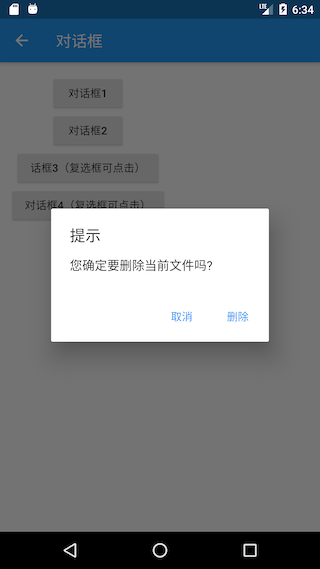

该对话框样式代码如下：

```dart
AlertDialog(
  title: Text("提示"),
  content: Text("您确定要删除当前文件吗?"),
  actions: <Widget>[
    FlatButton(
      child: Text("取消"),
      onPressed: () => Navigator.of(context).pop(), //关闭对话框
    ),
    FlatButton(
      child: Text("删除"),
      onPressed: () {
        // ... 执行删除操作
        Navigator.of(context).pop(true); //关闭对话框
      },
    ),
  ],
);
```

实现代码很简单，不在赘述。唯一需要注意的是我们是通过 Navigator.of(context).pop(…) 方法来关闭对话框的，这和路由返回的方式是一致的，并且都可以返回一个结果数据。现在，对话框我们已经构建好了，那么如何将它弹出来呢？还有对话框返回的数据应如何被接收呢？这些问题的答案都在 showDialog() 方法中。

showDialog() 是 Material 组件库提供的一个用于弹出 Material 风格对话框的方法，签名如下：

```dart
Future<T> showDialog<T>({
  @required BuildContext context,
  bool barrierDismissible = true, //点击对话框barrier(遮罩)时是否关闭它
  WidgetBuilder builder, // 对话框UI的builder
})
```

该方法只有两个参数，含义见注释。该方法返回一个 Future，它正是用于接收对话框的返回值：如果我们是通过点击对话框遮罩关闭的，则 Future 的值为 null，否则为我们通过 Navigator.of(context).pop(result) 返回的 result 值，下面我们看一下整个示例：

```dart
//点击该按钮后弹出对话框
RaisedButton(
  child: Text("对话框1"),
  onPressed: () async {
    //弹出对话框并等待其关闭
    bool delete = await showDeleteConfirmDialog1();
    if (delete == null) {
      print("取消删除");
    } else {
      print("已确认删除");
      //... 删除文件
    }
  },
),

// 弹出对话框
Future<bool> showDeleteConfirmDialog1() {
  return showDialog<bool>(
    context: context,
    builder: (context) {
      return AlertDialog(
        title: Text("提示"),
        content: Text("您确定要删除当前文件吗?"),
        actions: <Widget>[
          FlatButton(
            child: Text("取消"),
            onPressed: () => Navigator.of(context).pop(), // 关闭对话框
          ),
          FlatButton(
            child: Text("删除"),
            onPressed: () {
              //关闭对话框并返回true
              Navigator.of(context).pop(true);
            },
          ),
        ],
      );
    },
  );
}
```

示例运行后，我们点击对话框“取消”按钮或遮罩，控制台就会输出"取消删除"，如果点击“删除”按钮，控制台就会输出"已确认删除"。

> 注意：如果 AlertDialog 的内容过长，内容将会溢出，这在很多时候可能不是我们期望的，所以如果对话框内容过长时，可以用 SingleChildScrollView 将内容包裹起来。

##### SimpleDialog

SimpleDialog 也是 Material 组件库提供的对话框，它会展示一个列表，用于列表选择的场景。下面是一个选择 APP 语言的示例，运行结果如图所示。

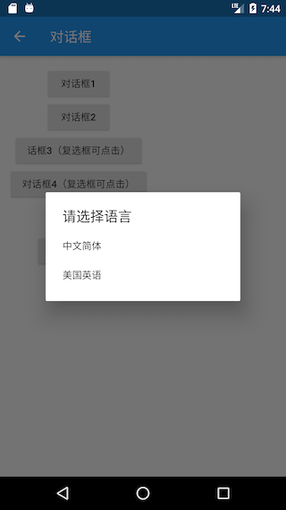

- 实现代码如下：

```dart
Future<void> changeLanguage() async {
  int i = await showDialog<int>(
      context: context,
      builder: (BuildContext context) {
        return SimpleDialog(
          title: const Text('请选择语言'),
          children: <Widget>[
            SimpleDialogOption(
              onPressed: () {
                // 返回1
                Navigator.pop(context, 1);
              },
              child: Padding(
                padding: const EdgeInsets.symmetric(vertical: 6),
                child: const Text('中文简体'),
              ),
            ),
            SimpleDialogOption(
              onPressed: () {
                // 返回2
                Navigator.pop(context, 2);
              },
              child: Padding(
                padding: const EdgeInsets.symmetric(vertical: 6),
                child: const Text('美国英语'),
              ),
            ),
          ],
        );
      });

  if (i != null) {
    print("选择了：${i == 1 ? "中文简体" : "美国英语"}");
  }
}
```

列表项组件我们使用了 SimpleDialogOption 组件来包装了一下，它相当于一个 FlatButton，只不过按钮文案是左对齐的，并且 padding 较小。上面示例运行后，用户选择一种语言后，控制台就会打印出它。

##### Dialog

实际上 AlertDialog 和 SimpleDialog 都使用了 Dialog 类。由于 AlertDialog 和 SimpleDialog 中使用了 IntrinsicWidth 来尝试通过子组件的实际尺寸来调整自身尺寸，这就导致他们的子组件不能是延迟加载模型的组件（如ListView、GridView 、 CustomScrollView等），如下面的代码运行后会报错。


```dart
AlertDialog(
  content: ListView(
    children: ...//省略
  ),
);
```

如果我们就是需要嵌套一个 ListView 应该怎么做？这时，我们可以直接使用 Dialog 类，如：

```dart
Dialog(
  child: ListView(
    children: ...//省略
  ),
);
```

下面我们看一个弹出一个有 30 个列表项的对话框示例，运行效果如图所示：


实现代码如下：

```dart
Future<void> showListDialog() async {
  int index = await showDialog<int>(
    context: context,
    builder: (BuildContext context) {
      var child = Column(
        children: <Widget>[
          ListTile(title: Text("请选择")),
          Expanded(
              child: ListView.builder(
            itemCount: 30,
            itemBuilder: (BuildContext context, int index) {
              return ListTile(
                title: Text("$index"),
                onTap: () => Navigator.of(context).pop(index),
              );
            },
          )),
        ],
      );
      //使用AlertDialog会报错
      //return AlertDialog(content: child);
      return Dialog(child: child);
    },
  );
  if (index != null) {
    print("点击了：$index");
  }
}
```

现在，我们己经介绍完了 AlertDialog、SimpleDialog 以及 Dialog。上面的示例中，我们在调用 showDialog 时，在 builder 中都是构建了这三个对话框组件的一种，可能有些读者会惯性的以为在 builder 中只能返回这三者之一，其实这不是必须的！就拿 Dialog 的示例来举例，我们完全可以用下面的代码来替代 Dialog：

```dart
// return Dialog(child: child) 
return UnconstrainedBox(
  constrainedAxis: Axis.vertical,
  child: ConstrainedBox(
    constraints: BoxConstraints(maxWidth: 280),
    child: Material(
      child: child,
      type: MaterialType.card,
    ),
  ),
);
```

上面代码运行后可以实现一样的效果。现在我们总结一下：AlertDialog、SimpleDialog 以及 Dialog 是 Material 组件库提供的三种对话框，旨在帮助开发者快速构建出符合 Material 设计规范的对话框，但读者完全可以自定义对话框样式，因此，我们仍然可以实现各种样式的对话框，这样即带来了易用性，又有很强的扩展性。

#### 6.6.2 对话框打开动画及遮罩

我们可以把对话框分为内部样式和外部样式两部分。内部样式指对话框中显示的具体内容，这部分内容我们已经在上面介绍过了；外部样式包含对话框遮罩样式、打开动画等，本节主要介绍如何自定义这些外部样式。

> 关于动画相关内容我们将在本书后面章节介绍，下面内容读者可以先了解一下（不必深究），读者可以在学习完动画相关内容后再回头来看。

我们已经介绍过了 showDialog 方法，它是 Material 组件库中提供的一个打开 Material 风格对话框的方法。那如何打开一个普通风格的对话框呢（非 Material 风格）？ Flutter 提供了一个 showGeneralDialog 方法，签名如下：

```dart
Future<T> showGeneralDialog<T>({
  @required BuildContext context,
  @required RoutePageBuilder pageBuilder, //构建对话框内部UI
  bool barrierDismissible, //点击遮罩是否关闭对话框
  String barrierLabel, // 语义化标签(用于读屏软件)
  Color barrierColor, // 遮罩颜色
  Duration transitionDuration, // 对话框打开/关闭的动画时长
  RouteTransitionsBuilder transitionBuilder, // 对话框打开/关闭的动画
})
```

实际上，showDialog 方法正是 showGeneralDialog 的一个封装，定制了 Material 风格对话框的遮罩颜色和动画。Material 风格对话框打开/关闭动画是一个 Fade（渐隐渐显）动画，如果我们想使用一个缩放动画就可以通过 transitionBuilder 来自定义。下面我们自己封装一个 showCustomDialog 方法，它定制的对话框动画为缩放动画，并同时制定遮罩颜色为 Colors.black87：

```dart
Future<T> showCustomDialog<T>({
  @required BuildContext context,
  bool barrierDismissible = true,
  WidgetBuilder builder,
}) {
  final ThemeData theme = Theme.of(context, shadowThemeOnly: true);
  return showGeneralDialog(
    context: context,
    pageBuilder: (BuildContext buildContext, Animation<double> animation,
        Animation<double> secondaryAnimation) {
      final Widget pageChild = Builder(builder: builder);
      return SafeArea(
        child: Builder(builder: (BuildContext context) {
          return theme != null
              ? Theme(data: theme, child: pageChild)
              : pageChild;
        }),
      );
    },
    barrierDismissible: barrierDismissible,
    barrierLabel: MaterialLocalizations.of(context).modalBarrierDismissLabel,
    barrierColor: Colors.black87, // 自定义遮罩颜色
    transitionDuration: const Duration(milliseconds: 150),
    transitionBuilder: _buildMaterialDialogTransitions,
  );
}

Widget _buildMaterialDialogTransitions(
    BuildContext context,
    Animation<double> animation,
    Animation<double> secondaryAnimation,
    Widget child) {
  // 使用缩放动画
  return ScaleTransition(
    scale: CurvedAnimation(
      parent: animation,
      curve: Curves.easeOut,
    ),
    child: child,
  );
}
```

现在，我们使用 showCustomDialog 打开文件删除确认对话框，代码如下：

```dart
... //省略无关代码
showCustomDialog<bool>(
  context: context,
  builder: (context) {
    return AlertDialog(
      title: Text("提示"),
      content: Text("您确定要删除当前文件吗?"),
      actions: <Widget>[
        FlatButton(
          child: Text("取消"),
          onPressed: () => Navigator.of(context).pop(),
        ),
        FlatButton(
          child: Text("删除"),
          onPressed: () {
            // 执行删除操作
            Navigator.of(context).pop(true);
          },
        ),
      ],
    );
  },
);
```

运行效果如图所示：


可以发现，遮罩颜色比通过 showDialog 方法打开的对话框更深。另外对话框打开/关闭的动画已变为缩放动画了，读者可以亲自运行示例查看效果。

#### 6.6.3 对话框实现原理

我们已经知道对话框最终都是由 showGeneralDialog 方法打开的，我们来看看它的具体实现：

```dart
Future<T> showGeneralDialog<T>({
  @required BuildContext context,
  @required RoutePageBuilder pageBuilder,
  bool barrierDismissible,
  String barrierLabel,
  Color barrierColor,
  Duration transitionDuration,
  RouteTransitionsBuilder transitionBuilder,
}) {
  return Navigator.of(context, rootNavigator: true).push<T>(_DialogRoute<T>(
    pageBuilder: pageBuilder,
    barrierDismissible: barrierDismissible,
    barrierLabel: barrierLabel,
    barrierColor: barrierColor,
    transitionDuration: transitionDuration,
    transitionBuilder: transitionBuilder,
  ));
}
```

实现很简单，直接调用 Navigator 的 push 方法打开了一个新的对话框路由 \_DialogRoute，然后返回了 push 的返回值。可见对话框实际上正是通过路由的形式实现的，这也是为什么我们可以使用 Navigator 的 pop 方法来退出对话框的原因。关于对话框的样式定制在 \_DialogRoute 中，没有什么新的东西，读者可以自行查看。

#### 6.6.4 对话框状态管理

我们在用户选择删除一个文件时，会询问是否删除此文件；在用户选择一个文件夹是，应该再让用户确认是否删除子文件夹。为了在用户选择了文件夹时避免二次弹窗确认是否删除子目录，我们在确认对话框底部添加一个“同时删除子目录？”的复选框，如图所示：


现在就有一个问题：如何管理复选框的选中状态？习惯上，我们会在路由页的 State 中来管理选中状态，我们可能会写出如下这样的代码：

```dart
class _DialogRouteState extends State<DialogRoute> {
  bool withTree = false; // 复选框选中状态

  @override
  Widget build(BuildContext context) {
    return Column(
      children: <Widget>[
        RaisedButton(
          child: Text("对话框2"),
          onPressed: () async {
            bool delete = await showDeleteConfirmDialog2();
            if (delete == null) {
              print("取消删除");
            } else {
              print("同时删除子目录: $delete");
            }
          },
        ),
      ],
    );
  }

  Future<bool> showDeleteConfirmDialog2() {
    withTree = false; // 默认复选框不选中
    return showDialog<bool>(
      context: context,
      builder: (context) {
        return AlertDialog(
          title: Text("提示"),
          content: Column(
            crossAxisAlignment: CrossAxisAlignment.start,
            mainAxisSize: MainAxisSize.min,
            children: <Widget>[
              Text("您确定要删除当前文件吗?"),
              Row(
                children: <Widget>[
                  Text("同时删除子目录？"),
                  Checkbox(
                    value: withTree,
                    onChanged: (bool value) {
                      //复选框选中状态发生变化时重新构建UI
                      setState(() {
                        //更新复选框状态
                        withTree = !withTree;
                      });
                    },
                  ),
                ],
              ),
            ],
          ),
          actions: <Widget>[
            FlatButton(
              child: Text("取消"),
              onPressed: () => Navigator.of(context).pop(),
            ),
            FlatButton(
              child: Text("删除"),
              onPressed: () {
                //执行删除操作
                Navigator.of(context).pop(withTree);
              },
            ),
          ],
        );
      },
    );
  }
}
```

然后，当我们运行上面的代码时我们会发现复选框根本选不中！为什么会这样呢？其实原因很简单，我们知道 setState 方法只会针对当前 context 的子树重新 build，但是我们的对话框并不是在 \_DialogRouteState 的 build 方法中构建的，而是通过 showDialog 单独构建的，所以在 \_DialogRouteState 的 context 中调用 setState 是无法影响通过 showDialog 构建的 UI 的。另外，我们可以从另外一个角度来理解这个现象，前面说过对话框也是通过路由的方式来实现的，那么上面的代码实际上就等同于企图在父路由中调用 setState 来让子路由更新，这显然是不行的！简尔言之，根本原因就是 context 不对。那如何让复选框可点击呢？通常有如下三种方法：

##### 单独抽离出 StatefulWidget

既然是 context 不对，那么直接的思路就是将复选框的选中逻辑单独封装成一个 StatefulWidget，然后在其内部管理复选状态。我们先来看看这种方法，下面是实现代码：

```dart
// 单独封装一个内部管理选中状态的复选框组件
class DialogCheckbox extends StatefulWidget {
  DialogCheckbox({
    Key key,
    this.value,
    @required this.onChanged,
  });

  final ValueChanged<bool> onChanged;
  final bool value;

  @override
  _DialogCheckboxState createState() => _DialogCheckboxState();
}

class _DialogCheckboxState extends State<DialogCheckbox> {
  bool value;

  @override
  void initState() {
    value = widget.value;
    super.initState();
  }

  @override
  Widget build(BuildContext context) {
    return Checkbox(
      value: value,
      onChanged: (v) {
        //将选中状态通过事件的形式抛出
        widget.onChanged(v);
        setState(() {
          //更新自身选中状态
          value = v;
        });
      },
    );
  }
}
```

下面是弹出对话框的代码：

```dart
Future<bool> showDeleteConfirmDialog3() {
  bool _withTree = false; //记录复选框是否选中
  return showDialog<bool>(
    context: context,
    builder: (context) {
      return AlertDialog(
        title: Text("提示"),
        content: Column(
          crossAxisAlignment: CrossAxisAlignment.start,
          mainAxisSize: MainAxisSize.min,
          children: <Widget>[
            Text("您确定要删除当前文件吗?"),
            Row(
              children: <Widget>[
                Text("同时删除子目录？"),
                DialogCheckbox(
                  value: _withTree, //默认不选中
                  onChanged: (bool value) {
                    //更新选中状态
                    _withTree = !_withTree;
                  },
                ),
              ],
            ),
          ],
        ),
        actions: <Widget>[
          FlatButton(
            child: Text("取消"),
            onPressed: () => Navigator.of(context).pop(),
          ),
          FlatButton(
            child: Text("删除"),
            onPressed: () {
              // 将选中状态返回
              Navigator.of(context).pop(_withTree);
            },
          ),
        ],
      );
    },
  );
}
```

最后，就是使用：

```dart
RaisedButton(
  child: Text("话框3（复选框可点击）"),
  onPressed: () async {
    //弹出删除确认对话框，等待用户确认
    bool deleteTree = await showDeleteConfirmDialog3();
    if (deleteTree == null) {
      print("取消删除");
    } else {
      print("同时删除子目录: $deleteTree");
    }
  },
),
```

运行后效果如图所示：


可见复选框能选中了，点击“取消”或“删除”后，控制台就会打印出最终的确认状态。

##### 使用 StatefulBuilder 方法

上面的方法虽然能解决对话框状态更新的问题，但是有一个明显的缺点——对话框上所有可能会改变状态的组件都得单独封装在一个在内部管理状态的 StatefulWidget 中，这样不仅麻烦，而且复用性不大。因此，我们来想想能不能找到一种更简单的方法？上面的方法本质上就是将对话框的状态置于一个 StatefulWidget 的上下文中，由 StatefulWidget 在内部管理，那么我们有没有办法在不需要单独抽离组件的情况下创建一个 StatefulWidget 的上下文呢？想到这里，我们可以从 Builder 组件的实现获得灵感。在前面介绍过 Builder 组件可以获得组件所在位置的真正的 Context，那它是怎么实现的呢，我们看看它的源码：

```dart
class Builder extends StatelessWidget {
  const Builder({
    Key key,
    @required this.builder,
  }) : assert(builder != null),
       super(key: key);
  final WidgetBuilder builder;

  @override
  Widget build(BuildContext context) => builder(context);
}
```

可以看到，Builder 实际上只是继承了 StatelessWidget，然后在 build 方法中获取当前 context 后将构建方法代理到了 builder 回调，可见，Builder 实际上是获取了 StatelessWidget 的上下文（context）。那么我们能否用相同的方法获取 StatefulWidget 的上下文，并代理其 build 方法呢？下面我们照猫画虎，来封装一个 StatefulBuilder 方法：

```dart
class StatefulBuilder extends StatefulWidget {
  const StatefulBuilder({
    Key key,
    @required this.builder,
  }) : assert(builder != null),
       super(key: key);

  final StatefulWidgetBuilder builder;

  @override
  _StatefulBuilderState createState() => _StatefulBuilderState();
}

class _StatefulBuilderState extends State<StatefulBuilder> {
  @override
  Widget build(BuildContext context) => widget.builder(context, setState);
}
```

代码很简单，StatefulBuilder 获取了 StatefulWidget 的上下文，并代理了其构建过程。下面我们就可以通过 StatefulBuilder 来重构上面的代码了（变动只在DialogCheckbox部分）：

```dart
... //省略无关代码
Row(
  children: <Widget>[
    Text("同时删除子目录？"),
    //使用StatefulBuilder来构建StatefulWidget上下文
    StatefulBuilder(
      builder: (context, _setState) {
        return Checkbox(
          value: _withTree, //默认不选中
          onChanged: (bool value) {
            //_setState方法实际就是该StatefulWidget的setState方法，
            //调用后builder方法会重新被调用
            _setState(() {
              //更新选中状态
              _withTree = !_withTree;
            });
          },
        );
      },
    ),
  ],
),
```

实际上，这种方法本质上就是子组件通知父组件（StatefulWidget）重新 build 子组件本身来实现 UI 更新的，读者可以对比代码理解。实际上 StatefulBuilder 正是 Flutter SDK 中提供的一个类，它和 Builder 的原理是一样的，在此，提醒读者一定要将 StatefulBuilder 和 Builder 理解透彻，因为它们在 Flutter 中是非常实用的。

##### 精妙的解法

是否还有更简单的解决方案呢？要确认这个问题，我们就得先搞清楚 UI 是怎么更新的，我们知道在调用 setState 方法后 StatefulWidget 就会重新 build，那 setState 方法做了什么呢？我们能不能从中找到方法？顺着这个思路，我们就得看一下 setState 的核心源码：

```dart
void setState(VoidCallback fn) {
  ... //省略无关代码
  _element.markNeedsBuild();
}
```

可以发现，setState 中调用了 Element 的 markNeedsBuild() 方法，我们前面说过，Flutter 是一个响应式框架，要更新 UI 只需改变状态后通知框架页面需要重构即可，而 Element 的 markNeedsBuild() 方法正是来实现这个功能的！markNeedsBuild() 方法会将当前的 Element 对象标记为 “dirty”（脏的），在每一个 Frame，Flutter 都会重新构建被标记为 “dirty”Element 对象。既然如此，我们有没有办法获取到对话框内部 UI 的 Element 对象，然后将其标示为为 “dirty” 呢？答案是肯定的！我们可以通过 Context 来得到 Element 对象，至于 Element 与 Context 的关系我们将会在后面 “Flutter核心原理” 一章中再深入介绍，现在只需要简单的认为：在组件树中，context 实际上就是 Element 对象的引用。知道这个后，那么解决的方案就呼之欲出了，我们可以通过如下方式来让复选框可以更新：

```dart
Future<bool> showDeleteConfirmDialog4() {
  bool _withTree = false;
  return showDialog<bool>(
    context: context,
    builder: (context) {
      return AlertDialog(
        title: Text("提示"),
        content: Column(
          crossAxisAlignment: CrossAxisAlignment.start,
          mainAxisSize: MainAxisSize.min,
          children: <Widget>[
            Text("您确定要删除当前文件吗?"),
            Row(
              children: <Widget>[
                Text("同时删除子目录？"),
                Checkbox( // 依然使用Checkbox组件
                  value: _withTree,
                  onChanged: (bool value) {
                    // 此时context为对话框UI的根Element，我们 
                    // 直接将对话框UI对应的Element标记为dirty
                    (context as Element).markNeedsBuild();
                    _withTree = !_withTree;
                  },
                ),
              ],
            ),
          ],
        ),
        actions: <Widget>[
          FlatButton(
            child: Text("取消"),
            onPressed: () => Navigator.of(context).pop(),
          ),
          FlatButton(
            child: Text("删除"),
            onPressed: () {
              // 执行删除操作
              Navigator.of(context).pop(_withTree);
            },
          ),
        ],
      );
    },
  );
}
```

上面的代码运行后复选框也可以正常选中。可以看到，我们只用了一行代码便解决了这个问题！当然上面的代码并不是最优，因为我们只需要更新复选框的状态，而此时的 context 我们用的是对话框的根 context，所以会导致整个对话框 UI 组件全部 rebuild，因此最好的做法是将 context 的“范围”缩小，也就是说只将 Checkbox 的 Element 标记为 dirty，优化后的代码为：

```dart
... //省略无关代码
Row(
  children: <Widget>[
    Text("同时删除子目录？"),
    // 通过Builder来获得构建Checkbox的`context`，
    // 这是一种常用的缩小`context`范围的方式
    Builder(
      builder: (BuildContext context) {
        return Checkbox(
          value: _withTree,
          onChanged: (bool value) {
            (context as Element).markNeedsBuild();
            _withTree = !_withTree;
          },
        );
      },
    ),
  ],
),
```

#### 6.6.5 其它类型的对话框

##### 底部菜单列表

showModalBottomSheet 方法可以弹出一个 Material 风格的底部菜单列表模态对话框，示例如下：

```dart
// 弹出底部菜单列表模态对话框
Future<int> _showModalBottomSheet() {
  return showModalBottomSheet<int>(
    context: context,
    builder: (BuildContext context) {
      return ListView.builder(
        itemCount: 30,
        itemBuilder: (BuildContext context, int index) {
          return ListTile(
            title: Text("$index"),
            onTap: () => Navigator.of(context).pop(index),
          );
        },
      );
    },
  );
}
```

点击按钮，弹出该对话框：

```dart
RaisedButton(
  child: Text("显示底部菜单列表"),
  onPressed: () async {
    int type = await _showModalBottomSheet();
    print(type);
  },
),
```

运行后效果如图所示：


showModalBottomSheet 的实现原理和 showGeneralDialog 实现原理相同，都是通过路由的方式来实现的，读者可以查看源码对比。但值得一提的是还有一个 showBottomSheet 方法，该方法会从设备底部向上弹出一个全屏的菜单列表，示例如下：

```dart
// 返回的是一个controller
PersistentBottomSheetController<int> _showBottomSheet() {
  return showBottomSheet<int>(
    context: context,
    builder: (BuildContext context) {
      return ListView.builder(
        itemCount: 30,
        itemBuilder: (BuildContext context, int index) {
          return ListTile(
            title: Text("$index"),
            onTap: (){
              // do something
              print("$index");
              Navigator.of(context).pop();
            },
          );
        },
      );
    },
  );
}
```

运行效果如图所示：


PersistentBottomSheetController 中包含了一些控制对话框的方法比如 close 方法可以关闭该对话框，功能比较简单，读者可以自行查看源码。唯一需要注意的是，showBottomSheet 和我们上面介绍的弹出对话框的方法原理不同：showBottomSheet 是调用 widget 树顶部的 Scaffold 组件的 ScaffoldState的showBottomSheet 同名方法实现，也就是说要调用 showBottomSheet 方法就必须得保证父级组件中有 Scaffold。

##### Loading 框

其实 Loading 框可以直接通过 showDialog+AlertDialog 来自定义：

```dart
showLoadingDialog() {
  showDialog(
    context: context,
    barrierDismissible: false, //点击遮罩不关闭对话框
    builder: (context) {
      return AlertDialog(
        content: Column(
          mainAxisSize: MainAxisSize.min,
          children: <Widget>[
            CircularProgressIndicator(),
            Padding(
              padding: const EdgeInsets.only(top: 26.0),
              child: Text("正在加载，请稍后..."),
            )
          ],
        ),
      );
    },
  );
}
```

显示效果如图所示：


如果我们嫌 Loading 框太宽，想自定义对话框宽度，这时只使用 SizedBox 或 ConstrainedBox 是不行的，原因是 showDialog 中已经给对话框设置了宽度限制，根据我们在第五章“尺寸限制类容器”一节中所述，我们可以使用 UnconstrainedBox 先抵消 showDialog 对宽度的限制，然后再使用 SizedBox 指定宽度，代码如下：

```dart
... //省略无关代码
UnconstrainedBox(
  constrainedAxis: Axis.vertical,
  child: SizedBox(
    width: 280,
    child: AlertDialog(
      content: Column(
        mainAxisSize: MainAxisSize.min,
        children: <Widget>[
          CircularProgressIndicator(value: .8,),
          Padding(
            padding: const EdgeInsets.only(top: 26.0),
            child: Text("正在加载，请稍后..."),
          )
        ],
      ),
    ),
  ),
);
```

代码运行后，效果如图所示：


##### 日历选择

我们先看一下 Material 风格的日历选择器，如图所示：


实现代码：

```dart
Future<DateTime> _showDatePicker1() {
  var date = DateTime.now();
  return showDatePicker(
    context: context,
    initialDate: date,
    firstDate: date,
    lastDate: date.add( //未来30天可选
      Duration(days: 30),
    ),
  );
}
```

iOS 风格的日历选择器需要使用 showCupertinoModalPopup 方法和 CupertinoDatePicker 组件来实现：

```dart
Future<DateTime> _showDatePicker2() {
  var date = DateTime.now();
  return showCupertinoModalPopup(
    context: context,
    builder: (ctx) {
      return SizedBox(
        height: 200,
        child: CupertinoDatePicker(
          mode: CupertinoDatePickerMode.dateAndTime,
          minimumDate: date,
          maximumDate: date.add(
            Duration(days: 30),
          ),
          maximumYear: date.year + 1,
          onDateTimeChanged: (DateTime value) {
            print(value);
          },
        ),
      );
    },
  );
}
```

运行效果如图所示：


