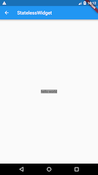

## 一、第一个 Flutter 应用

```dart
// 包导入；导入了 Material UI 组件库。Material 是一种标准的移动端和 web 端的视觉设计语言， Flutter 默认提供了一套丰富的 Material 风格的 UI 组件。
import 'package:flutter/material.dart';

// 应用入口
void main() => runApp(new MyApp());
// 应用结构
class MyApp extends StatelessWidget {
  @override
  Widget build(BuildContext context) {
    return new MaterialApp(
      // 应用名称
      title: 'Flutter Demo',
      theme: new ThemeData(
        // 蓝色主题
        primarySwatch: Colors.blue,
      ),
      // 应用页路由
      home: new MyHomePage(title: 'Flutter Demo Home Page'),
    );
  }
}

// 首页
class MyHomePage extends StatefulWidget {
  MyHomePage({Key key, this.title}) : super(key: key);
  final String title;

  @override
  _MyHomePageState createState() => new _MyHomePageState();
}

class _MyHomePageState extends State<MyHomePage> {
  int _counter = 0;     // 用于记录按钮点击的总次数

  void _incrementCounter() {
    setState(() {       // setState 方法的作用是通知 Flutter 
      _counter++;
    });
  }

  @override
  Widget build(BuildContext context) {
    return new Scaffold(
      appBar: new AppBar(
        title: new Text(widget.title),
      ),
      body: new Center(
        child: new Column(
          mainAxisAlignment: MainAxisAlignment.center,
          children: <Widget>[
            new Text(
              'You have pushed the button this many times:',
            ),
            new Text(
              '$_counter',
              style: Theme.of(context).textTheme.headline4,
            ),
          ],
        ),
      ),
      floatingActionButton: new FloatingActionButton(
        onPressed: _incrementCounter,
        tooltip: 'Increment',
        child: new Icon(Icons.add),
      ), // This trailing comma makes auto-formatting nicer for build methods.
    );
  }
}
```

### 1.1 分析

#### 1.1.1 导入包

导入了 Material UI 组件库。Material 是一种标准的移动端和 web 端的视觉设计语言， Flutter 默认提供了一套丰富的 Material 风格的 UI 组件。

#### 1.1.2 应用入口

- 与 C/C++、Java 类似，Flutter  应用中 main 函数为应用程序的入口。main 函数中调用了 runApp 方法，它的功能是启动 Flutter 应用。runApp 它接受一个 Widget 参数，在本示例中它是一个 MyApp 对象，MyApp() 是 Flutter 应用的根组件。
- main 函数使用了 (=>) 符号，这是 Dart 中单行函数或方法的简写。

#### 1.1.3 应用结构

```dart
class MyApp extends StatelessWidget {
  @override
  Widget build(BuildContext context) {
    return new MaterialApp(
      //应用名称  
      title: 'Flutter Demo', 
      theme: new ThemeData(
        //蓝色主题  
        primarySwatch: Colors.blue,
      ),
      //应用首页路由  
      home: new MyHomePage(title: 'Flutter Demo Home Page'),
    );
  }
}
```

- MyApp 类代表 Flutter 应用，它继承了 StatelessWidget 类，这也就意味着应用本身也是一个 widget。
- 在Flutter中，大多数东西都是 widget（后同“组件”或“部件”），包括对齐(alignment)、填充(padding)和布局(layout)等，它们都是以 widget 的形式提供。
- Flutter 在构建页面时，会调用组件的 build 方法，widget 的主要工作是提供一个 build() 方法来描述如何构建 UI 界面（通常是通过组合、拼装其它基础 widget）。
- MaterialApp 是 Material 库中提供的 Flutter APP 框架，通过它可以设置应用的名称、主题、语言、首页及路由列表等。MaterialApp 也是一个 widget。
- home 为 Flutter 应用的首页，它也是一个 widget。

#### 1.1.4 首页

```dart
class MyHomePage extends StatefulWidget {
 MyHomePage({Key key, this.title}) : super(key: key);
 final String title;
 @override
 _MyHomePageState createState() => new _MyHomePageState();
}

class _MyHomePageState extends State<MyHomePage> {
...
}
```

- MyHomePage 是 Flutter 应用的首页，它继承自 StatefulWidget 类，表示它是一个有状态的组件（Stateful widget）。现在我们只需简单认为有状态的组件（Stateful widget） 和无状态的组件（Stateless widget）有两点不同：
    - Stateful widget 可以拥有状态，这些状态在 widget 生命周期中是可以变的，而 Stateless widget 是不可变的。
    - Stateful widget 至少由两个类组成：
        - 一个 StatefulWidget 类;
        - 一个 State 类； StatefulWidget 类本身是不变的，但是 State 类中持有的状态在 widget 生命周期中可能会发生变化。

\_MyHomePageState 类是 MyHomePage 类对应的状态类。看到这里，读者可能已经发现：和 MyApp 类不同， MyHomePage 类中并没有 build 方法，取而代之的是，build 方法被挪到了 \_MyHomePageState 方法中，至于为什么这么做，先留个疑问，在分析完完整代码后再来解答。

#### 1.1.5 State 类

接下来，看看 \_MyHomePageState 中都包含哪些东西：

##### 1 组件状态

```dart
int _counter = 0; //用于记录按钮点击的总次数
```

##### 2 状态操作方法

```dart
void _incrementCounter() {
  setState(() {     // setState 方法的作用是通知 Flutter 框架，有状态发生了改变
     _counter++;
  });
}
```

当按钮点击时，会调用此函数，该函数的作用是先自增 \_counter，然后调用 setState 方法。setState 方法的作用是通知 Flutter 框架，有状态发生了改变，Flutter 框架收到通知后，会执行 build 方法来根据新的状态重新构建界面， Flutter 对此方法做了优化，使重新执行变的很快，所以你可以重新构建任何需要更新的东西，而无需分别去修改各个 widget。

##### 3 构建 UI 界面

构建 UI 界面的逻辑在 build 方法中，当 MyHomePage 第一次创建时，\_MyHomePageState 类会被创建，当初始化完成后，Flutter 框架会调用 Widget 的 build 方法来构建 widget 树，最终将 widget 树渲染到设备屏幕上。所以，我们看看 \_MyHomePageState 的 build 方法中都干了什么事：

```dart
Widget build(BuildContext context) {
return new Scaffold(
  appBar: new AppBar(
    title: new Text(widget.title),
  ),
  body: new Center(
    child: new Column(
      mainAxisAlignment: MainAxisAlignment.center,
      children: <Widget>[
        new Text(
          'You have pushed the button this many times:',
        ),
        new Text(
          '$_counter',
          style: Theme.of(context).textTheme.headline4,
        ),
      ],
    ),
  ),
  floatingActionButton: new FloatingActionButton(
    onPressed: _incrementCounter,
    tooltip: 'Increment',
    child: new Icon(Icons.add),
  ),
);
}
```

- Scaffold 是 Material 库中提供的页面脚手架，它提供了默认的导航栏、标题和包含主屏幕 widget 树（后同“组件树”或“部件树”）的 body 属性，组件树可以很复杂。本书后面示例中，路由默认都是通过Scaffold创建。
- body 的组件树中包含了一个 Center 组件，Center 可以将其子组件树对齐到屏幕中心。此例中， Center 子组件是一个 Column 组件，Column 的作用是将其所有子组件沿屏幕垂直方向依次排列； 此例中 Column 子组件是两个 Text：
    - 第一个 Text 显示固定文本 “You have pushed the button this many times:”；
    - 第二个 Text 显示 \_counter 状态的数值。
- floatingActionButton 是页面右下角的带 “+” 的悬浮按钮，它的 onPressed 属性接受一个回调函数，代表它被点击后的处理器，本例中直接将 \_incrementCounter 方法作为其处理函数。

#### 1.1.6 为何将 build 方法放在 State 中，而不是 StatefulWidget

如果将 build() 方法放在 StatefulWidget 中则会有两个问题

##### 1. 状态访问不便

如果我们的 StatefulWidget 有很多状态，而每次状态改变都要调用 build 方法，由于状态是保存在 State 中的，如果 build 方法在 StatefulWidget 中，那么 build 方法和状态分别在两个类中，那么构建时读取状态将会很不方便！如果真的将 build 方法放在 StatefulWidget 中的话，由于构建用户界面过程需要依赖 State，所以 build 方法将必须加一个 State 参数，大概是下面这样：

```dart
Widget build(BuildContext context, State state){
  //state.counter
  ...
}
```

这样的话就只能将 State 的所有状态声明为公开的状态，这样才能在 State 类外部访问状态！但是，将状态设置为公开后，状态将不再具有私密性，这就会导致对状态的修改将会变的不可控。但如果将 build() 方法放在 State 中的话，构建过程不仅可以直接访问状态，而且也无需公开私有状态，这会非常方便。

##### 2. 继承 StatefulWidget 不便

例如，Flutter 中有一个动画 widget 的基类 AnimatedWidget，它继承自 StatefulWidget 类。AnimatedWidget 中引入了一个抽象方法 build(BuildContext context)，继承自 AnimatedWidget 的动画 widget 都要实现这个 build 方法。现在设想一下，如果 StatefulWidget 类中已经有了一个 build 方法，正如上面所述，此时 build 方法需要接收一个 state 对象，这就意味着 AnimatedWidget 必须将自己的 State 对象(记为 \_animatedWidgetState)提供给其子类，因为子类需要在其 build 方法中调用父类的 build 方法，代码可能如下：

```dart
class MyAnimationWidget extends AnimatedWidget{
    @override
    Widget build(BuildContext context, State state){
      //由于子类要用到AnimatedWidget的状态对象_animatedWidgetState，
      //所以AnimatedWidget必须通过某种方式将其状态对象_animatedWidgetState
      //暴露给其子类
      super.build(context, _animatedWidgetState)
    }
}
```

- 这样很显然是不合理的，因为:
    - AnimatedWidget 的状态对象是 AnimatedWidget 内部实现细节，不应该暴露给外部。
    - 如果要将父类状态暴露给子类，那么必须得有一种传递机制，而做这一套传递机制是无意义的，因为父子类之间状态的传递和子类本身逻辑是无关的。

### 1.2 路由管理

路由 (Route) 在移动开发中通常指页面（Page），这跟 web 开发中单页应用的 Route 概念意义是相同的，Route 在 Android 中通常指一个 Activity，在 iOS 中指一个 ViewController。所谓路由管理，就是管理页面之间如何跳转，通常也可被称为导航管理。Flutter 中的路由管理和原生开发类似，无论是 Android 还是 iOS，导航管理都会维护一个路由栈，路由入栈(push)操作对应打开一个新页面，路由出栈(pop)操作对应页面关闭操作，而路由管理主要是指如何来管理路由栈。

#### 1.2.1 一个简单示例

1. 创建一个新路由，命名 “NewRoute”

```Dart
class NewRoute extends StatelessWidget {  // 新路由继承自 StatelessWidget
  @override
  Widget build(BuildContext context) {
    return Scaffold(
      appBar: AppBar(
        title: Text("New route"),
      ),
      body: Center(
        child: Text("This is new route"), // 界面很简单，在页面中间显示一句 "This is new route"
      ),
    );
  }
}
```

2. 在 \_MyHomePageState.build 方法中的 Column 的子 widget 中添加一个按钮（FlatButton）

```dart
Column(
      mainAxisAlignment: MainAxisAlignment.center,
      children: <Widget>[
      ... //省略无关代码
      FlatButton(
         child: Text("open new route"),
         textColor: Colors.blue,
         onPressed: () {
          //导航到新路由   
          Navigator.push( context,
           MaterialPageRoute(builder: (context) {
              return NewRoute();
           }));
          },
         ),
       ],
 )
```

#### 1.2.2 MaterialPageRoute

MaterialPageRoute 继承自 PageRoute 类，PageRoute 类是一个抽象类，表示占有整个屏幕空间的一个模态路由页面，它还定义了路由构建及切换时过渡动画的相关接口及属性。MaterialPageRoute 是 Material 组件库提供的组件，它可以针对不同平台，实现与平台页面切换动画风格一致的路由切换动画：

- 对于 Android，当打开新页面时，新的页面会从屏幕底部滑动到屏幕顶部；当关闭页面时，当前页面会从屏幕顶部滑动到屏幕底部后消失，同时上一个页面会显示到屏幕上。
- 对于 IOS，当打开页面时，新的页面会从屏幕右侧边缘一致滑动到屏幕左边，直到新页面全部显示到屏幕上，而上一个页面则会从当前屏幕滑动到屏幕左侧而消失；当关闭页面时，正好相反，当前页面会从屏幕右侧滑出，同时上一个页面会从屏幕左侧滑入。

##### MaterialPageRoute 构造函数的各个参数的意义：

```dart
  MaterialPageRoute({
    WidgetBuilder builder,
    RouteSettings settings,
    bool maintainState = true,
    bool fullscreenDialog = false,
  })
```
- builder：是一个 WidgetBuilder 类型的回调函数，它的作用是构建路由页面的具体内容，返回值是一个 widget。我们通常要实现此回调，返回新路由的实例。
- settings：包含路由的配置信息，如路由名称、是否初始路由（首页）。
- maintainState：默认情况下，当入栈一个新路由时，原来的路由仍然会被保存在内存中，如果想在路由没用的时候释放其所占用的所有资源，可以设置 maintainState 为 false。
- fullscreenDialog：表示新的路由页面是否是一个全屏的模态对话框，在 iOS 中，如果 fullscreenDialog 为 true，新页面将会从屏幕底部滑入（而不是水平方向）。

如果想自定义路由切换动画，可以自己继承 PageRoute 来实现，我们将在后面介绍动画时，实现一个自定义的路由组件。

#### 1.2.3 Navigator

Navigator 是一个路由管理的组件，它提供了打开和退出路由页方法。Navigator 通过一个栈来管理活动路由集合。通常当前屏幕显示的页面就是栈顶的路由。Navigator 提供了一系列方法来管理路由栈，在此我们只介绍其最常用的两个方法：

```dart
// 将给定的路由入栈（即打开新的页面），返回值是一个 Future 对象，用以接收新路由出栈（即关闭）时的返回数据
Future push(BuildContext context, Route route)
// 将栈顶路由出栈，result 为页面关闭时返回给上一个页面的数据
bool pop(BuildContext context, [ result ])
```

Navigator 还有很多其它方法，如 Navigator.replace、Navigator.popUntil 等，详情请参考 API 文档或 SDK 源码注释，在此不再赘述。下面我们还需要介绍一下路由相关的另一个概念“命名路由”。

##### 实例方法

Navigator 类中第一个参数为 context 的静态方法都对应一个 Navigator 的实例方法， 比如 Navigator.push(BuildContext context, Route route) 等价于 Navigator.of(context).push(Route route)，下面命名路由相关的方法也是一样的。

#### 1.2.4 路由传值

很多时候，在路由跳转时我们需要带一些参数，比如打开商品详情页时，我们需要带一个商品 id，这样商品详情页才知道展示哪个商品信息；又比如我们在填写订单时需要选择收货地址，打开地址选择页并选择地址后，可以将用户选择的地址返回到订单页等等。下面我们通过一个简单的示例来演示新旧路由如何传参。

#### 示例

```dart
class TipRoute extends StatelessWidget {
  TipRoute({
    Key key,
    @required this.text,  // 接收一个text参数
  }) : super(key: key);
  final String text;

  @override
  Widget build(BuildContext context) {
    return Scaffold(
      appBar: AppBar(
        title: Text("提示"),
      ),
      body: Padding(
        padding: EdgeInsets.all(18),
        child: Center(
          child: Column(
            children: <Widget>[
              Text(text),
              RaisedButton(
                onPressed: () => Navigator.pop(context, "我是返回值"),
                child: Text("返回"),
              )
            ],
          ),
        ),
      ),
    );
  }
}
```

下面是打开新路由 TipRoute 的代码：

```dart
class RouterTestRoute extends StatelessWidget {
  @override
  Widget build(BuildContext context) {
    return Center(
      child: RaisedButton(
        onPressed: () async {
          // 打开`TipRoute`，并等待返回结果
          var result = await Navigator.push(
            context,
            MaterialPageRoute(
              builder: (context) {
                return TipRoute(
                  // 路由参数
                  text: "我是提示xxxx",
                );
              },
            ),
          );
          //输出`TipRoute`路由返回结果
          print("路由返回值: $result");
        },
        child: Text("打开提示页"),
      ),
    );
  }
}
```

- 需要说明：
  - 提示文案“我是提示xxxx”是通过TipRoute的text参数传递给新路由页的。我们可以通过等待Navigator.push(…)返回的Future来获取新路由的返回数据。
  - 在TipRoute页中有两种方式可以返回到上一页；第一种方式时直接点击导航栏返回箭头，第二种方式是点击页面中的“返回”按钮。这两种返回方式的区别是前者不会返回数据给上一个路由，而后者会。下面是分别点击页面中的返回按钮和导航栏返回箭头后，RouterTestRoute页中print方法在控制台输出的内容：

```
I/flutter (27896): 路由返回值: 我是返回值
I/flutter (27896): 路由返回值: null
```

上面介绍的是非命名路由的传值方式，命名路由的传值方式会有所不同，我们会在下面介绍命名路由时介绍。

#### 1.2.5 命名路由

所谓“命名路由”（Named Route）即有名字的路由，我们可以先给路由起一个名字，然后就可以通过路由名字直接打开新的路由了，这为路由管理带来了一种直观、简单的方式。

##### 路由表

要想使用命名路由，我们必须先提供并注册一个路由表（routing table），这样应用程序才知道哪个名字与哪个路由组件相对应。其实注册路由表就是给路由起名字，路由表的定义如下：

```dart
Map<String, WidgetBuilder> routes;
```

它是一个 Map，key 为路由的名字，是个字符串；value 是个 builder 回调函数，用于生成相应的路由 widget。我们在通过路由名字打开新路由时，应用会根据路由名字在路由表中查找到对应的 WidgetBuilder 回调函数，然后调用该回调函数生成路由 widget 并返回。

##### 注册路由表

路由表的注册方式很简单，我们回到之前“计数器”的示例，然后在 MyApp 类的 build 方法中找到 MaterialApp，添加 routes 属性，代码如下：

```dart
MaterialApp(
  title: 'Flutter Demo',
  theme: ThemeData(
    primarySwatch: Colors.blue,
  ),
  //注册路由表
  routes:{
   "new_page":(context) => NewRoute(),
    ... // 省略其它路由注册信息
  } ,
  home: MyHomePage(title: 'Flutter Demo Home Page'),
);
```

现在我们就完成了路由表的注册。上面的代码中 home 路由并没有使用命名路由，如果我们也想将 home 注册为命名路由应该怎么做呢？其实很简单，直接看代码：

```dart
MaterialApp(
  title: 'Flutter Demo',
  initialRoute:"/", // 名为"/"的路由作为应用的home(首页)
  theme: ThemeData(
    primarySwatch: Colors.blue,
  ),
  //注册路由表
  routes:{
   "new_page":(context) => NewRoute(),
   "/":(context) => MyHomePage(title: 'Flutter Demo Home Page'), //注册首页路由
  } 
);
```

可以看到，我们只需在路由表中注册一下 MyHomePage 路由，然后将其名字作为 MaterialApp 的 initialRoute 属性值即可，该属性决定应用的初始路由页是哪一个命名路由。

##### 通过路由名打开新路由页

要通过路由名称来打开新路由，可以使用 Navigator 的 pushNamed 方法：

```dart
Future pushNamed(BuildContext context, String routeName,{Object arguments})
```

Navigator 除了 pushNamed 方法，还有 pushReplacementNamed 等其他管理命名路由的方法，读者可以自行查看 API 文档。接下来我们通过路由名来打开新的路由页，修改 FlatButton 的 onPressed 回调代码，改为：

```dart
onPressed: () {
  Navigator.pushNamed(context, "new_page");
  //Navigator.push(context,
  //  MaterialPageRoute(builder: (context) {
  //  return NewRoute();
  //}));  
},
```

热重载应用，再次点击 “open new route” 按钮，依然可以打开新的路由页。

##### 命名路由参数传递

在 Flutter 最初的版本中，命名路由是不能传递参数的，后来才支持了参数；下面展示命名路由如何传递并获取路由参数：

我们先注册一个路由：

```dart
 routes:{
   "new_page":(context) => EchoRoute(),
  } ,
```

在路由页通过RouteSetting对象获取路由参数：

```dart
class EchoRoute extends StatelessWidget {

  @override
  Widget build(BuildContext context) {
    //获取路由参数
    var args=ModalRoute.of(context).settings.arguments;
    //...省略无关代码
  }
}
```

在打开路由时传递参数

```dart
Navigator.of(context).pushNamed("new_page", arguments: "hi");
```

##### 适配

假设我们也想将上面路由传参示例中的 TipRoute 路由页注册到路由表中，以便也可以通过路由名来打开它。但是，由于 TipRoute 接受一个 text 参数，我们如何在不改变 TipRoute 源码的前提下适配这种情况？其实很简单：

```dart
MaterialApp(
  ... //省略无关代码
  routes: {
   "tip2": (context){
     return TipRoute(text: ModalRoute.of(context).settings.arguments);
   },
 }, 
);
```

#### 1.2.6 路由生成钩子

假设我们要开发一个电商 APP，当用户没有登录时可以看店铺、商品等信息，但交易记录、购物车、用户个人信息等页面需要登录后才能看。为了实现上述功能，我们需要在打开每一个路由页前判断用户登录状态！如果每次打开路由前我们都需要去判断一下将会非常麻烦，那有什么更好的办法吗？答案是有！

MaterialApp 有一个 onGenerateRoute 属性，它在打开命名路由时可能会被调用，之所以说可能，是因为当调用 Navigator.pushNamed(...) 打开命名路由时，如果指定的路由名在路由表中已注册，则会调用路由表中的 builder 函数来生成路由组件；如果路由表中没有注册，才会调用 onGenerateRoute 来生成路由。onGenerateRoute 回调签名如下：

```dart
Route<dynamic> Function(RouteSettings settings)
```

有了 onGenerateRoute 回调，要实现上面控制页面权限的功能就非常容易：我们放弃使用路由表，取而代之的是提供一个 onGenerateRoute 回调，然后在该回调中进行统一的权限控制，如：

```dart
MaterialApp(
  ... //省略无关代码
  onGenerateRoute:(RouteSettings settings){
      return MaterialPageRoute(builder: (context){
           String routeName = settings.name;
       // 如果访问的路由页需要登录，但当前未登录，则直接返回登录页路由，
       // 引导用户登录；其它情况则正常打开路由。
     }
   );
  }
);
```

注意，onGenerateRoute 只会对命名路由生效。

#### 1.2.7 总结

本章先介绍了 Flutter 中路由管理、传参的方式，然后又着重介绍了命名路由相关内容。在此需要说明一点，由于命名路由只是一种可选的路由管理方式，在实际开发中，读者可能心中会犹豫到底使用哪种路由管理方式。在此，根据笔者经验，建议读者最好统一使用命名路由的管理方式，这将会带来如下好处：

- 语义化更明确；
- 代码更好维护，如果使用匿名路由，则必须在调用 Navigator.push 的地方创建新路由页，这样不仅需要 import 新路由页的 dart 文件，而且这样的代码将会非常分散；
- 可以通过 onGenerateRoute 做一些全局的路由跳转前置处理逻辑。

综上所述，笔者比较建议使用命名路由，当然这并不是什么金科玉律，读者可以根据自己偏好或实际情况来决定。

另外，还有一些关于路由管理的内容我们没有介绍，比如路由 MaterialApp 中还有 navigatorObservers 和 onUnknownRoute 两个回调属性，前者可以监听所有路由跳转动作，后者在打开一个不存在的命名路由时会被调用，由于这些功能并不常用，而且也比较简单，我们便不再花费篇幅来介绍了，读者可以自行查看 API 文档。

### 1.3 包管理

flutter 使用配置文件 pubspec.yaml（位于项目根目录）来管理第三方依赖包

YAML是一种直观、可读性高并且容易被人类阅读的文件格式，Flutter 也是用 yaml 文件作为其配置文件。Flutter 项目默认的配置文件是 pubspec.yaml，我们看一个简单的示例：

```yaml
name: flutter_in_action   # 应用或包名称
description: First Flutter application.   # 应用或包的描述、简介

version: 1.0.0+1  # 应用或包的版本号

dependencies:     # 应用或包依赖的其它包或插件
  flutter:
    sdk: flutter
  cupertino_icons: ^0.1.2

dev_dependencies: # 开发环境依赖的工具包（而不是 flutter 应用本身依赖的包
  flutter_test:
    sdk: flutter

flutter:          # flutter 相关的配置选项
  uses-material-design: true
```

如果我们的 Flutter 应用本身依赖某个包，我们需要将所依赖的包添加到 dependencies 下，接下来我们通过一个例子来演示一下如何添加、下载并使用第三方包。

#### 1.3.1 Pub 仓库

[Pub](https://pub.dev/) 是 Google 官方的 Dart Packages 仓库，类似于 node 中的 npm 仓库，android 中的 jcenter。我们可以在 Pub 上面查找我们需要的包和插件，也可以向 Pub 发布我们的包和插件。我们将在后面的章节中介绍如何向 Pub 发布我们的包和插件。

#### 1.3.2 示例

接下来，我们实现一个显示随机字符串的 widget。有一个名为 “english_words” 的开源软件包，其中包含数千个常用的英文单词以及一些实用功能。我们首先在 pub 上找到 english_words 这个包如下图，确定其最新的版本号和是否支持 Flutter。


我们看到“english_words”包最新的版本是3.1.3，并且支持flutter，接下来：

##### 将 “english_words”（3.1.3版本）添加到依赖项列表，如下：

```yaml
dependencies:
  flutter:
    sdk: flutter

  cupertino_icons: ^0.1.0
  # 新添加的依赖
  english_words: ^3.1.3
```

##### 下载包。在 Android Studio 的编辑器视图中查看 pubspec.yaml 时如图，单击右上角的 Packages get 


我们也可以在控制台，定位到当前工程目录，然后手动运行 flutter packages get 命令来下载依赖包。另外，需要注意 dependencies 和 dev_dependencies 的区别，前者的依赖包将作为 APP 的源码的一部分参与编译，生成最终的安装包。而后者的依赖包只是作为开发阶段的一些工具包，主要是用于帮助我们提高开发、测试效率，比如 flutter 的自动化测试包等。

##### 引入 english_words 包

```dart
import 'package:english_words/english_words.dart';
```

在输入时，Android Studio 会自动提供有关库导入的建议选项。导入后该行代码将会显示为灰色，表示导入的库尚未使用

##### 使用 english_words 包来生成随机字符串

```dart
class RandomWordsWidget extends StatelessWidget {
  @override
  Widget build(BuildContext context) {
   // 生成随机字符串
    final wordPair = new WordPair.random();
    return Padding(
      padding: const EdgeInsets.all(8.0),
      child: new Text(wordPair.toString()),
    );
  }
}

// 将 RandomWordsWidget 添加到 _MyHomePageState.build 的 Column 的子 widget 中
Column(
  mainAxisAlignment: MainAxisAlignment.center,
  children: <Widget>[
    ... //省略无关代码
    RandomWordsWidget(),
  ],
)
```

运行结果如下：


#### 1.3.3 其它依赖方式

- 依赖本地包

```yaml
dependencies:
    pkg1:
        path: ../../code/pkg1
```

- 依赖Git

```yaml
dependencies:   # 上面假定包位于Git存储库的根目录中
  pkg1:
    git:
      url: git://github.com/xxx/pkg1.git

dependencies:   # 非根目录下
  package1:
    git:
      url: git://github.com/flutter/packages.git
      path: packages/package1
```

### 1.4 资源管理

#### 1.4.1 指定 assets

和包管理一样，Flutter 也使用 pubspec.yaml 文件来管理应用程序所需的资源，举个例子:

```yaml
flutter:
  assets:
    - assets/my_icon.png
    - assets/background.png
```

assets 指定应包含在应用程序中的文件， 每个 asset 都通过相对于 pubspec.yaml 文件所在的文件系统路径来标识自身的路径。asset 的声明顺序是无关紧要的，asset 的实际目录可以是任意文件夹（在本示例中是 assets 文件夹）

在构建期间，Flutter 将 asset 放置到称为 asset bundle 的特殊存档中，应用程序可以在运行时读取它们（但不能修改）。

#### 1.4.2 Asset 变体（variant）

构建过程支持 “asset 变体” 的概念：不同版本的 asset 可能会显示在不同的上下文中。 在 pubspec.yaml 的 assets 部分中指定 asset 路径时，构建过程中，会在**相邻子目录中**查找具有相同名称的任何文件。这些文件随后会与指定的 asset 一起被包含在 asset bundle 中。

例如，如果应用程序目录中有以下文件:

- …/pubspec.yaml
- …/graphics/my_icon.png
- …/graphics/background.png
- …/graphics/dark/background.png
- …etc.

然后 pubspec.yaml 文件中只需包含:

```yaml
flutter:
  assets:
    - graphics/background.png
```

那么这两个 graphics/background.png 和 graphics/dark/background.png 都将包含在您的 asset bundle 中。前者被认为是 main asset （主资源），后者被认为是一种变体（variant）。

在选择匹配当前设备分辨率的图片时，Flutter 会使用到 asset 变体（见下文），将来，Flutter 可能会将这种机制扩展到本地化、阅读提示等方面。

#### 1.4.3 加载 assets

您的应用可以通过 AssetBundle 对象访问其 asset。有两种主要方法允许从 Asset bundle 中加载字符串或图片（二进制）文件。

##### 1. 加载文本 assets

- 通过 rootBundle 对象加载：每个 Flutter 应用程序都有一个 rootBundle 对象，通过它可以轻松访问主资源包，直接使用 package:flutter/services.dart 中全局静态的 rootBundle 对象来加载 asset 即可；
- 通过 DefaultAssetBundle 加载：建议使用 DefaultAssetBundle 来获取当前 BuildContext 的 AssetBundle。这种方法不是使用应用程序构建的默认 asset bundle，而是使父级 widget 在运行时动态替换的不同的 AssetBundle，这对于本地化或测试场景很有用。

通常，可以使用 DefaultAssetBundle.of() 在应用运行时来间接加载 asset（例如JSON文件），而在 widget 上下文之外，或其它 AssetBundle 句柄不可用时，可以使用 rootBundle 直接加载这些 asset，例如：

```dart
import 'dart:async' show Future;
import 'package:flutter/services.dart' show rootBundle;

Future<String> loadAsset() async {
  return await rootBundle.loadString('assets/config.json');
}
```

##### 2. 加载图片

类似于原生开发，Flutter 也可以为当前设备加载适合其分辨率的图像

###### 声明分辨率相关的图片 assets

AssetImage 可以将 asset 的请求逻辑映射到最接近当前设备像素比例（dpi）的 asset。为了使这种映射起作用，必须根据特定的目录结构来保存 asset：

- …/image.png
- …/Mx/image.png
- …/Nx/image.png
- …etc.

其中 M 和 N 是数字标识符，对应于其中包含的图像的分辨率，也就是说，它们指定不同设备像素比例的图片。

主资源默认对应于 1.0 倍的分辨率图片。看一个例子：

- …/my_icon.png
- …/2.0x/my_icon.png
- …/3.0x/my_icon.png

在设备像素比率为 1.8 的设备上，.../2.0x/my_icon.png 将被选择。对于 2.7 的设备像素比率，.../3.0x/my_icon.png 将被选择。

如果未在 Image widget 上指定渲染图像的宽度和高度，那么 Image widget 将占用与主资源相同的屏幕空间大小。 也就是说，如果 .../my_icon.png 是 72px 乘 72px，那么 .../3.0x/my_icon.png 应该是 216px 乘 216px；但如果未指定宽度和高度，它们都将渲染为 72像素 × 72像素（以逻辑像素为单位）。

pubspec.yaml 中 asset 部分中的每一项都应与实际文件相对应，但主资源项除外。当主资源缺少某个资源时，会按分辨率从低到高的顺序去选择 ，也就是说 1x 中没有的话会在 2x 中找，2x 中还没有的话就在 3x 中找。

###### 加载图片

要加载图片，可以使用 AssetImage 类。例如，我们可以从上面的 asset 声明中加载背景图片：

```dart
Widget build(BuildContext context) {
  return new DecoratedBox(
    decoration: new BoxDecoration(
      image: new DecorationImage(
        image: new AssetImage('graphics/background.png'),
      ),
    ),
  );
}
```

注意，AssetImage 并非是一个 widget， 它实际上是一个 ImageProvider，有些时候你可能期望直接得到一个显示图片的 widget，那么你可以使用 Image.asset() 方法，如：

```dart
Widget build(BuildContext context) {
  return Image.asset('graphics/background.png');
}
```

使用默认的 asset bundle 加载资源时，内部会自动处理分辨率等，这些处理对开发者来说是无感知的。 (如果使用一些更低级别的类，如 ImageStream 或 ImageCache 时你会注意到有与缩放相关的参数)

###### 依赖包中的资源图片

要加载依赖包中的图像，必须给 AssetImage 提供 package 参数。

例如，假设您的应用程序依赖于一个名为 “my_icons” 的包，它具有如下目录结构：

- …/pubspec.yaml
- …/icons/heart.png
- …/icons/1.5x/heart.png
- …/icons/2.0x/heart.png
- …etc.

然后加载图像，使用：

```dart
new AssetImage('icons/heart.png', package: 'my_icons')
// 或
new Image.asset('icons/heart.png', package: 'my_icons')
```

注意：包在使用本身的资源时也应该加上 package 参数来获取

###### 打包包中的 assets

如果在 pubspec.yaml 文件中声明了期望的资源，它将会打包到相应的 package 中。特别是，包本身使用的资源必须在 pubspec.yaml 中指定。

包也可以选择在其 lib/ 文件夹中包含未在其 pubspec.yaml 文件中声明的资源。在这种情况下，对于要打包的图片，应用程序必须在 pubspec.yaml 中指定包含哪些图像。 例如，一个名为 “fancy_backgrounds” 的包，可能包含以下文件：

- …/lib/backgrounds/background1.png
- …/lib/backgrounds/background2.png
- …/lib/backgrounds/background3.png

要包含第一张图像，必须在 pubspec.yaml 的 assets 部分中声明它：

```yaml
flutter:
  assets:
    - packages/fancy_backgrounds/backgrounds/background1.png
```

lib/ 是隐含的，所以它不应该包含在资产路径中。

#### 1.4.4 特定平台 assets

上面的资源都是 flutter 应用中的，这些资源只有在 Flutter 框架运行之后才能使用，如果要给我们的应用设置 APP 图标或者添加启动图，那我们必须使用特定平台的 assets。

##### 1. 设置APP图标

更新 Flutter 应用程序启动图标的方式与在本机 Android 或 iOS 应用程序中更新启动图标的方式相同。

- Android
  - 在 Flutter 项目的根目录中，导航到 .../android/app/src/main/res 目录，里面包含了各种资源文件夹（如 mipmap-hdpi 已包含占位符图像 “ic_launcher.png”，如下图）。 只需按照 Android 开发人员指南中的说明，将其替换为所需的资源，并遵守每种屏幕密度（dpi）的建议图标大小标准


> 注意: 如果您重命名 .png 文件，则还必须在您 AndroidManifest.xml 的 <application> 标签的 android:icon 属性中更新名称

- iOS
  - 在 Flutter 项目的根目录中，导航到 .../ios/Runner。该目录中 Assets.xcassets/AppIcon.appiconset 已经包含占位符图片（如图）， 只需将它们替换为适当大小的图片，保留原始文件名称。


#### 1.4.5 更新启动页


在 Flutter 框架加载时，Flutter 会使用本地平台机制绘制启动页。此启动页将持续到 Flutter 渲染应用程序的第一帧时。

> 注意: 这意味着如果您不在应用程序的 main() 方法中调用 runApp 函数 （或者更具体地说，如果您不调用 window.render 去响应 window.onDrawFrame）的话， 启动屏幕将永远持续显示。

##### 1. Android

要将启动屏幕（splash screen）添加到您的 Flutter 应用程序， 请导航至 .../android/app/src/main。在 res/drawable/launch_background.xml，通过自定义 drawable 来实现自定义启动界面（你也可以直接换一张图片）。

##### 2. iOS

要将图片添加到启动屏幕（splash screen）的中心，请导航至 .../ios/Runner。在 Assets.xcassets/LaunchImage.imageset， 拖入图片，并命名为 LaunchImage.png、LaunchImage@2x.png、LaunchImage@3x.png。 如果你使用不同的文件名，那您还必须更新同一目录中的 Contents.json 文件，图片的具体尺寸可以查看苹果官方的标准。

您也可以通过打开 Xcode 完全自定义 storyboard。在 Project Navigator 中导航到 Runner/Runner 然后通过打开 Assets.xcassets 拖入图片，或者通过在 LaunchScreen.storyboard 中使用 Interface Builder 进行自定义，如下图。


### 1.5 调试 Flutter 应用

有各种各样的工具和功能来帮助调试 Flutter 应用程序

#### 1.5.1 Dart 分析器

在运行应用程序前，请运行 flutter analyze 测试你的代码。这个工具是一个静态代码检查工具，它是 dartanalyzer 工具的一个包装，主要用于分析代码并帮助开发者发现可能的错误，比如，Dart 分析器大量使用了代码中的类型注释来帮助追踪问题，避免 var、无类型的参数、无类型的列表文字等。

如果你使用 IntelliJ 的 Flutter 插件，那么分析器在打开 IDE 时就已经自动启用了，如果读者使用的是其它 IDE，强烈建议读者启用 Dart 分析器，因为在大多数时候，Dart 分析器可以在代码运行前发现大多数问题。

#### 1.5.2 Dart Observatory (语句级的单步调试和分析器)

### 1.6 Flutter 异常捕获

## 二、基础组件

### 2.1 Widget 简介

#### 2.1.1

Flutter 中几乎所有的对象都是一个 Widget。与原生开发中“控件”不同的是，Flutter 中的 Widget 的概念更广泛，它不仅可以表示 UI 元素，也可以表示一些功能性的组件如：用于手势检测的 GestureDetector widget、用于 APP 主题数据传递的 Theme 等等，而原生开发中的控件通常只是指UI元素。在后面的内容中，我们在描述 UI 元素时可能会用到“控件”、“组件”这样的概念，读者心里需要知道他们就是 widget，只是在不同场景的不同表述而已。由于 Flutter 主要就是用于构建用户界面的，所以，在大多数时候，读者可以认为 widget 就是一个控件，不必纠结于概念。

#### 2.1.2 Widget 与 Element

Widget 的功能是“描述一个 UI 元素的配置数据”，它就是说，Widget 其实并不是表示最终绘制在设备屏幕上的显示元素，而它只是描述显示元素的一个配置数据；真正代表屏幕上显示元素的类是 Element，也就是说 Widget 只是描述 Element 的配置数据。

- Widget 实际上就是 Element 的配置数据，Widget 树实际上是一个配置树，而真正的 UI 渲染树是由 Element 构成；不过，由于 Element 是通过 Widget 生成的，所以它们之间有对应关系，在大多数场景，我们可以宽泛地认为 Widget 树就是指 UI 控件树或 UI 渲染树。
- 一个 Widget 对象可以对应多个 Element 对象。这很好理解，根据同一份配置（Widget），可以创建多个实例（Element）。

#### 2.1.3 Widget 主要接口

先来看一下Widget类的声明：

```dart
@immutable
abstract class Widget extends DiagnosticableTree {
  const Widget({ this.key });
  final Key key;

  @protected
  Element createElement();

  @override
  String toStringShort() {
    return key == null ? '$runtimeType' : '$runtimeType-$key';
  }

  @override
  void debugFillProperties(DiagnosticPropertiesBuilder properties) {
    super.debugFillProperties(properties);
    properties.defaultDiagnosticsTreeStyle = DiagnosticsTreeStyle.dense;
  }

  static bool canUpdate(Widget oldWidget, Widget newWidget) {
    return oldWidget.runtimeType == newWidget.runtimeType
        && oldWidget.key == newWidget.key;
  }
}
```

- Widget 类：继承自 DiagnosticableTree，DiagnosticableTree 即“诊断树”，主要作用是提供调试信息。
- Key: 主要的作用是决定是否在下一次 build 时复用旧的 widget，决定的条件在 canUpdate() 方法中。
- createElement()：正如前文所述“一个 Widget 可以对应多个 Element”；Flutter Framework 在构建 UI 树时，会先调用此方法生成对应节点的 Element 对象。此方法是 Flutter Framework 隐式调用的，在我们开发过程中基本不会调用到。
- debugFillProperties(...)：复写父类的方法，主要是设置诊断树的一些特性。
- canUpdate(...)：是一个静态方法，它主要用于在 Widget 树重新 build 时复用旧的 widget，其实具体来说，应该是：是否用新的 Widget 对象去更新旧 UI 树上所对应的 Element 对象的配置；通过其源码我们可以看到，只要 newWidget 与 oldWidget 的 runtimeType 和 key 同时相等时就会用 newWidget 去更新 Element 对象的配置，否则就会创建新的 Element。

现在只需知道，为 Widget 显式添加 key 的话可能（但不一定）会使 UI 在重新构建时变的高效，读者目前可以先忽略此参数。本书后面的示例中，只会在构建列表项 UI 时会显式指定 Key。

另外 Widget 类本身是一个抽象类，其中最核心的就是定义了 createElement() 接口，在 Flutter 开发中，我们一般都不用直接继承 Widget 类来实现一个新组件，相反，我们通常会通过继承 StatelessWidget 或 StatefulWidget 来间接继承 Widget 类来实现。StatelessWidget 和 StatefulWidget 都是直接继承自 Widget 类，而这两个类也正是 Flutter 中非常重要的两个抽象类，它们引入了两种 Widget 模型，接下来我们将重点介绍一下这两个类。

#### 2.1.4 StatelessWidget

StatelessWidget相对比较简单，它继承自 Widget 类，重写了 createElement() 方法：

```dart
@override
StatelessElement createElement() => new StatelessElement(this);
```

StatelessElement 间接继承自 Element 类，与 StatelessWidget 相对应（作为其配置数据）。

StatelessWidget 用于不需要维护状态的场景，它通常在 build 方法中通过嵌套其它 Widget 来构建 UI，在构建过程中会递归的构建其嵌套的 Widget。我们看一个简单的例子：

```dart
class Echo extends StatelessWidget {
  const Echo({
    Key key,
    @required this.text,
    this.backgroundColor:Colors.grey,
  }):super(key:key);

  final String text;
  final Color backgroundColor;

  @override
  Widget build(BuildContext context) {
    return Center(
      child: Container(
        color: backgroundColor,
        child: Text(text),
      ),
    );
  }
}
```

上面的代码，实现了一个回显字符串的 Echo widget。

> 按照惯例，widget 的构造函数参数应使用命名参数，命名参数中的必要参数要添加 @required 标注，这样有利于静态代码分析器进行检查。另外，在继承 widget 时，第一个参数通常应该是 Key，另外，如果 Widget 需要接收子 Widget，那么 child 或 children 参数通常应被放在参数列表的最后。同样是按照惯例，Widget 的属性应尽可能的被声明为 final，防止被意外改变。

然后我们可以通过如下方式使用它：

```
Widget build(BuildContext context) {
  return Echo(text: "hello world");
}
```

运行后效果如图：



##### Context

build 方法有一个 context 参数，它是 BuildContext 类的一个实例，表示当前 widget 在 widget 树中的上下文，每一个 widget 都会对应一个 context 对象（因为每一个 widget 都是 widget 树上的一个节点）。实际上，context 是当前 widget 在 widget 树中位置中执行 "相关操作" 的一个句柄，比如它提供了从当前 widget 开始向上遍历 widget 树以及按照 widget 类型查找父级 widget 的方法。下面是在子树中获取父级 widget 的一个示例：

```dart
class ContextRoute extends StatelessWidget {
  @override
  Widget build(BuildContext context) {
    return Scaffold(
      appBar: AppBar(
        title: Text("Context测试"),
      ),
      body: Container(
        child: Builder(builder: (context) {
          // 在 Widget 树中向上查找最近的父级 `Scaffold` widget
          Scaffold scaffold = context.findAncestorWidgetOfExactType<Scaffold>();
          // 直接返回 AppBar 的 title， 此处实际上是 Text("Context测试")
          return (scaffold.appBar as AppBar).title;
        }),
      ),
    );
  }
}
```
运行后效果如图：


#### 2.1.5 StatefulWidget

和 StatelessWidget 一样，StatefulWidget 也是继承自 Widget 类，并重写了 createElement() 方法，不同的是返回的 Element 对象并不相同；另外 StatefulWidget 类中添加了一个新的接口 createState()。

```dart
abstract class StatefulWidget extends Widget {
  const StatefulWidget({ Key key }) : super(key: key);

  @override
  StatefulElement createElement() => new StatefulElement(this);

  @protected
  State createState();
}
```

- StatefulElement 间接继承自 Element 类，与 StatefulWidget 相对应（作为其配置数据）。StatefulElement 中可能会多次调用 createState() 来创建状态(State)对象。
- createState() 用于创建和 Stateful widget 相关的状态，它在 Stateful widget 的生命周期中可能会被多次调用。例如，当一个 Stateful widget 同时插入到 widget 树的多个位置时，Flutter framework 就会调用该方法为每一个位置生成一个独立的 State 实例，其实，本质上就是一个 StatefulElement 对应一个 State 实例。

#### 2.1.6 State

一个 StatefulWidget 类会对应一个 State 类，State 表示与其对应的 StatefulWidget 要维护的状态，State 中的保存的状态信息可以：
- 在 widget 构建时可以被同步读取；
- 在 widget 生命周期中可以被改变，当 State 被改变时，可以手动调用其 setState() 方法通知 Flutter framework 状态发生改变，Flutter framework 在收到消息后，会重新调用其 build 方法重新构建 widget 树，从而达到更新 UI 的目的。

State中有两个常用属性：
- widget：它表示与该 State 实例关联的 widget 实例，由 Flutter framework 动态设置。注意，这种关联并非永久的，因为在应用生命周期中，UI 树上的某一个节点的 widget 实例在重新构建时可能会变化，但 State 实例只会在第一次插入到树中时被创建，当在重新构建时，如果 widget 被修改了，Flutter framework 会动态设置 State.widget 为新的 widget 实例；
- context：StatefulWidget 对应的 BuildContext，作用同 StatelessWidget 的 BuildContext。

##### State生命周期

理解 State 的生命周期对 flutter 开发非常重要，为了加深读者印象，本节我们通过一个实例来演示一下 State 的生命周期。在接下来的示例中，我们实现一个计数器 widget，点击它可以使计数器加 1，由于要保存计数器的数值状态，所以我们应继承 StatefulWidget，代码如下：

```dart
class CounterWidget extends StatefulWidget {
  const CounterWidget({
    Key key,
    this.initValue: 0
  });

  final int initValue;

  @override
  _CounterWidgetState createState() => new _CounterWidgetState();
}
```

CounterWidget 接收一个 initValue 整型参数，它表示计数器的初始值。下面我们看一下 State 的代码：

```dart
class _CounterWidgetState extends State<CounterWidget> {  
  int _counter;

  @override
  void initState() {
    super.initState();
    //初始化状态  
    _counter=widget.initValue;
    print("initState");
  }

  @override
  Widget build(BuildContext context) {
    print("build");
    return Scaffold(
      body: Center(
        child: FlatButton(
          child: Text('$_counter'),
          //点击后计数器自增
          onPressed:()=>setState(()=> ++_counter,
          ),
        ),
      ),
    );
  }

  @override
  void didUpdateWidget(CounterWidget oldWidget) {
    super.didUpdateWidget(oldWidget);
    print("didUpdateWidget");
  }

  @override
  void deactivate() {
    super.deactivate();
    print("deactive");
  }

  @override
  void dispose() {
    super.dispose();
    print("dispose");
  }

  @override
  void reassemble() {
    super.reassemble();
    print("reassemble");
  }

  @override
  void didChangeDependencies() {
    super.didChangeDependencies();
    print("didChangeDependencies");
  }

}
```

接下来，我们创建一个新路由，在新路由中，我们只显示一个CounterWidget：

```dart
Widget build(BuildContext context) {
  return CounterWidget();
}
```

我们运行应用并打开该路由页面，在新路由页打开后，屏幕中央就会出现一个数字 0，然后控制台日志输出：

```
I/flutter ( 5436): initState
I/flutter ( 5436): didChangeDependencies
I/flutter ( 5436): build
```

可以看到，在 StatefulWidget 插入到 Widget 树时首先 initState 方法会被调用。

然后我们点击 ⚡️ 按钮热重载，控制台输出日志如下：

```
I/flutter ( 5436): reassemble
I/flutter ( 5436): didUpdateWidget
I/flutter ( 5436): build
```

可以看到此时 initState 和 didChangeDependencies 都没有被调用，而此时 didUpdateWidget 被调用。

接下来，我们在 widget 树中移除 CounterWidget，将路由 build 方法改为：

```dart
Widget build(BuildContext context) {
  //移除计数器 
  //return CounterWidget();
  //随便返回一个Text()
  return Text("xxx");
}
```

然后热重载，日志如下：

```
I/flutter ( 5436): reassemble
I/flutter ( 5436): deactive
I/flutter ( 5436): dispose
```

我们可以看到，在 CounterWidget 从 widget 树中移除时，deactive 和 dispose 会依次被调用。

下面我们来看看各个回调函数：

- initState：当 Widget 第一次插入到 Widget 树时会被调用，对于每一个 State 对象，Flutter framework 只会调用一次该回调，所以，通常在该回调中做一些一次性的操作，如状态初始化、订阅子树的事件通知等。不能在该回调中调用 BuildContext.dependOnInheritedWidgetOfExactType（该方法用于在 Widget 树上获取离当前 widget 最近的一个父级 InheritFromWidget，关于 InheritedWidget 我们将在后面章节介绍），原因是在初始化完成后，Widget 树中的 InheritFromWidget 也可能会发生变化，所以正确的做法应该在在 build（）方法或 didChangeDependencies() 中调用它；
- didChangeDependencies()：当 State 对象的依赖发生变化时会被调用；例如：在之前build() 中包含了一个 InheritedWidget，然后在之后的 build() 中 InheritedWidget 发生了变化，那么此时 InheritedWidget 的子 widget 的 didChangeDependencies() 回调都会被调用。典型的场景是当系统语言 Locale 或应用主题改变时，Flutter framework 会通知 widget 调用此回调；
- build()：此回调读者现在应该已经相当熟悉了，它主要是用于构建 Widget 子树的，会在如下场景被调用：
    - 在调用 initState() 之后。
    - 在调用 didUpdateWidget() 之后。
    - 在调用 setState() 之后。
    - 在调用 didChangeDependencies() 之后。
    - 在State对象从树中一个位置移除后（会调用deactivate）又重新插入到树的其它位置之后。
- reassemble()：此回调是专门为了开发调试而提供的，在热重载 (hot reload) 时会被调用，此回调在 Release 模式下永远不会被调用；
- didUpdateWidget()：在 widget 重新构建时，Flutter framework 会调用 Widget.canUpdate 来检测 Widget 树中同一位置的新旧节点，然后决定是否需要更新，如果 Widget.canUpdate 返回 true 则会调用此回调。正如之前所述，Widget.canUpdate 会在新旧 widget 的 key 和 runtimeType 同时相等时会返回 true，也就是说在在新旧 widget 的 key 和 runtimeType 同时相等时 didUpdateWidget() 就会被调用；
- deactivate()：当 State 对象从树中被移除时，会调用此回调。在一些场景下，Flutter framework 会将 State 对象重新插到树中，如包含此 State 对象的子树在树的一个位置移动到另一个位置时（可以通过 GlobalKey 来实现）。如果移除后没有重新插入到树中则紧接着会调用 dispose() 方法；
- dispose()：当 State 对象从树中被永久移除时调用；通常在此回调中释放资源。

StatefulWidget生命周期如图所示：


#### 3.1.7 在 Widget 树中获取 State 对象

由于 StatefulWidget 的的具体逻辑都在其 State 中，所以很多时候，我们需要获取 StatefulWidget 对应的 State 对象来调用一些方法，比如 Scaffold 组件对应的状态类 ScaffoldState 中就定义了打开 SnackBar (路由页底部提示条)的方法。我们有两种方法在子 widget 树中获取父级 StatefulWidget 的 State 对象。

##### 1. 通过 Context 获取

context 对象有一个 findAncestorStateOfType() 方法，该方法可以从当前节点沿着 widget 树向上查找指定类型的 StatefulWidget 对应的 State 对象。下面是实现打开 SnackBar 的示例：

```dart
Scaffold(
  appBar: AppBar(
    title: Text("子树中获取State对象"),
  ),
  body: Center(
    child: Builder(builder: (context) {
      return RaisedButton(
        onPressed: () {
          // 查找父级最近的 Scaffold 对应的 ScaffoldState 对象
          ScaffoldState _state = context.findAncestorStateOfType<ScaffoldState>();
          // 调用 ScaffoldState 的 showSnackBar 来弹出 SnackBar
          _state.showSnackBar(
            SnackBar(
              content: Text("我是 SnackBar"),
            ),
          );
        },
        child: Text("显示SnackBar"),
      );
    }),
  ),
);
```

上面示例运行后，点击 "显示SnackBar"，效果如图所示：


一般来说，如果 StatefulWidget 的状态是私有的（不应该向外部暴露），那么我们代码中就不应该去直接获取其 State 对象；如果 StatefulWidget 的状态是希望暴露出的（通常还有一些组件的操作方法），我们则可以去直接获取其 State 对象。但是通过 context.findAncestorStateOfType 获取 StatefulWidget 的状态的方法是通用的，我们并不能在语法层面指定 StatefulWidget 的状态是否私有，所以在 Flutter 开发中便有了一个默认的约定：如果 StatefulWidget 的状态是希望暴露出的，应当在 StatefulWidget 中提供一个 of 静态方法来获取其 State 对象，开发者便可直接通过该方法来获取；如果 State 不希望暴露，则不提供 of 方法。这个约定在 Flutter SDK 里随处可见。所以，上面示例中的 Scaffold 也提供了一个 of 方法，我们其实是可以直接调用它的：

```dart
...//省略无关代码
// 直接通过of静态方法来获取ScaffoldState 
ScaffoldState _state=Scaffold.of(context); 
_state.showSnackBar(
  SnackBar(
    content: Text("我是SnackBar"),
  ),
);
```

##### 2. 通过 GlobalKey

Flutter 还有一种通用的获取 State 对象的方法——通过 GlobalKey 来获取！ 步骤分两步：

- 给目标 StatefulWidget 添加 GlobalKey；

```dart
//定义一个 globalKey, 由于 GlobalKey 要保持全局唯一性，我们使用静态变量存储
static GlobalKey<ScaffoldState> _globalKey= GlobalKey();
...
Scaffold(
    key: _globalKey , //设置key
    ...  
)
```

- 通过 GlobalKey 来获取 State 对象

```dart
_globalKey.currentState.openDrawer()
```

GlobalKey 是 Flutter 提供的一种在整个 APP 中引用 element 的机制。如果一个 widget 设置了 GlobalKey，那么我们便可以通过 globalKey.currentWidget 获得该 widget 对象、globalKey.currentElement 来获得 widget 对应的 element 对象，如果当前 widget 是 StatefulWidget，则可以通过 globalKey.currentState 来获得该 widget 对应的 state 对象。

> 注意：使用 GlobalKey 开销较大，如果有其他可选方案，应尽量避免使用它。另外同一个 GlobalKey 在整个 widget 树中必须是唯一的，不能重复。

#### 3.1.8 Flutter SDK内置组件库介绍

Flutter 提供了一套丰富、强大的基础组件，在基础组件库之上 Flutter 又提供了一套 Material 风格（Android默认的视觉风格）和一套 Cupertino 风格（iOS视觉风格）的组件库。要使用基础组件库，需要先导入：

```dart
import 'package:flutter/widgets.dart';
```

下面我们介绍一下常用的组件

##### 1. 基础组件

- Text：该组件可让您创建一个带格式的文本；
- Row、 Column：这些具有弹性空间的布局类 Widget 可让您在水平（Row）和垂直（Column）方向上创建灵活的布局。其设计是基于 Web 开发中的 Flexbox 布局模型；
- Stack：取代线性布局 ，Stack 允许子 widget 堆叠， 你可以使用 Positioned 来定位他们相对于 Stack 的上下左右四条边的位置。Stacks 是基于 Web 开发中的绝对定位（absolute positioning)布局模型设计的；
- Container： Container 可让您创建矩形视觉元素。container 可以装饰一个 BoxDecoration, 如 background、一个边框、或者一个阴影。 Container 也可以具有边距（margins）、填充(padding)和应用于其大小的约束(constraints)。另外， Container可以使用矩阵在三维空间中对其进行变换。

##### 2. Material 组件

Flutter 提供了一套丰富的 Material 组件，它可以帮助我们构建遵循 Material Design 设计规范的应用程序。Material 应用程序以 MaterialApp 组件开始，该组件在应用程序的根部创建了一些必要的组件，比如 Theme 组件，它用于配置应用的主题。 是否使用 MaterialApp 完全是可选的，但是使用它是一个很好的做法。在之前的示例中，我们已经使用过多个 Material 组件了，如：Scaffold、AppBar、FlatButton 等。要使用 Material 组件，需要先引入它：

```dart
import 'package:flutter/material.dart';
```

##### 3. Cupertino 组件

Flutter 也提供了一套丰富的 Cupertino 风格的组件，尽管目前还没有 Material 组件那么丰富，但是它仍在不断的完善中。值得一提的是在 Material 组件库中有一些组件可以根据实际运行平台来切换表现风格，比如 MaterialPageRoute，在路由切换时，如果是 Android 系统，它将会使用 Android 系统默认的页面切换动画(从底向上)；如果是 iOS 系统，它会使用 iOS 系统默认的页面切换动画（从右向左）。由于在前面的示例中还没有 Cupertino 组件的示例，下面我们实现一个简单的 Cupertino 组件风格的页面：

```dart
//导入cupertino widget库
import 'package:flutter/cupertino.dart';

class CupertinoTestRoute extends StatelessWidget {
  @override
  Widget build(BuildContext context) {
    return CupertinoPageScaffold(
      navigationBar: CupertinoNavigationBar(
        middle: Text("Cupertino Demo"),
      ),
      child: Center(
        child: CupertinoButton(
            color: CupertinoColors.activeBlue,
            child: Text("Press"),
            onPressed: () {}
        ),
      ),
    );
  }
}
```

下面是在 iPhoneX 上页面效果截图：


